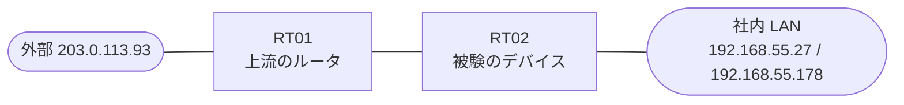

# 問題 20260910-005

> **本問は機器に接続せずに解答すること。追加の show 実行は認めない。**

## トポロジ

あなたは、ネットワークの運用を担当しています。あなたの会社の拠点のルータ RT02 は、上流のルータ RT01 を経由して、外部のネットワークへ接続されています。社内の LAN には、管理のステーション 192.168.55.27 およびサーバ 192.168.55.178 が存在し、そして、RT02 と RT01 の間では、ルーティング・プロトコルの隣接関係が確立されています。RT02 には、コントロール・プレーンを保護するためのサービス・ポリシーが、構成されています。



| 対象 | 内容 |
|------|------|
| RT02 ⇔ RT01（外部側） | Ethernet0/0・10.92.204.0/30（RT02=10.92.204.1 / RT01=10.92.204.2） |
| RT02 ⇔ 社内 LAN | Ethernet0/1・192.168.55.0/24（RT02=192.168.55.1） |
| 管理のステーション（NMS） | 192.168.55.27（SSH / ping の発信元） |
| サーバ | 192.168.55.178 |
| 外部の発信元 | 203.0.113.93 |

## 要件

1. 導入の第1段階として、いかなるトラフィックも、破棄されることはできません。
2. 管理のステーション 192.168.55.27 からの SSH によるアクセス、および、ルーティング・プロトコルの隣接関係は、影響を受けてはなりません。
3. スタティック・ルートおよび既定のルートによる迂回は、実施されてはなりません。
4. ルーター自身に宛てられた ICMP は、police の統計によって計測される必要があります。
5. ルーター自身に宛てられたトラフィックの保護は、control-plane の input のサービス・ポリシーによって、実装されなければなりません。

## 現在の状態

いくつかの宛先への通信について、報告が上がっています。あなたは、示されているところの出力および構成に基づいて、その構成が、下記において記述されているとおりに動作していない理由を、判断する必要があります。

```
RT02# show policy-map control-plane
Control Plane 

  Service-policy input: PM-CPP

    Class-map: CM-ICMP (match-all)  
      Match: access-group 186
      police:
          rate 50 pps, burst 2 packets
        conformed 0 packets, 0 bytes; actions:
          transmit 
        exceeded 0 packets, 0 bytes; actions:
          drop 
        conformed 0 pps, exceeded 0 pps

    Class-map: class-default (match-any)  
      Match: any
```

## 設定抜粋

```
RT02# show running-config | section control-plane
control-plane
 service-policy input PM-CPP
```
```
RT02# show access-lists
Extended IP access list 125
    10 permit icmp any any
```
```
RT02# show running-config | section interface
interface Ethernet0/0
 description === to RT01 ===
 ip address 10.92.204.1 255.255.255.252
interface Ethernet0/1
 ip address 192.168.55.1 255.255.255.0
```
```
RT02# show running-config | section line
line con 0
 logging synchronous
line vty 0 4
 login local
 transport input ssh
```

## 設問

次のうち、正しいものは、どれですか。

## 選択肢
A. 報告されているトラフィックは、ルータを通過するところの(transit の)ものであり、コントロール・プレーンのポリシーの対象の外にある

B. サービス・ポリシーが、コントロール・プレーンの output の方向に適用されており、着信するトラフィックに効果を持たない

C. police のバーストの値が構成されていないという理由により、policer が動作していない

D. より広い一致を持つところの class が先に評価されており、意図された class にトラフィックが到達していない

E. class が match によって参照しているところの番号のアクセス・リストが、定義されていない

F. 保護のための明示の class が存在せず、管理およびルーティングのトラフィックが、class-default の制限に道連れにされている
