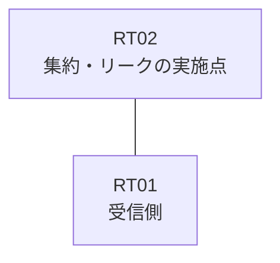

# 問題 20260911-001

> **本問は機器に接続せずに解答すること。追加の show 実行は認めない。**

## トポロジ

あなたは、ネットワークの運用を担当しています。拠点のルーター RT02 は、複数のループバック インターフェイスによって、サービスのためのアドレスのブロック 172.20.46.8/29 を収容しています。RT02 と RT01 は、1本のリンクによって直接に接続されており、そして、EIGRP 65100 が構成されています。



| 対象 | 内容 |
|------|------|
| RT02 のループバック | 172.20.46.9, 172.20.46.10, 172.20.46.11, 172.20.46.12 |
| RT02 の運用系ループバック | 10.227.60.10 |
| RT02 ⇔ RT01 のリンク | 10.62.12.0/24（RT02=10.62.12.1 / RT01=10.62.12.2・GigabitEthernet0/1） |

## 要件

1. RT01 に対して、ブロック 172.20.46.8/29 は、集約のルートとして広告されなければなりません。
2. ブロックのループバックのインターフェイスを、network のステートメントによって EIGRP へ参加させることは、認められていません。
3. 運用のためのループバック 10.227.60.10 (/32) は、引き続き受信されなければなりません。
4. インタフェースの IP アドレッシングは、変更されることはできません。
5. ただし、監視のためのホストである 172.20.46.12 (/32) の明細のルートは、集約とともに、受信されなければなりません。
6. ブロックの内部の明細のルートは、広告されることはできません。

## 現在の状態

いくつかの宛先への通信について、報告が上がっています。あなたは、提示されているところの情報のみを使用して、要求されている状態が満たされていない理由を、特定しなければなりません。

```
RT01# show ip route eigrp | begin Gateway
Gateway of last resort is not set
      10.0.0.0/32 is subnetted, 1 subnets
D        10.227.60.10 [90/409600] via 10.62.12.1, 00:12:39, GigabitEthernet0/1
      172.20.0.0/16 is variably subnetted, 5 subnets, 2 masks
D        172.20.46.8/29 [90/409600] via 10.62.12.1, 00:12:39, GigabitEthernet0/1
D        172.20.46.9/32 [90/409600] via 10.62.12.1, 00:12:39, GigabitEthernet0/1
D        172.20.46.10/32 [90/409600] via 10.62.12.1, 00:12:39, GigabitEthernet0/1
D        172.20.46.11/32 [90/409600] via 10.62.12.1, 00:12:39, GigabitEthernet0/1
D        172.20.46.12/32 [90/409600] via 10.62.12.1, 00:12:39, GigabitEthernet0/1
```

## 設定抜粋

```
RT02# show running-config
Building configuration...
!
interface Loopback0
 ip address 172.20.46.9 255.255.255.255
interface Loopback1
 ip address 172.20.46.10 255.255.255.255
interface Loopback2
 ip address 172.20.46.11 255.255.255.255
interface Loopback3
 ip address 172.20.46.12 255.255.255.255
interface Loopback10
 ip address 10.227.60.10 255.255.255.255
interface GigabitEthernet0/1
 description === to RT01 ===
 ip address 10.62.12.1 255.255.255.252
 ip summary-address eigrp 65100 172.20.46.8 255.255.255.248 leak-map RM-LEAK
!
router eigrp 65100
 network 172.20.46.9 0.0.0.0
 network 172.20.46.10 0.0.0.0
 network 172.20.46.11 0.0.0.0
 network 172.20.46.12 0.0.0.0
 network 10.227.60.10 0.0.0.0
 network 10.62.12.0 0.0.0.3
!
ip prefix-list MON32 seq 5 permit 172.20.46.12/32
ip prefix-list PL01 seq 5 permit 172.20.46.8/29 le 32
!
route-map MON-LEAK permit 10
 match ip address prefix-list PL01
route-map RM-LEAK permit 10
 match ip address prefix-list PL_MON
!
```

## 設問

次のうち、正しいものは、どれですか。

## 選択肢
A. ルート・マップが参照しているところの名前のリストが、定義されていない

B. 対象のループバックのネットワークが、EIGRP のプロセスへ参加させられていない

C. リストにおいて許可されているアドレスが、対象のループバックのアドレスと異なっている

D. leak-map が参照しているところの名前のルート・マップが、定義されていない

E. EIGRP のスタブ・ルーティングの構成によって、広告が制限されている

F. EIGRP の auto-summary が有効にされており、明細の広告に影響している
