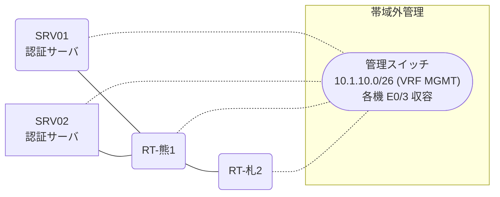

# 問題 20260911-002

> **本問は機器に接続せずに解答すること。追加の show 実行は認めない。**

## トポロジ

あなたは、下記のネットワークの保守を担当する技術者です。2 つの拠点のルータが、共通の認証サーバ群を用いて、管理者の認証を行うように構成されています。一方のルータはサーバと直結しており、他方はそのルーターを経由してサーバに到達します。



### 認証サーバの仕様

| 項目 | SRV01 | SRV02 |
|---|---|---|
| アドレス | 10.99.13.2 | 10.99.14.2 |
| 待受ポート | 1812 / 1813 | 1645 / 1646 |
| 共有鍵 | Rad-8102 | Rad-8102 |
| 受理する送信元 | 10.0.0.1 ・ 10.7.0.2 | 同左 |
| 台帳 | netadmin(15) ・ desk-01(1) ・ SUZUKI(15) | 同左 |
| 現在の稼働状態 | 保守作業のため停止中 | 稼働中 |

### ルータのアドレス

| ルータ | Loopback0 | 認証サーバ方向のインタフェース |
|---|---|---|
| RT-熊1(熊本) | 10.0.0.1 | Ethernet0/0 = 10.99.13.1 |
| RT-札2(札幌) | 10.7.0.2 | Ethernet0/0 = 10.25.12.2 |

## 要件

1. 熊本・札幌 の両拠点で、利用者 netadmin が権限レベル 15 で機器を操作できること。
2. 運用者の遠隔からの接続が失われないこと。
3. 認証は認証サーバ群 NOC-RADIUS を用いること。
4. 緊急時にコンソールから操作できる経路を失わないこと。

## 現在の状態

特権レベルへの昇格が試行された際の、デバッグの出力が、採取されました。

```
RT-札2# debug aaa authentication
AAA/AUTHEN/START (2019292465): port='tty3' list='' action=LOGIN service=ENABLE
AAA/AUTHEN/START (2019292465): non-console enable - default to enable password
AAA/AUTHEN/START (2019292465): Method=ENABLE
AAA/AUTHEN (2019292465): status = GETPASS
AAA/AUTHEN/CONT (2019292465): continue_login (user='(undef)')
AAA/AUTHEN (2019292465): status = GETPASS
AAA/AUTHEN/CONT (2019292465): Method=ENABLE
AAA/AUTHEN(2019292465): password incorrect
AAA/AUTHEN (2019292465): status = FAIL
```

## 設定抜粋

```
RT-札2# show running-config | section aaa
aaa new-model
!
aaa group server radius NOC-RADIUS
 server name RAD1
 server name RAD2
 deadtime 5
!
aaa authentication login default group NOC-RADIUS local
aaa authorization exec default group NOC-RADIUS local
```

## 設問

示されているところの出力について、正しい記述は、どれですか。(2つを選択してください)

## 選択肢
A. 特権レベルへの昇格は成功している。

B. method2 は試行されていない。

C. method1 として認証サーバ群 NOC-RADIUS への問い合わせが行われ、応答が得られていない。

D. method1 として enable パスワードによる認証が行われている。
