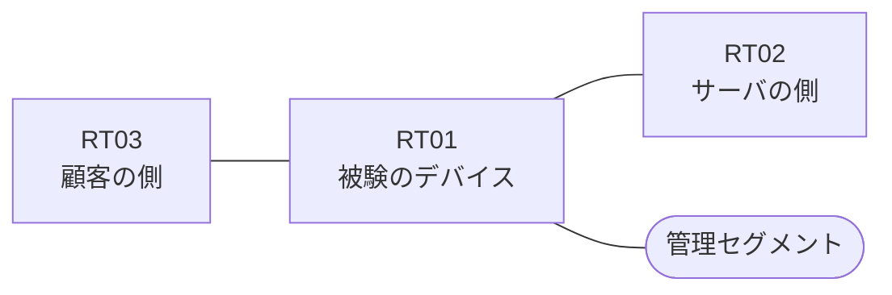

# 問題 20260911-003

> **本問は機器に接続せずに解答すること。追加の show 実行は認めない。**

## トポロジ

あなたは、ネットワークの運用を担当しています。ある企業のネットワークにおいて、RT01 は、顧客の側のネットワークと、サーバの側のネットワークとの間に、配置されています。



| 区間 | 被験デバイス側のインターフェイス | ネットワーク |
|------|----------------------------------|--------------|
| RT03（顧客の側） ⇔ RT01 | `Ethernet0/0` | 10.78.253.0/24 |
| RT01 ⇔ RT02（サーバの側） | `Ethernet0/1` | 10.78.254.0/24 |
| RT01 ⇔ 管理セグメント | `Ethernet0/2` | 10.78.255.0/24 |

## 要件

1. 当該のサーバの他のポートへの通信、および当該のサーバ以外の宛先への通信は、許可されてはなりません。
2. RT01 において、`10.78.32.0/24` から `10.78.38.0/24` までの範囲にあるネットワークからの通信のみが、サーバである `172.24.3.53` の TCP ポート 3389 に到達できなければなりません。
3. アクセス リストは、顧客の側のインターフェイスである `Ethernet0/0` において、着信の方向に適用される必要があります。
4. 対象としていないネットワークが、一致の対象に含まれてはなりません。また、エントリの行数は、最小でなければなりません。
5. ルーティング・プロトコルの種別およびプロセスの配置は、変更されてはなりません。
6. `10.78.41.0/24` からの通信は、許可されてはなりません。
7. `10.78.39.0/24` からの通信は、許可されてはなりません。

## 設問

次のうち、正しいものは、どれですか。

## 選択肢
**A.**
```
access-list 110 permit tcp 10.78.32.0 0.0.3.255 any eq 3389
```

**B.**
```
access-list 110 permit ip 10.78.32.0 0.0.3.255 host 172.24.3.53
```

**C.**
```
access-list 110 permit tcp 10.78.32.0 0.0.7.255 host 172.24.3.53 eq 3389
```

**D.**
```
access-list 110 deny tcp 10.78.38.0 0.0.0.255 host 172.24.3.53 eq 3389
access-list 110 permit tcp 10.78.32.0 0.0.7.255 host 172.24.3.53 eq 3389
```

**E.**
```
access-list 110 permit tcp 10.78.32.0 0.0.3.255 host 172.24.3.53 eq 3389
```

**F.**
```
access-list 110 permit tcp 10.78.32.0 0.0.1.255 host 172.24.3.53 eq 3389
access-list 110 permit tcp 10.78.34.0 0.0.1.255 host 172.24.3.53 eq 3389
access-list 110 permit tcp 10.78.36.0 0.0.1.255 host 172.24.3.53 eq 3389
access-list 110 permit tcp 10.78.38.0 0.0.0.255 host 172.24.3.53 eq 3389
```

**G.**
```
access-list 110 deny tcp 10.78.39.0 0.0.0.255 host 172.24.3.53 eq 3389
access-list 110 permit tcp 10.78.32.0 0.0.7.255 host 172.24.3.53 eq 3389
```

**H.**
```
access-list 110 permit tcp 10.78.32.0 0.0.3.255 host 172.24.3.53 eq 3389
access-list 110 permit tcp 10.78.36.0 0.0.1.255 host 172.24.3.53 eq 3389
access-list 110 permit tcp 10.78.38.0 0.0.0.255 host 172.24.3.53 eq 3389
```
