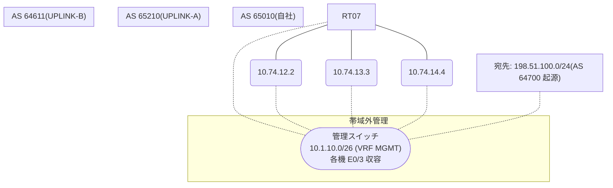

# 問題 20260911-004

> **本問は機器に接続せずに解答すること。追加の show 実行は認めない。**

## シナリオ

あなたは、下記のネットワークの保守を担当する技術者です。自社のルータ RT07 は、外部のネットワーク 198.51.100.0/24 への到達性を、複数の経路を通じて、確立しています。 UPLINK-A とは、2 本のリンクで、接続されています。 UPLINK-B とも、接続されています。運用チームは、対向 AS の経路選択に影響を与えることを意図して、示されているところの route-map を、外部の近隣に対して、適用しました。しかしながら、対向 AS から受信するところのトラフィックの経路は、変更されていません。示されているところの出力、および、構成に基づいて、判断すること。なお、機器の構成は、示されている抜粋のほかは、既定値である。



## 出力

```
RT07# show ip bgp
BGP table version is 29, local router ID is 152.152.152.152
Status codes: s suppressed, d damped, h history, * valid, > best, i - internal, 
              r RIB-failure, S Stale, m multipath, b backup-path, f RT-Filter, 
              x best-external, a additional-path, c RIB-compressed, 
              t secondary path, L long-lived-stale,
Origin codes: i - IGP, e - EGP, ? - incomplete
RPKI validation codes: V valid, I invalid, N Not found

     Network          Next Hop            Metric LocPrf Weight Path
 *    198.51.100.0     10.74.13.3                             0 65210 65210 64700 64700 i
 *                     10.74.14.4                             0 64611 64700 i
 *>                    10.74.12.2                             0 65210 64700 i
```
```
RT07# show ip bgp 198.51.100.0
BGP routing table entry for 198.51.100.0/24, version 29
Paths: (3 available, best #3, table default)
  Advertised to update-groups:
     5         
  Refresh Epoch 2
  65210 65210 64700 64700
    10.74.13.3 from 10.74.13.3 (144.144.144.144)
      Origin IGP, localpref 100, valid, external
      rx pathid: 0, tx pathid: 0
      Updated on Jul 16 2026 03:10:56 UTC
  Refresh Epoch 4
  64611 64700
    10.74.14.4 from 10.74.14.4 (49.49.49.49)
      Origin IGP, localpref 100, valid, external
      rx pathid: 0, tx pathid: 0
      Updated on Jul 16 2026 03:37:14 UTC
  Refresh Epoch 3
  65210 64700
    10.74.12.2 from 10.74.12.2 (165.165.165.165)
      Origin IGP, localpref 100, valid, external, best
      rx pathid: 0, tx pathid: 0x0
      Updated on Jul 16 2026 02:29:07 UTC
```
```
RT07# show running-config | section router bgp
router bgp 65010
 bgp router-id 152.152.152.152
 bgp log-neighbor-changes
 neighbor 10.74.12.2 remote-as 65210
 neighbor 10.74.13.3 remote-as 65210
 neighbor 10.74.14.4 remote-as 64611
 !
 address-family ipv4
  neighbor 10.74.12.2 activate
  neighbor 10.74.12.2 route-map RM-PREF-OUT out
  neighbor 10.74.13.3 activate
  neighbor 10.74.14.4 activate
 exit-address-family
```
```
RT07# show running-config | section route-map
route-map RM-PREF-OUT permit 10
 set local-preference 300
```

## 設問

この事象の原因である可能性が、最も高いものは、どれですか。(1つを選択してください)

## 選択肢
A. LOCAL_PREF は iBGP でのみ交換される属性であり、eBGP の近隣には送信されない

B. weight は、それを設定したルータのローカルでのみ有効であり、iBGP の近隣には伝播しない

C. 設定変更後に BGP セッションの再評価(clear)が行われていない

D. MED は、異なる隣接 AS から受信した経路の間では、既定では比較されない
