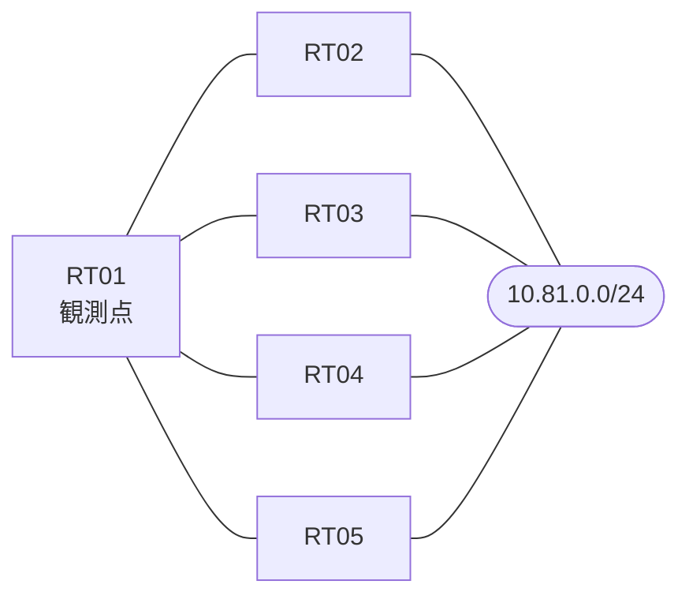

# 問題 20260911-005

> **本問は機器に接続せずに解答すること。追加の show 実行は認めない。**

## シナリオ

あなたは、下記のネットワークの保守を担当する技術者です。拠点のルータ RT01 は、複数の隣接するルーターを経由して、10.81.0.0/24 への経路を学習しています。ネットワークは単一の EIGRP のオートノマス・システム(100)として運用されており、そして、冗長なパスの活用が検討されています。経路の選好に関する挙動のレビューが、実施されています。不等コストのロード・バランシングのために用いられる倍率は、示されている値を超えて拡大されてはなりません。RT01 における 10.81.0.0/24 への転送のパスは、運用の設計の意図と一致していなければなりません。インタフェースの IP アドレッシングは、変更されてはなりません。構成の変更は、1 箇所に限られなければなりません。既存の隣接関係は、維持される必要があります。



| 対象 | 内容 |
|------|------|
| RT01 ⇔ RT02 | Ethernet0/0・10.202.2.0/24（RT01 側の delay = 100） |
| RT01 ⇔ RT03 | Ethernet0/1・10.202.3.0/24（RT01 側の delay = 450） |
| RT01 ⇔ RT04 | Ethernet0/2・10.202.4.0/24（RT01 側の delay = 400） |
| RT01 ⇔ RT05 | Ethernet0/3・10.202.5.0/24（RT01 側の delay = 150） |
| 宛先 | 10.81.0.0/24（すべての隣接から到達可能） |

## 出力

```
RT01# show running-config | section interface
interface Ethernet0/0
 description === to RT02 ===
 ip address 10.202.2.1 255.255.255.0
 delay 100
interface Ethernet0/1
 description === to RT03 ===
 ip address 10.202.3.1 255.255.255.0
 delay 450
interface Ethernet0/2
 description === to RT04 ===
 ip address 10.202.4.1 255.255.255.0
 delay 400
interface Ethernet0/3
 description === to RT05 ===
 ip address 10.202.5.1 255.255.255.0
 delay 150
```
```
RT01# show ip eigrp topology all-links
EIGRP-IPv4 Topology Table for AS(100)/ID(40.0.0.1)
Codes: P - Passive, A - Active, U - Update, Q - Query, R - Reply,
       r - reply Status, s - sia Status 

P 10.202.2.0/24, 1 successors, FD is 281600, serno 2
        via Connected, Ethernet0/0
P 10.202.3.0/24, 1 successors, FD is 371200, serno 3
        via Connected, Ethernet0/1
P 10.81.0.0/24, 1 successors, FD is 435200, serno 8, refcount 1
        via 10.202.2.2 (435200/409600), Ethernet0/0
        via 10.202.5.5 (492800/454400), Ethernet0/3
        via 10.202.4.4 (517120/414720), Ethernet0/2
        via 10.202.3.3 (524800/409600), Ethernet0/1
```
```
RT01# show running-config | section router eigrp
router eigrp 100
 eigrp router-id 40.0.0.1
 network 10.202.0.0 0.0.255.255
 no auto-summary
```

## 設問

現在の最良の経路を変更することなく、RT05(10.202.5.5)経由の経路も転送に利用されるようにするために、実施されなければならない変更は、どれですか。(1つを選択してください)

## 選択肢
A. RT01 の Ethernet0/3 の delay を 100 へ下げ、かつ RT05 の宛先の側の delay を 100 へ下げる

B. RT01 の Ethernet0/3 の delay を 100 へ下げる

C. RT01 の EIGRP のプロセスにおいて、variance を 5 へ引き上げる

D. RT01 において、10.81.0.0/24 へのスタティック・ルートを 10.202.5.5 宛てに追加する

E. RT05 の、宛先の側のインタフェースの delay を 100 へ下げる
