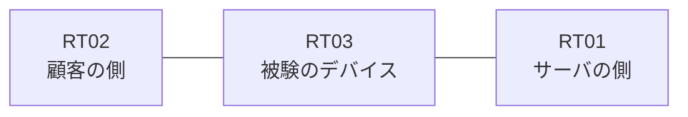

# 問題 20260911-008

> **本問は機器に接続せずに解答すること。追加の show 実行は認めない。**

## シナリオ

あなたの組織は、下記に示されているところのネットワークを運用しています。ある企業のネットワークにおいて、RT03 は、顧客の側のネットワークと、サーバの側のネットワークとの間に配置されており、IPv6 によって運用されています。本作業は、日中の時間帯において実施されるという理由により、対象外であるところのデバイスに対する構成の変更は、許可されていません。拒否のエントリを使用してはなりません。RT03 において、`2001:DB8:33:30::/64`、`2001:DB8:33:31::/64`、`2001:DB8:33:32::/64` のネットワークからの通信のみが、`2001:DB8:33:FF::10` の TCP ポート 80 に到達できなければなりません。`2001:DB8:33:35::/64` からの通信は、許可されることはできません。




## 設問

次のうち、正しいものは、どれですか。

## 選択肢
**A.**
```
sequence 10 permit ipv6 2001:DB8:33:30::/63 any
```

**B.**
```
sequence 10 permit ipv6 2001:DB8:33:30::/61 any
```

**C.**
```
sequence 10 permit ipv6 2001:DB8:33:30::/62 any
```

**D.**
```
sequence 10 permit ipv6 2001:DB8:33:30::/62 0.0.3.255 any
```

**E.**
```
sequence 10 deny ipv6 2001:DB8:33:33::/64 any
sequence 20 permit ipv6 2001:DB8:33:30::/62 any
```

**F.**
```
sequence 10 permit ipv6 2001:DB8:33:30::/64 any
sequence 20 permit ipv6 2001:DB8:33:31::/64 any
sequence 30 permit ipv6 2001:DB8:33:32::/64 any
```
