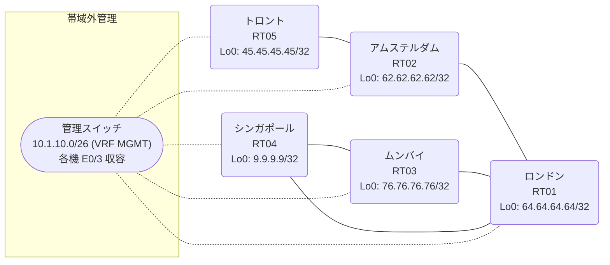

# 問題 20260912-001

> **本問は機器に接続せずに解答すること。追加の show 実行は認めない。**

## シナリオ

あなたの組織は、下記に示されているところのネットワークを運用しています。あなたの会社のネットワークは、複数のルーティング・ドメインが、境界のルータによって接続され、そして、すべての拠点のリーチアビリティが提供されている、というものです。ルーティングの設計の詳細は、示されているところのコンフィギュレーションから、読み取られることが、期待されています。各拠点のルータと、拠点のネットワークとの対応は、下記の表に示されているとおりです。一部の通信が、意図されているとおりに動作していない、という報告があります。あなたは、示されているところの出力および構成に基づいて、その構成が、下記において記述されているとおりに動作していない理由を、判断する必要があります。再配送に対するフィルタの適用は、禁止されているところのものです。シード・メトリック `10000 10 255 1 1500` は、redistribute のステートメントごとに、個別に指定されなければなりません。redistribute によって参照されるところのプロセス ID / AS 番号は、その境界に実在する隣接のドメインのものと一致させられ、そして、実在しないプロセスへの参照が、残置されてはなりません。ルーティング・プロトコルの種別およびプロセスの配置は、変更されてはなりません。各サイトのネットワークは、ドメインをまたいで、すべてのサイトから、到達されることができること。



| 拠点 | ルータ | 拠点網 |
|------|--------|----------------------|
| アムステルダム | RT02 | `62.62.62.62/32` |
| シンガポール | RT04 | `9.9.9.9/32` |
| トロント | RT05 | `45.45.45.45/32` |
| ムンバイ | RT03 | `76.76.76.76/32` |
| ロンドン | RT01 | `64.64.64.64/32` |

リンク一覧:
```
  RT01:E0/0(.1) ── RT03:E0/0(.2)   10.2.46.0/30
  RT01:E0/1(.1) ── RT02:E0/0(.2)   10.195.84.0/30
  RT02:E0/1(.1) ── RT05:E0/0(.2)   10.167.104.0/30
  RT03:E0/1(.1) ── RT04:E0/0(.2)   10.33.178.0/30
  RT01:E0/2(.1) ── RT04:E0/1(.2)   10.7.207.0/30
```

## 出力

```
RT01# show access-lists
Standard IP access list 53
    10 deny   45.45.45.45
    20 permit any
```
```
RT05# show running-config | section router
router eigrp 377
 network 10.167.104.0 0.0.0.3
 network 45.45.45.45 0.0.0.0
```
```
RT02# show running-config | section router
router eigrp 377
 network 10.167.104.0 0.0.0.3
 network 10.195.84.0 0.0.0.3
 network 62.62.62.62 0.0.0.0
 passive-interface Loopback0
```
```
RT01# show ip prefix-list
ip prefix-list PL-OLD1: 2 entries
   seq 5 deny 45.45.45.45/32
   seq 10 permit 0.0.0.0/0 le 32
ip prefix-list PL-SVC: 1 entries
   seq 5 permit 62.62.62.62/32
```
```
RT03# show running-config | section router
router ospf 26
 router-id 76.76.76.76
 network 10.2.46.0 0.0.0.3 area 0
 network 10.33.178.0 0.0.0.3 area 0
 network 76.76.76.76 0.0.0.0 area 0
```
```
RT04# show running-config | section router
router ospf 26
 router-id 9.9.9.9
 network 9.9.9.9 0.0.0.0 area 0
 network 10.7.207.0 0.0.0.3 area 0
 network 10.33.178.0 0.0.0.3 area 0
```
```
RT03# show ip route
Gateway of last resort is not set
      9.0.0.0/32 is subnetted, 1 subnets
O        9.9.9.9 [110/11] via 10.33.178.2, 00:03:46, Ethernet0/1
      10.0.0.0/8 is variably subnetted, 7 subnets, 2 masks
C        10.2.46.0/30 is directly connected, Ethernet0/0
L        10.2.46.2/32 is directly connected, Ethernet0/0
O        10.7.207.0/30 [110/20] via 10.33.178.2, 00:03:46, Ethernet0/1
                       [110/20] via 10.2.46.1, 00:03:51, Ethernet0/0
C        10.33.178.0/30 is directly connected, Ethernet0/1
L        10.33.178.1/32 is directly connected, Ethernet0/1
O E2     10.167.104.0/30 [110/20] via 10.2.46.1, 00:03:51, Ethernet0/0
O E2     10.195.84.0/30 [110/20] via 10.2.46.1, 00:03:51, Ethernet0/0
      45.0.0.0/32 is subnetted, 1 subnets
O E2     45.45.45.45 [110/20] via 10.2.46.1, 00:03:51, Ethernet0/0
      64.0.0.0/32 is subnetted, 1 subnets
O        64.64.64.64 [110/11] via 10.2.46.1, 00:03:51, Ethernet0/0
      76.0.0.0/32 is subnetted, 1 subnets
C        76.76.76.76 is directly connected, Loopback0
```
```
RT01# show running-config | section router
router eigrp 377
 network 10.195.84.0 0.0.0.3
 network 64.64.64.64 0.0.0.0
 redistribute ospf 26 match internal external 1 external 2 metric 10000 10 255 1 1500
 passive-interface Loopback0
router ospf 26
 router-id 64.64.64.64
 redistribute eigrp 377 route-map RM-SVC
 network 10.2.46.0 0.0.0.3 area 0
 network 10.7.207.0 0.0.0.3 area 0
 network 64.64.64.64 0.0.0.0 area 0
```
```
RT01# show route-map
route-map RM-SVC, deny, sequence 10
  Match clauses:
    ip address prefix-lists: PL-SVC 
  Set clauses:
  Policy routing matches: 0 packets, 0 bytes
route-map RM-SVC, permit, sequence 20
  Match clauses:
  Set clauses:
  Policy routing matches: 0 packets, 0 bytes
route-map RM-OLD1, deny, sequence 10
  Match clauses:
    ip address prefix-lists: PL-OLD1 
  Set clauses:
  Policy routing matches: 0 packets, 0 bytes
route-map RM-OLD1, permit, sequence 20
  Match clauses:
  Set clauses:
  Policy routing matches: 0 packets, 0 bytes
```
```
RT04# show ip route
Gateway of last resort is not set
      9.0.0.0/32 is subnetted, 1 subnets
C        9.9.9.9 is directly connected, Loopback0
      10.0.0.0/8 is variably subnetted, 7 subnets, 2 masks
O        10.2.46.0/30 [110/20] via 10.33.178.1, 00:04:21, Ethernet0/0
                      [110/20] via 10.7.207.1, 00:04:22, Ethernet0/1
C        10.7.207.0/30 is directly connected, Ethernet0/1
L        10.7.207.2/32 is directly connected, Ethernet0/1
C        10.33.178.0/30 is directly connected, Ethernet0/0
L        10.33.178.2/32 is directly connected, Ethernet0/0
O E2     10.167.104.0/30 [110/20] via 10.7.207.1, 00:04:22, Ethernet0/1
O E2     10.195.84.0/30 [110/20] via 10.7.207.1, 00:04:22, Ethernet0/1
      45.0.0.0/32 is subnetted, 1 subnets
O E2     45.45.45.45 [110/20] via 10.7.207.1, 00:04:22, Ethernet0/1
      64.0.0.0/32 is subnetted, 1 subnets
O        64.64.64.64 [110/11] via 10.7.207.1, 00:04:22, Ethernet0/1
      76.0.0.0/32 is subnetted, 1 subnets
O        76.76.76.76 [110/11] via 10.33.178.1, 00:04:21, Ethernet0/0
```
```
RT05# show ip route
Gateway of last resort is not set
      9.0.0.0/32 is subnetted, 1 subnets
D EX     9.9.9.9 [170/309760] via 10.167.104.1, 00:04:04, Ethernet0/0
      10.0.0.0/8 is variably subnetted, 6 subnets, 2 masks
D EX     10.2.46.0/30 [170/309760] via 10.167.104.1, 00:04:40, Ethernet0/0
D EX     10.7.207.0/30 [170/309760] via 10.167.104.1, 00:04:40, Ethernet0/0
D EX     10.33.178.0/30 [170/309760] via 10.167.104.1, 00:04:08, Ethernet0/0
C        10.167.104.0/30 is directly connected, Ethernet0/0
L        10.167.104.2/32 is directly connected, Ethernet0/0
D        10.195.84.0/30 [90/307200] via 10.167.104.1, 00:04:40, Ethernet0/0
      45.0.0.0/32 is subnetted, 1 subnets
C        45.45.45.45 is directly connected, Loopback0
      62.0.0.0/32 is subnetted, 1 subnets
D        62.62.62.62 [90/409600] via 10.167.104.1, 00:04:40, Ethernet0/0
      64.0.0.0/32 is subnetted, 1 subnets
D        64.64.64.64 [90/435200] via 10.167.104.1, 00:04:40, Ethernet0/0
      76.0.0.0/32 is subnetted, 1 subnets
D EX     76.76.76.76 [170/309760] via 10.167.104.1, 00:04:08, Ethernet0/0
```

## 設問

次のうち、正しいものは、どれですか。

## 選択肢
A. RT01 の router ospf 26 配下に redistribute が設定されていない

B. RT01 の redistribute に適用された route-map が特定の拠点網を deny している

C. RT01 と RT03 側ドメインの間のリンクで MTU が一致していない

D. RT03 の router ospf 26 に Loopback0 の network 文が設定されていない

E. RT01 の router ospf 26 配下の redistribute が、実在しないプロセス/AS を参照している

F. RT03 の router ospf 26 で、上流側インタフェースが passive-interface に設定されている
