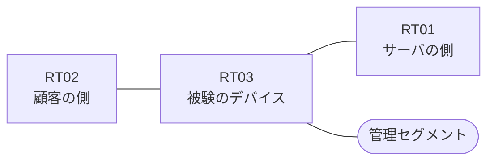

# 問題 20260912-003

> **本問は機器に接続せずに解答すること。追加の show 実行は認めない。**

## シナリオ

あなたの組織は、下記に示されているところのネットワークを運用しています。ある企業のネットワークにおいて、RT03 は、顧客の側のネットワークと、サーバの側のネットワークとの間に、配置されています。要求されているところの動作が、得られていない、ということが、報告されています。原因として、**アクセス・リストが、顧客の側ではなくサーバの側のインターフェイスに、着信の方向で適用されている** と **戻りの通信を許可するアクセス・リストに、established のキーワードを伴うエントリが存在しない** と **established のキーワードが、戻りの側ではなく、通信を開始する側のアクセス・リストに記述されている** の 3 つが、想定されています。機器の構成は、まだ取得されていません。示されているところのアクセス・リストの適用は、変更されることはできません。RT03 において、`10.136.96.0/24`、`10.136.97.0/24`、`10.136.98.0/24`、`10.136.99.0/24` のネットワークから、サーバである `172.25.113.86` の TCP ポート 80 への通信は、セッションを確立できなければなりません。顧客の側のインターフェイスである `Ethernet0/0` と、サーバの側のインターフェイスである `Ethernet0/1` の双方において、着信の方向にアクセス リストが適用されています。サーバの側のネットワークから、顧客の側のネットワークへ**新たに開始される**通信は、許可されてはなりません。本作業は、日中の時間帯において実施されるという理由により、対象外であるところのデバイスに対する構成の変更は、許可されていません。

| 区間 | 被験デバイス側のインターフェイス | ネットワーク |
|------|----------------------------------|--------------|
| RT02（顧客の側） ⇔ RT03 | `Ethernet0/0` | 10.136.253.0/24 |
| RT03 ⇔ RT01（サーバの側） | `Ethernet0/1` | 10.136.254.0/24 |
| RT03 ⇔ 管理セグメント | `Ethernet0/2` | 10.136.255.0/24 |

## 出力

観測 | TCP セッション
--- | ---
送信元が 10.136.96.0/24 のネットワークにあるホストから、172.25.113.86 の TCP ポート 80 宛ての通信 | 確立できない
送信元が 10.136.97.0/24 のネットワークにあるホストから、172.25.113.86 の TCP ポート 80 宛ての通信 | 確立できない
送信元が 10.136.98.0/24 のネットワークにあるホストから、172.25.113.86 の TCP ポート 80 宛ての通信 | 確立できない
送信元が 10.136.99.0/24 のネットワークにあるホストから、172.25.113.86 の TCP ポート 80 宛ての通信 | 確立できない
送信元が 10.136.100.0/24 のネットワークにあるホストから、172.25.113.86 の TCP ポート 80 宛ての通信 | 確立できない
送信元が 10.136.101.0/24 のネットワークにあるホストから、172.25.113.86 の TCP ポート 80 宛ての通信 | 確立できない
送信元が 10.136.250.0/24 のネットワークにあるホストから、172.25.113.86 の TCP ポート 80 宛ての通信 | 確立できない
送信元が 10.136.96.0/24 のネットワークにあるホストから、172.25.113.86 の TCP ポート 23 宛ての通信 | 確立できない
送信元が 10.136.96.0/24 のネットワークにあるホストから、172.25.113.164 の TCP ポート 80 宛ての通信 | 確立できない

## 設問

この事象の原因を特定するために、次に取得するべき出力として、最も多くの候補を除外できるものは、どれですか。(1つを選択してください)

## 選択肢
A. RT03 における `show interfaces Ethernet0/0 | include packets`

B. RT03 における `show ip route`

C. RT03 における `show running-config | section ^interface`

D. RT03 における `show ip access-lists`

E. RT03 における `show ip interface Ethernet0/0 | include access list`
