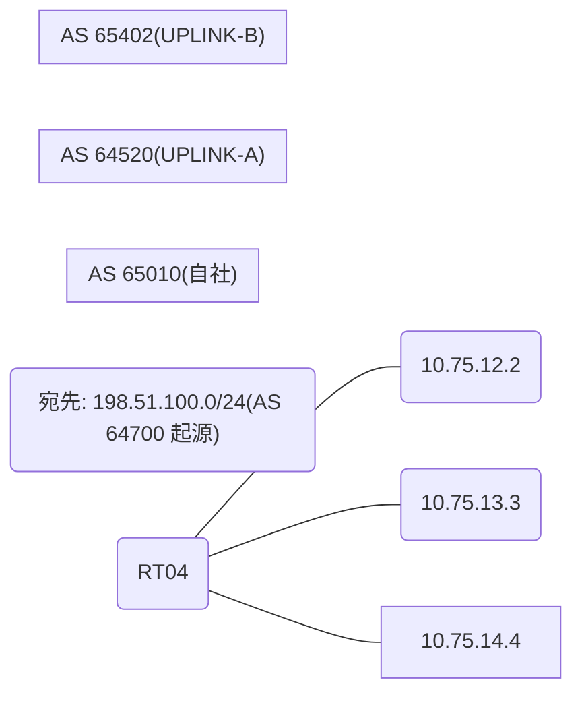

# 問題 20260912-004

> **本問は機器に接続せずに解答すること。追加の show 実行は認めない。**

## トポロジ

あなたの組織は、下記に示されているところのネットワークを運用しています。自社のルーター RT04 は、外部のネットワーク 198.51.100.0/24 への到達性を、複数の経路を通じて、確立しています。 UPLINK-A とは、2 本のリンクで、接続されています。 UPLINK-B とも、接続されています。



## 要件

1. 示されているところの出力、および、構成に基づいて、判断すること。
2. なお、機器の構成は、示されている抜粋のほかは、既定値である。

## 現在の状態

外部との 1 つのセッションが失われ、それまで使用されていたところの経路は、取り下げられました。ルータは、残るところの経路からの、ベストパスの選出を、行おうとしています。示されているところの出力は、その時点で、採取されたものです。

```
RT04# show ip bgp
BGP table version is 48, local router ID is 188.188.188.188
Status codes: s suppressed, d damped, h history, * valid, > best, i - internal, 
              r RIB-failure, S Stale, m multipath, b backup-path, f RT-Filter, 
              x best-external, a additional-path, c RIB-compressed, 
              t secondary path, L long-lived-stale,
Origin codes: i - IGP, e - EGP, ? - incomplete
RPKI validation codes: V valid, I invalid, N Not found

     Network          Next Hop            Metric LocPrf Weight Path
 *    198.51.100.0     10.75.14.4                             0 65402 65402 64700 64700 i
 *                     10.75.12.2                             0 64520 64700 i
 *                     10.75.13.3                             0 64520 64700 i
```
```
RT04# show ip bgp 198.51.100.0
BGP routing table entry for 198.51.100.0/24, version 48
BGP Bestpath: compare-routerid
Paths: (3 available, no best path)
  Not advertised to any peer
  Refresh Epoch 1
  65402 65402 64700 64700
    10.75.14.4 from 10.75.14.4 (185.185.185.185)
      Origin IGP, localpref 100, valid, external
      rx pathid: 0, tx pathid: 0
      Updated on May 18 2026 18:02:56 UTC
  Refresh Epoch 3
  64520 64700
    10.75.12.2 from 10.75.12.2 (235.235.235.235)
      Origin IGP, localpref 100, valid, external
      rx pathid: 0, tx pathid: 0
      Updated on May 18 2026 15:55:14 UTC
  Refresh Epoch 2
  64520 64700
    10.75.13.3 from 10.75.13.3 (246.246.246.246)
      Origin IGP, localpref 100, valid, external
      rx pathid: 0, tx pathid: 0
      Updated on May 18 2026 15:25:07 UTC
```

## 設定抜粋

```
RT04# show running-config | section router bgp
router bgp 65010
 bgp router-id 188.188.188.188
 bgp log-neighbor-changes
 bgp bestpath compare-routerid
 neighbor 10.75.12.2 remote-as 64520
 neighbor 10.75.13.3 remote-as 64520
 neighbor 10.75.14.4 remote-as 65402
 !
 address-family ipv4
  neighbor 10.75.12.2 activate
  neighbor 10.75.13.3 activate
  neighbor 10.75.14.4 activate
 exit-address-family
```

## 設問

示されているところの出力に基づいて、この後、198.51.100.0/24 のベストパスとして選出され、転送に使用されるところの経路は、どれですか。(1つを選択してください)

## 選択肢
A. next hop 10.75.14.4 の経路

B. next hop 10.75.13.3 の経路

C. next hop 10.75.12.2 の経路
