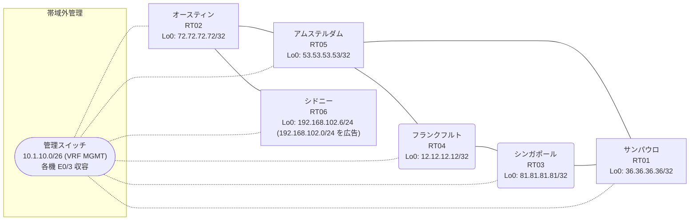

# 問題 20260912-006

> **本問は機器に接続せずに解答すること。追加の show 実行は認めない。**

## シナリオ

あなたは、下記のネットワークの保守を担当する技術者です。あなたの会社のネットワークは、OSPF のドメインと EIGRP のドメインとが、2 つの境界のルーターによって接続され、そして、それらは境界において接続されています。顧客のネットワーク `192.168.102.0/24` は、シドニー のサイトにおいて、別のルーティング・プロトコルによって学習され、そして、再配送によって、社内へ持ち込まれています。ルーティングの設計の詳細は、示されているところのコンフィギュレーションから、読み取られることが、期待されています。いくつかの宛先への通信について、報告が上がっています。あなたは、提示されているところの情報のみを使用して、要求されている状態が満たされていない理由を、特定しなければなりません。すべてのサイトから、`192.168.102.0/24` を含むところのすべての宛先へ、到達することができること。スタティック ルートおよび既定のルートによる迂回は、実施されることはできません。既存の相互再配送の設計が、削除または停止されることはできません。スタティック・ルートおよび既定のルートによる迂回は、実施されてはなりません。是正は、prefix-list と、再配送点における distribute-list によって、実装される必要があります。`192.168.102.0/24` 宛のトラフィックが RT06 へ配送され、経路の周回が、発生していないこと。



| 拠点 | ルータ | 拠点網 / 広告網 |
|------|--------|------------------|
| アムステルダム | RT05 | 53.53.53.53/32 |
| オースティン | RT02 | 72.72.72.72/32 |
| サンパウロ | RT01 | 36.36.36.36/32 |
| シドニー | RT06 | 192.168.102.6/24 (`192.168.102.0/24` を広告) |
| シンガポール | RT03 | 81.81.81.81/32 |
| フランクフルト | RT04 | 12.12.12.12/32 |

リンク一覧:
```
  RT03:E0/0(.1) ── RT01:E0/0(.2)   172.16.20.0/24
  RT03:E0/1(.1) ── RT04:E0/0(.3)   172.16.135.0/24
  RT01:E0/1(.2) ── RT05:E0/0(.4)   172.16.25.0/24
  RT04:E0/1(.3) ── RT05:E0/1(.4)   172.16.140.0/24
  RT05:E0/2(.4) ── RT02:E0/0(.5)   172.16.152.0/24
  RT02:E0/1(.5) ── RT06:E0/0(.6)   172.16.107.0/24
```

## 出力

```
RT05# show ip route
Gateway of last resort is not set
      12.0.0.0/32 is subnetted, 1 subnets
D EX     12.12.12.12 [170/281856] via 172.16.140.3, 00:04:05, Ethernet0/1
                     [170/281856] via 172.16.25.2, 00:04:05, Ethernet0/0
      36.0.0.0/32 is subnetted, 1 subnets
D EX     36.36.36.36 [170/281856] via 172.16.140.3, 00:04:07, Ethernet0/1
                     [170/281856] via 172.16.25.2, 00:04:07, Ethernet0/0
      53.0.0.0/32 is subnetted, 1 subnets
C        53.53.53.53 is directly connected, Loopback0
      72.0.0.0/32 is subnetted, 1 subnets
D        72.72.72.72 [90/409600] via 172.16.152.5, 00:04:52, Ethernet0/2
      81.0.0.0/32 is subnetted, 1 subnets
D EX     81.81.81.81 [170/281856] via 172.16.140.3, 00:04:07, Ethernet0/1
                     [170/281856] via 172.16.25.2, 00:04:07, Ethernet0/0
      172.16.0.0/16 is variably subnetted, 9 subnets, 2 masks
D EX     172.16.20.0/24 [170/281856] via 172.16.140.3, 00:04:07, Ethernet0/1
                        [170/281856] via 172.16.25.2, 00:04:07, Ethernet0/0
C        172.16.25.0/24 is directly connected, Ethernet0/0
L        172.16.25.4/32 is directly connected, Ethernet0/0
D        172.16.107.0/24 [90/307200] via 172.16.152.5, 00:04:52, Ethernet0/2
D EX     172.16.135.0/24 [170/281856] via 172.16.140.3, 00:04:12, Ethernet0/1
                         [170/281856] via 172.16.25.2, 00:04:12, Ethernet0/0
C        172.16.140.0/24 is directly connected, Ethernet0/1
L        172.16.140.4/32 is directly connected, Ethernet0/1
C        172.16.152.0/24 is directly connected, Ethernet0/2
L        172.16.152.4/32 is directly connected, Ethernet0/2
D EX  192.168.102.0/24 [170/281856] via 172.16.140.3, 00:04:07, Ethernet0/1
```
```
RT05# show ip eigrp topology 192.168.102.0 255.255.255.0
EIGRP-IPv4 Topology Entry for AS(56)/ID(53.53.53.53) for 192.168.102.0/24
  State is Passive, Query origin flag is 1, 1 Successor(s), FD is 281856
  Descriptor Blocks:
  172.16.140.3 (Ethernet0/1), from 172.16.140.3, Send flag is 0x0
      Composite metric is (281856/2816), route is External
      Vector metric:
        Minimum bandwidth is 10000 Kbit
        Total delay is 1010 microseconds
        Reliability is 255/255
        Load is 1/255
        Minimum MTU is 1500
        Hop count is 1
        Originating router is 12.12.12.12
      External data:
        AS number of route is 40
        External protocol is OSPF, external metric is 20
        Administrator tag is 0 (0x00000000)
  172.16.152.5 (Ethernet0/2), from 172.16.152.5, Send flag is 0x0
      Composite metric is (307456/281856), route is External
      Vector metric:
        Minimum bandwidth is 10000 Kbit
        Total delay is 2010 microseconds
        Reliability is 255/255
        Load is 1/255
        Minimum MTU is 1500
        Hop count is 2
        Originating router is 192.168.102.6
      External data:
        AS number of route is 0
        External protocol is RIP, external metric is 0
        Administrator tag is 0 (0x00000000)
```
```
RT02# show ip route
Gateway of last resort is not set
      12.0.0.0/32 is subnetted, 1 subnets
D EX     12.12.12.12 [170/307456] via 172.16.152.4, 00:04:23, Ethernet0/0
      36.0.0.0/32 is subnetted, 1 subnets
D EX     36.36.36.36 [170/307456] via 172.16.152.4, 00:05:07, Ethernet0/0
      53.0.0.0/32 is subnetted, 1 subnets
D        53.53.53.53 [90/409600] via 172.16.152.4, 00:05:16, Ethernet0/0
      72.0.0.0/32 is subnetted, 1 subnets
C        72.72.72.72 is directly connected, Loopback0
      81.0.0.0/32 is subnetted, 1 subnets
D EX     81.81.81.81 [170/307456] via 172.16.152.4, 00:04:30, Ethernet0/0
      172.16.0.0/16 is variably subnetted, 8 subnets, 2 masks
D EX     172.16.20.0/24 [170/307456] via 172.16.152.4, 00:05:07, Ethernet0/0
D        172.16.25.0/24 [90/307200] via 172.16.152.4, 00:05:16, Ethernet0/0
C        172.16.107.0/24 is directly connected, Ethernet0/1
L        172.16.107.5/32 is directly connected, Ethernet0/1
D EX     172.16.135.0/24 [170/307456] via 172.16.152.4, 00:04:30, Ethernet0/0
D        172.16.140.0/24 [90/307200] via 172.16.152.4, 00:05:16, Ethernet0/0
C        172.16.152.0/24 is directly connected, Ethernet0/0
L        172.16.152.5/32 is directly connected, Ethernet0/0
D EX  192.168.102.0/24 [170/281856] via 172.16.107.6, 00:04:26, Ethernet0/1
```
```
RT03# show ip route
Gateway of last resort is not set
      12.0.0.0/32 is subnetted, 1 subnets
O        12.12.12.12 [110/11] via 172.16.135.3, 00:04:45, Ethernet0/1
      36.0.0.0/32 is subnetted, 1 subnets
O        36.36.36.36 [110/11] via 172.16.20.2, 00:04:50, Ethernet0/0
      53.0.0.0/32 is subnetted, 1 subnets
O E2     53.53.53.53 [110/20] via 172.16.135.3, 00:04:45, Ethernet0/1
                     [110/20] via 172.16.20.2, 00:04:50, Ethernet0/0
      72.0.0.0/32 is subnetted, 1 subnets
O E2     72.72.72.72 [110/20] via 172.16.135.3, 00:04:45, Ethernet0/1
                     [110/20] via 172.16.20.2, 00:04:50, Ethernet0/0
      81.0.0.0/32 is subnetted, 1 subnets
C        81.81.81.81 is directly connected, Loopback0
      172.16.0.0/16 is variably subnetted, 8 subnets, 2 masks
C        172.16.20.0/24 is directly connected, Ethernet0/0
L        172.16.20.1/32 is directly connected, Ethernet0/0
O E2     172.16.25.0/24 [110/20] via 172.16.135.3, 00:04:45, Ethernet0/1
                        [110/20] via 172.16.20.2, 00:04:50, Ethernet0/0
O E2     172.16.107.0/24 [110/20] via 172.16.135.3, 00:04:45, Ethernet0/1
                         [110/20] via 172.16.20.2, 00:04:50, Ethernet0/0
C        172.16.135.0/24 is directly connected, Ethernet0/1
L        172.16.135.1/32 is directly connected, Ethernet0/1
O E2     172.16.140.0/24 [110/20] via 172.16.135.3, 00:04:45, Ethernet0/1
                         [110/20] via 172.16.20.2, 00:04:50, Ethernet0/0
O E2     172.16.152.0/24 [110/20] via 172.16.135.3, 00:04:45, Ethernet0/1
                         [110/20] via 172.16.20.2, 00:04:50, Ethernet0/0
O E2  192.168.102.0/24 [110/20] via 172.16.20.2, 00:04:50, Ethernet0/0
```
```
RT05# show ip protocols | include Routing Protocol|Distance
Routing Protocol is "application"
    Gateway         Distance      Last Update
  Distance: (default is 4)
Routing Protocol is "eigrp 56"
      Distance: internal 90 external 170
    Gateway         Distance      Last Update
  Distance: internal 90 external 170
```
```
RT03# traceroute 192.168.102.6 probe 1 timeout 1 ttl 1 8
Type escape sequence to abort.
Tracing the route to 192.168.102.6
VRF info: (vrf in name/id, vrf out name/id)
  1 172.16.20.2 1 msec
  2 172.16.25.4 2 msec
  3 172.16.140.3 1 msec
  4 172.16.135.1 1 msec
  5 172.16.20.2 2 msec
  6 172.16.25.4 4 msec
  7 172.16.140.3 3 msec
  8 172.16.135.1 2 msec
```
```
RT03# show running-config | section router
router ospf 40
 router-id 81.81.81.81
 network 81.81.81.81 0.0.0.0 area 0
 network 172.16.20.0 0.0.0.255 area 0
 network 172.16.135.0 0.0.0.255 area 0
```
```
RT01# show running-config | section router
router eigrp 56
 network 172.16.25.0 0.0.0.255
 redistribute ospf 40 metric 1000000 1 255 1 1500
router ospf 40
 router-id 36.36.36.36
 redistribute eigrp 56
 network 36.36.36.36 0.0.0.0 area 0
 network 172.16.20.0 0.0.0.255 area 0
```
```
RT04# show running-config | section router
router eigrp 56
 network 172.16.140.0 0.0.0.255
 redistribute ospf 40 metric 1000000 1 255 1 1500
router ospf 40
 router-id 12.12.12.12
 redistribute eigrp 56
 network 12.12.12.12 0.0.0.0 area 0
 network 172.16.135.0 0.0.0.255 area 0
```
```
RT05# show running-config | section router
router eigrp 56
 network 53.53.53.53 0.0.0.0
 network 172.16.25.0 0.0.0.255
 network 172.16.140.0 0.0.0.255
 network 172.16.152.0 0.0.0.255
```
```
RT02# show running-config | section router
router eigrp 56
 network 72.72.72.72 0.0.0.0
 network 172.16.107.0 0.0.0.255
 network 172.16.152.0 0.0.0.255
```
```
RT06# show running-config | section router
router eigrp 56
 network 172.16.107.0 0.0.0.255
 redistribute rip metric 1000000 1 255 1 1500
router rip
 version 2
 network 192.168.102.0
 no auto-summary
```

## 設問

次のうち、正しいものは、どれですか。

## 選択肢
A. RT01 でのみ、`PL-NO-FEEDBACK` に `192.168.102.0/24` を deny・他を permit で作成し、router eigrp 56 配下に `distribute-list prefix PL-NO-FEEDBACK out ospf 40` を適用する

B. RT05 の router eigrp 56 配下に `distance eigrp 90 200` を設定する

C. RT01 と RT04 の両方で、`PL-NO-FEEDBACK` に `192.168.102.0/24` を deny・他を permit で作成し、router eigrp 56 配下に `distribute-list prefix PL-NO-FEEDBACK out ospf 40` を適用する

D. RT05 で `clear ip route *` を実行する

E. RT01 と RT04 の両方で、router ospf 40 配下に `distance ospf external 180` を設定する

F. RT06 の router eigrp 56 配下の `redistribute rip` の seed metric をより小さい値へ変更する
