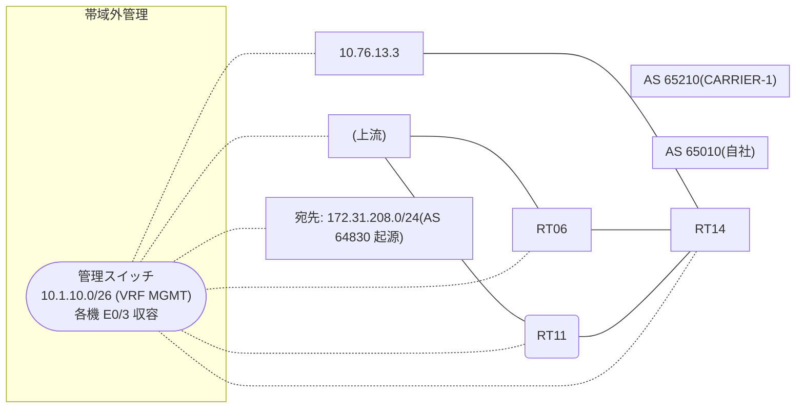

# 問題 20260912-009

> **本問は機器に接続せずに解答すること。追加の show 実行は認めない。**

## トポロジ

あなたの組織は、下記に示されているところのネットワークを運用しています。自社のルーター RT14 は、外部のネットワーク 172.31.208.0/24 への到達性を、複数の経路を通じて、確立しています。 CARRIER-1 とは、接続されています。 一部の経路は、自 AS 内の境界ルータから、iBGP で、学習されています。



## 要件

1. 示されているところの出力、および、構成に基づいて、判断すること。
2. なお、機器の構成は、示されている抜粋のほかは、既定値である。

## 現在の状態

ベストパスの選出の結果について、その根拠が、確認されようとしています。

```
RT14# show ip bgp
BGP table version is 50, local router ID is 244.244.244.244
Status codes: s suppressed, d damped, h history, * valid, > best, i - internal, 
              r RIB-failure, S Stale, m multipath, b backup-path, f RT-Filter, 
              x best-external, a additional-path, c RIB-compressed, 
              t secondary path, L long-lived-stale,
Origin codes: i - IGP, e - EGP, ? - incomplete
RPKI validation codes: V valid, I invalid, N Not found

     Network          Next Hop            Metric LocPrf Weight Path
 *    172.31.208.0/24  10.76.13.3                             0 65210 65210 64830 64830 i
 *>i                   5.5.5.5                       100      0 65210 64830 i
 * i                   9.6.6.6                       100      0 65210 64830 i
```
```
RT14# show ip bgp 172.31.208.0
BGP routing table entry for 172.31.208.0/24, version 50
Paths: (3 available, best #2, table default)
  Advertised to update-groups:
     1         
  Refresh Epoch 3
  65210 65210 64830 64830
    10.76.13.3 from 10.76.13.3 (105.105.105.105)
      Origin IGP, localpref 100, valid, external
      rx pathid: 0, tx pathid: 0
      Updated on Aug 15 2026 10:13:56 UTC
  Refresh Epoch 1
  65210 64830
    5.5.5.5 (metric 11) from 5.5.5.5 (70.70.70.70)
      Origin IGP, localpref 100, valid, internal, best
      rx pathid: 0, tx pathid: 0x0
      Updated on Aug 15 2026 10:37:14 UTC
  Refresh Epoch 4
  65210 64830
    9.6.6.6 (metric 101) from 9.6.6.6 (25.25.25.25)
      Origin IGP, localpref 100, valid, internal
      rx pathid: 0, tx pathid: 0
      Updated on Aug 15 2026 09:49:07 UTC
```

## 設定抜粋

```
RT14# show running-config | section router bgp
router bgp 65010
 bgp router-id 244.244.244.244
 bgp log-neighbor-changes
 neighbor 5.5.5.5 remote-as 65010
 neighbor 5.5.5.5 update-source Loopback0
 neighbor 9.6.6.6 remote-as 65010
 neighbor 9.6.6.6 update-source Loopback0
 neighbor 10.76.13.3 remote-as 65210
 !
 address-family ipv4
  neighbor 5.5.5.5 activate
  neighbor 9.6.6.6 activate
  neighbor 10.76.13.3 activate
 exit-address-family
```

## 設問

示されているところの出力において、ベストパスの選出を決定づけた要素は、どれですか。(1つを選択してください)

## 選択肢
A. 最も古い経路(eBGP 同士のタイ)

B. next-hop への IGP メトリック(小さいほうが優先)

C. 送り手の BGP ルータ ID(小さいほうが優先)

D. MED(小さいほうが優先)

E. next-hop の解決可否(そもそも候補に入らない)
