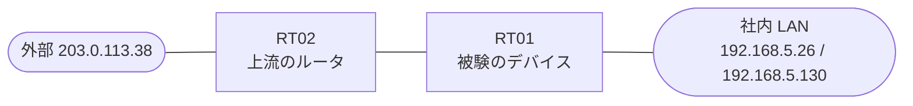

# 問題 20260912-010

> **本問は機器に接続せずに解答すること。追加の show 実行は認めない。**

## シナリオ

あなたは、下記のネットワークの保守を担当する技術者です。あなたの会社の拠点のルータ RT01 は、上流のルータ RT02 を経由して、外部のネットワークへ接続されています。社内の LAN には、管理のステーション 192.168.5.26 およびサーバ 192.168.5.130 が存在し、そして、RT01 と RT02 の間では、ルーティング プロトコルの隣接関係が確立されています。RT01 には、コントロール プレーンを保護するためのサービス ポリシーが、構成されています。導入されているところの保護の構成について、その挙動のレビューが、実施されています。インタフェースの IP アドレッシングは、変更されてはなりません。ルーター自身に宛てられた ICMP は、専用の class において帯域が制限され、そして、超過するトラフィックは破棄される必要があります。ルータを通過するところのトラフィックの転送に、影響が与えられてはなりません。問題となっているトラフィックへの対処のための分類において、特定の発信元のアドレスを名指しにするところのエントリの使用は、認められていません。class-default の扱いは、変更されてはなりません。ルータ自身に宛てられたトラフィックの保護は、control-plane の input のサービス ポリシーによって、実装される必要があります。管理のステーション 192.168.5.26 からの SSH によるアクセス、および、ルーティング・プロトコルの隣接関係は、影響を受けてはなりません。



| 対象 | 内容 |
|------|------|
| RT01 ⇔ RT02（外部側） | Ethernet0/0・10.42.206.0/30（RT01=10.42.206.1 / RT02=10.42.206.2） |
| RT01 ⇔ 社内 LAN | Ethernet0/1・192.168.5.0/24（RT01=192.168.5.1） |
| 管理のステーション（NMS） | 192.168.5.26（SSH / ping の発信元） |
| サーバ | 192.168.5.130 |
| 外部の発信元 | 203.0.113.38 |

## 出力

```
RT01# show policy-map control-plane
Control Plane 

  Service-policy input: PM-CPP

    Class-map: CM-ICMP (match-all)  
      Match: access-group 115
      police:
          cir 8000 bps, bc 1500 bytes
        conformed 304 packets, 34656 bytes; actions:
          transmit 
        exceeded 37 packets, 4218 bytes; actions:
          transmit 
        conformed 2000 bps, exceeded 0000 bps

    Class-map: class-default (match-any)  
      Match: any
```
```
RT01# show running-config | section interface
interface Ethernet0/0
 description === to RT02 ===
 ip address 10.42.206.1 255.255.255.252
interface Ethernet0/1
 ip address 192.168.5.1 255.255.255.0
```
```
RT01# show access-lists
Extended IP access list 115
    10 permit icmp any any
```
```
RT01# show running-config | section control-plane
control-plane
 service-policy input PM-CPP
```
```
RT01# show running-config | section line
line con 0
 logging synchronous
line vty 0 4
 login local
 transport input ssh
```

## 設問

次のトラフィックのうち、示されているところのポリシーの police のアクション(適合・超過としての計数と処理)の対象になるものを、すべて選んでください。

## 選択肢
A. 発信元 203.0.113.38 から、RT01 自身に宛てられた ICMP

B. 発信元 203.0.113.38 から、サーバ 192.168.5.130 に宛てられ、RT01 を通過する ICMP

C. 192.168.5.26 から、RT01 自身に宛てられた ICMP(死活監視の ping)

D. RT02 からの、ルーティング・プロトコルのパケット

E. 192.168.5.26 から、RT01 への SSH のセッションのパケット
