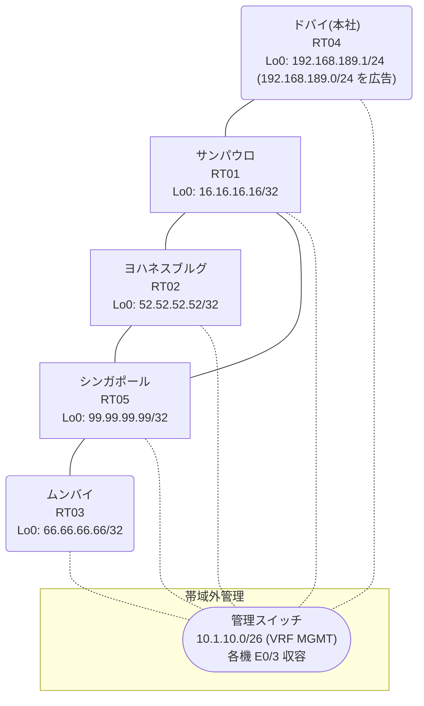

# 問題 20260912-012

> **本問は機器に接続せずに解答すること。追加の show 実行は認めない。**

## シナリオ

あなたは、下記のネットワークの保守を担当する技術者です。本社の顧客のネットワークは、BGP AS 64634 の RT04 によって、広告されています。あなたの会社の内部は、BGP / EIGRP / OSPF という 3 つのドメインから構成されています。サイトと、ルータおよびアドレスとの対応は、下記の表に示されているとおりです。複数のサイトから、本社の顧客のネットワーク宛の通信が、タイムアウトする、ということが、報告されています。サイトの間の通信は、正常です。これは、意図された動作ではありません。示されているところの出力を、参照してください。管理のための構成に対して、変更が加えられてはなりません。すべてのルータが、`192.168.189.0/24` を含むところのすべての宛先へ、到達することができること。既存の再配送の設計が、変更または撤去されることはできません。スタティック ルートによる回避も、許可されていません。経路の遮断は、当該の経路の出自に基づいて、実施される必要があります。distance コマンドによる管理距離の操作は、監査のポリシー上、使用されることができません。`192.168.189.0/24` 宛のトラフィックが RT04 へ配送され、経路の周回が、発生していないこと。



| 拠点 | ルータ | 拠点網 / 広告網 |
|------|--------|------------------|
| サンパウロ | RT01 | 16.16.16.16/32 |
| シンガポール | RT05 | 99.99.99.99/32 |
| ドバイ(本社) | RT04 | 192.168.189.1/24 (`192.168.189.0/24` を広告) |
| ムンバイ | RT03 | 66.66.66.66/32 |
| ヨハネスブルグ | RT02 | 52.52.52.52/32 |

リンク一覧:
```
  RT04:E0/0(.1) ── RT01:E0/0(.2)   10.37.68.0/30
  RT01:E0/1(.1) ── RT05:E0/0(.2)   10.97.33.0/30
  RT01:E0/2(.1) ── RT02:E0/0(.2)   10.119.163.0/30
  RT05:E0/1(.1) ── RT02:E0/1(.2)   10.119.56.0/30
  RT05:E0/2(.1) ── RT03:E0/0(.2)   10.207.68.0/30
```

## 出力

```
RT01# show ip route
Gateway of last resort is not set
      10.0.0.0/8 is variably subnetted, 8 subnets, 2 masks
C        10.37.68.0/30 is directly connected, Ethernet0/0
L        10.37.68.2/32 is directly connected, Ethernet0/0
C        10.97.33.0/30 is directly connected, Ethernet0/1
L        10.97.33.1/32 is directly connected, Ethernet0/1
O        10.119.56.0/30 [110/20] via 10.119.163.2, 00:03:53, Ethernet0/2
C        10.119.163.0/30 is directly connected, Ethernet0/2
L        10.119.163.1/32 is directly connected, Ethernet0/2
O        10.207.68.0/30 [110/30] via 10.119.163.2, 00:03:49, Ethernet0/2
      16.0.0.0/32 is subnetted, 1 subnets
C        16.16.16.16 is directly connected, Loopback0
      52.0.0.0/32 is subnetted, 1 subnets
O        52.52.52.52 [110/11] via 10.119.163.2, 00:03:56, Ethernet0/2
      66.0.0.0/32 is subnetted, 1 subnets
O        66.66.66.66 [110/31] via 10.119.163.2, 00:03:45, Ethernet0/2
      99.0.0.0/32 is subnetted, 1 subnets
O        99.99.99.99 [110/21] via 10.119.163.2, 00:03:49, Ethernet0/2
D EX  192.168.189.0/24 [170/307200] via 10.97.33.2, 00:03:22, Ethernet0/1
```
```
RT01# show route-map
route-map RM-STG2, deny, sequence 10
  Match clauses:
    ip address prefix-lists: PL-STG2 
  Set clauses:
  Policy routing matches: 0 packets, 0 bytes
route-map RM-STG2, permit, sequence 20
  Match clauses:
  Set clauses:
  Policy routing matches: 0 packets, 0 bytes
route-map RM-OLD1, deny, sequence 10
  Match clauses:
    ip address prefix-lists: PL-OLD1 
  Set clauses:
  Policy routing matches: 0 packets, 0 bytes
route-map RM-OLD1, permit, sequence 20
  Match clauses:
  Set clauses:
  Policy routing matches: 0 packets, 0 bytes
```
```
RT01# show ip prefix-list
ip prefix-list PL-OLD1: 2 entries
   seq 5 deny 192.168.189.0/24
   seq 10 permit 0.0.0.0/0 le 32
ip prefix-list PL-STG2: 2 entries
   seq 5 deny 66.66.66.66/32
   seq 10 permit 0.0.0.0/0 le 32
```
```
RT01# show access-lists
Standard IP access list 67
    10 deny   66.66.66.66
    20 permit any
Standard IP access list 82
    10 deny   192.168.189.0
    20 permit any
```
```
RT01# show ip bgp
BGP table version is 10, local router ID is 16.16.16.16
Status codes: s suppressed, d damped, h history, * valid, > best, i - internal, 
              r RIB-failure, S Stale, m multipath, b backup-path, f RT-Filter, 
              x best-external, a additional-path, c RIB-compressed, 
              t secondary path, L long-lived-stale,
Origin codes: i - IGP, e - EGP, ? - incomplete
RPKI validation codes: V valid, I invalid, N Not found

     Network          Next Hop            Metric LocPrf Weight Path
 *>   10.119.56.0/30   10.119.163.2            20         32768 ?
 *>   10.119.163.0/30  0.0.0.0                  0         32768 ?
 *>   10.207.68.0/30   10.119.163.2            30         32768 ?
 *>   16.16.16.16/32   0.0.0.0                  0         32768 i
 *>   52.52.52.52/32   10.119.163.2            11         32768 ?
 *>   66.66.66.66/32   10.119.163.2            31         32768 ?
 *>   99.99.99.99/32   10.119.163.2            21         32768 ?
 r>i  192.168.189.0    10.37.68.1               0    100      0 i
```
```
RT01# show ip protocols | include Routing Protocol|Distance
Routing Protocol is "application"
    Gateway         Distance      Last Update
  Distance: (default is 4)
Routing Protocol is "eigrp 318"
      Distance: internal 90 external 170
    Gateway         Distance      Last Update
  Distance: internal 90 external 170
Routing Protocol is "ospf 54"
    Gateway         Distance      Last Update
  Distance: (default is 110)
Routing Protocol is "bgp 64634"
    Gateway         Distance      Last Update
  Distance: external 20 internal 200 local 200
```
```
RT03# traceroute 192.168.189.1 probe 1 timeout 1 ttl 1 8
Type escape sequence to abort.
Tracing the route to 192.168.189.1
VRF info: (vrf in name/id, vrf out name/id)
  1 10.207.68.1 0 msec
  2 10.119.56.2 2 msec
  3 10.119.163.1 2 msec
  4 10.97.33.2 2 msec
  5 10.119.56.2 3 msec
  6 10.119.163.1 11 msec
  7 10.97.33.2 3 msec
  8 10.119.56.2 2 msec
```
```
RT01# show running-config | section router
router eigrp 318
 network 10.97.33.0 0.0.0.3
 passive-interface Loopback0
router ospf 54
 router-id 16.16.16.16
 redistribute eigrp 318
 redistribute bgp 64634
 network 10.119.163.0 0.0.0.3 area 0
 network 16.16.16.16 0.0.0.0 area 0
router bgp 64634
 bgp router-id 16.16.16.16
 bgp log-neighbor-changes
 bgp redistribute-internal
 network 16.16.16.16 mask 255.255.255.255
 redistribute ospf 54
 neighbor 10.37.68.1 remote-as 64634
```
```
RT05# show running-config | section router
router eigrp 318
 network 10.97.33.0 0.0.0.3
 redistribute ospf 54 metric 100000 100 255 1 1500
router ospf 54
 router-id 99.99.99.99
 redistribute eigrp 318
 network 10.119.56.0 0.0.0.3 area 0
 network 10.207.68.0 0.0.0.3 area 0
 network 99.99.99.99 0.0.0.0 area 0
```
```
RT02# show running-config | section router
router ospf 54
 router-id 52.52.52.52
 passive-interface Loopback0
 network 10.119.56.0 0.0.0.3 area 0
 network 10.119.163.0 0.0.0.3 area 0
 network 52.52.52.52 0.0.0.0 area 0
```
```
RT04# show running-config | section router
router bgp 64634
 bgp router-id 192.168.189.1
 bgp log-neighbor-changes
 network 192.168.189.0
 neighbor 10.37.68.2 remote-as 64634
```

## 設問

この問題を解決し、上記の要件をすべて満たすために、適用されなければならない構成の変更は、どれとどれですか。(2つを選択してください)

## 選択肢
A. RT01 の router bgp 64634 配下に「distance bgp 20 165 165」を設定し、clear ip route * を実行する

B. RT01 の router ospf 54 配下の redistribute bgp 64634 に、「set tag 64634」を行う route-map を適用する

C. RT05 の router eigrp 318 配下から redistribute ospf 54 を削除する

D. RT01 で `192.168.189.0/24` のみ deny の prefix-list を作成し、router eigrp 318 配下に「distribute-list prefix in」を適用する

E. RT05 の router eigrp 318 配下の redistribute ospf 54 に、「match tag 64634」を deny する route-map を適用する

F. RT02 で「clear ip route *」を実行する
