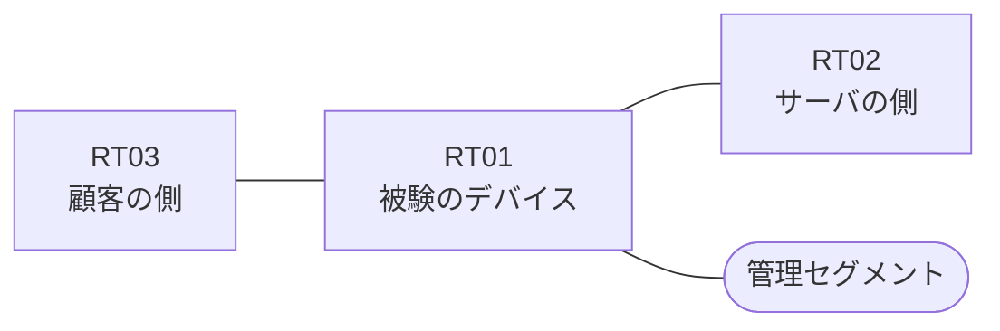

# 問題 20260912-014

> **本問は機器に接続せずに解答すること。追加の show 実行は認めない。**

## トポロジ

あなたは、下記のネットワークの保守を担当する技術者です。ある企業のネットワークにおいて、RT01 は、顧客の側のネットワークと、サーバの側のネットワークとの間に、配置されています。



| 区間 | 被験デバイス側のインターフェイス | ネットワーク |
|------|----------------------------------|--------------|
| RT03（顧客の側） ⇔ RT01 | `Ethernet2/0` | 10.162.253.0/24 |
| RT01 ⇔ RT02（サーバの側） | `Ethernet2/1` | 10.162.254.0/24 |
| RT01 ⇔ 管理セグメント | `Ethernet2/2` | 10.162.255.0/24 |

## 要件

1. `10.162.49.0/24` からの通信は、許可されることはできません。
2. RT01 において、`10.162.48.0/24`、`10.162.50.0/24`、`10.162.52.0/24`、`10.162.54.0/24` のネットワークからの通信のみが、許可される必要があります。
3. インタフェースの IP アドレッシングは、変更されてはなりません。
4. `10.162.51.0/24` からの通信は、許可されてはなりません。
5. アクセス リストのエントリは、1行で構成される必要があります。
6. アクセス リストは、顧客の側のインターフェイスである `Ethernet2/0` において、着信の方向に適用される必要があります。

## 現在の状態

ユーザーから、通信に関する事象が、報告されています。示されているところの出力および構成に基づいて、要求されているところの動作が得られていない理由が、判断されなければなりません。

観測 | サーバへの到達
--- | ---
送信元が 10.162.48.0/24 のネットワークにあるホストから、172.17.28.78 の TCP ポート 443 宛ての通信 | 到達可
送信元が 10.162.50.0/24 のネットワークにあるホストから、172.17.28.78 の TCP ポート 443 宛ての通信 | 到達可
送信元が 10.162.52.0/24 のネットワークにあるホストから、172.17.28.78 の TCP ポート 443 宛ての通信 | 到達可
送信元が 10.162.54.0/24 のネットワークにあるホストから、172.17.28.78 の TCP ポート 443 宛ての通信 | 到達可
送信元が 10.162.49.0/24 のネットワークにあるホストから、172.17.28.78 の TCP ポート 443 宛ての通信 | 到達可
送信元が 10.162.51.0/24 のネットワークにあるホストから、172.17.28.78 の TCP ポート 443 宛ての通信 | 到達可
送信元が 10.162.250.0/24 のネットワークにあるホストから、172.17.28.78 の TCP ポート 443 宛ての通信 | 到達可

```
RT01# show ip access-lists
Standard IP access list 10
    10 permit 10.162.48.0, wildcard bits 0.0.0.255
    20 permit 10.162.50.0, wildcard bits 0.0.0.255
    30 permit 10.162.52.0, wildcard bits 0.0.0.255
    40 permit 10.162.54.0, wildcard bits 0.0.0.255
```

## 設定抜粋

```
RT01# show running-config | section ^interface
interface Ethernet2/0
 description === to RT03 ===
 ip address 10.162.253.1 255.255.255.0
interface Ethernet2/1
 description === to RT02 ===
 ip address 10.162.254.1 255.255.255.0
interface Ethernet2/2
 description === management ===
 ip address 10.162.255.1 255.255.255.0
```

## 設問

次のうち、正しいものは、どれですか。

## 選択肢
A. ワイルドカードのビットが過剰であり、対象としていないネットワークまでが一致の対象に含まれている

B. プレフィックス・リストがルート・マップから参照されていない

C. インターフェイスに対して、アクセス・リストが in ではなく out の方向に適用されている

D. ルーティング・プロトコルの隣接関係が確立されていない

E. アクセス・リストが、いずれのインターフェイスにも適用されていない

F. インターフェイスから参照されているアクセス・リストが、定義されていない
