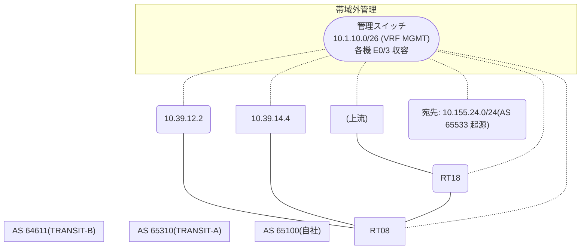

# 問題 20260912-015

> **本問は機器に接続せずに解答すること。追加の show 実行は認めない。**

## シナリオ

あなたは、ネットワークの運用を担当しています。自社のルーター RT08 は、外部のネットワーク 10.155.24.0/24 への到達性を、複数の経路を通じて、確立しています。 TRANSIT-A とは、接続されています。 TRANSIT-B とも、接続されています。 一部の経路は、自 AS 内の境界ルータから、iBGP で、学習されています。外部との 1 つのセッションが失われ、それまで使用されていたところの経路は、取り下げられました。ルータは、残るところの経路からの、ベストパスの選出を、行おうとしています。示されているところの出力は、その時点で、採取されたものです。示されているところの出力、および、構成に基づいて、判断すること。なお、機器の構成は、示されている抜粋のほかは、既定値である。



## 出力

```
RT08# show ip bgp
BGP table version is 27, local router ID is 101.101.101.101
Status codes: s suppressed, d damped, h history, * valid, > best, i - internal, 
              r RIB-failure, S Stale, m multipath, b backup-path, f RT-Filter, 
              x best-external, a additional-path, c RIB-compressed, 
              t secondary path, L long-lived-stale,
Origin codes: i - IGP, e - EGP, ? - incomplete
RPKI validation codes: V valid, I invalid, N Not found

     Network          Next Hop            Metric LocPrf Weight Path
 *    10.155.24.0/24   10.39.12.2                         40000 65310 65310 65533 i
 *                     10.39.14.4                             0 64611 65533 i
 * i                   8.5.5.5                       100      0 65310 65533 i
```
```
RT08# show running-config | section router bgp
router bgp 65100
 bgp router-id 101.101.101.101
 bgp log-neighbor-changes
 neighbor 8.5.5.5 remote-as 65100
 neighbor 8.5.5.5 update-source Loopback0
 neighbor 10.39.12.2 remote-as 65310
 neighbor 10.39.14.4 remote-as 64611
 !
 address-family ipv4
  neighbor 8.5.5.5 activate
  neighbor 10.39.12.2 activate
  neighbor 10.39.12.2 weight 40000
  neighbor 10.39.14.4 activate
 exit-address-family
```

## 設問

示されているところの出力に基づいて、この後、10.155.24.0/24 のベストパスとして選出され、転送に使用されるところの経路は、どれですか。(1つを選択してください)

## 選択肢
A. next hop 10.39.14.4 の経路

B. next hop 10.39.12.2 の経路

C. next hop 8.5.5.5 の経路
