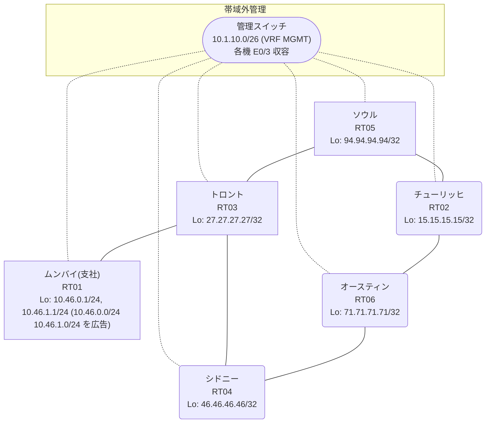

# 問題 20260913-001

> **本問は機器に接続せずに解答すること。追加の show 実行は認めない。**

## トポロジ

あなたは、下記のネットワークの保守を担当する技術者です。あなたの会社のネットワークは、支社のドメインと、本社のコアのドメイン(OSPF)とが、2 台の境界のルータによって接続され、そして、それらは境界において接続されています。支社のネットワーク `10.46.0.0/24` および `10.46.1.0/24` は、RT01 によって、広告されています。どちらの境界が失われた場合においても、通信が継続されることができるように、設計されています。ルーティングの設計の詳細は、示されているところの出力から、読み取られることが、期待されています。



| 拠点 | ルータ | Loopback / 広告網 |
|------|--------|--------------------|
| オースティン | RT06 | 71.71.71.71/32 |
| シドニー | RT04 | 46.46.46.46/32 |
| ソウル | RT05 | 94.94.94.94/32 |
| チューリッヒ | RT02 | 15.15.15.15/32 |
| トロント | RT03 | 27.27.27.27/32 |
| ムンバイ(支社) | RT01 | 10.46.0.1/24, 10.46.1.1/24 (`10.46.0.0/24` `10.46.1.0/24` を広告) |

リンク一覧:
```
  RT01:E0/0(.2) ── RT03:E0/0(.1)   10.92.167.0/30
  RT03:E0/1(.1) ── RT04:E0/0(.2)   10.10.227.0/30
  RT03:E0/2(.1) ── RT05:E0/0(.2)   10.204.47.0/30
  RT04:E0/1(.1) ── RT06:E0/0(.2)   172.16.217.0/30
  RT06:E0/1(.1) ── RT02:E0/0(.2)   172.16.25.0/30
  RT05:E0/1(.1) ── RT02:E0/1(.2)   172.16.194.0/30
```

## 要件

1. 経路は、最短の転送パスを取ること。
2. 支社のネットワーク宛のトラフィックが RT01 へ配送され、経路の周回が、発生していないこと。
3. インタフェースの IP アドレッシングは、変更されてはなりません。
4. ルーティング プロトコルの種別およびプロセスの配置は、変更されてはなりません。
5. フィルターおよび route-map の新設は、変更の凍結により、使用することができません。
6. すべてのサイトから、支社のネットワーク `10.46.0.0/24` および `10.46.1.0/24` を含むところの、すべての宛先へ、到達することができること。
7. スタティック ルートおよび既定のルートによる迂回は、実施されてはなりません。
8. 二点相互再配送による、冗長の設計が、維持されなければなりません。

## 現在の状態

ユーザーから、通信に関する事象が、報告されています。あなたは、提示されているところの情報のみを使用して、要求されている状態が満たされていない理由を、特定しなければなりません。

```
RT05# show ip route
Gateway of last resort is not set
      10.0.0.0/8 is variably subnetted, 6 subnets, 3 masks
O E2     10.10.227.0/30 [110/20] via 172.16.194.2, 00:04:08, Ethernet0/1
O E2     10.46.0.0/24 [110/20] via 172.16.194.2, 00:04:08, Ethernet0/1
O E2     10.46.1.0/24 [110/20] via 172.16.194.2, 00:04:08, Ethernet0/1
O E2     10.92.167.0/30 [110/20] via 172.16.194.2, 00:04:08, Ethernet0/1
C        10.204.47.0/30 is directly connected, Ethernet0/0
L        10.204.47.2/32 is directly connected, Ethernet0/0
      15.0.0.0/32 is subnetted, 1 subnets
O        15.15.15.15 [110/11] via 172.16.194.2, 00:04:16, Ethernet0/1
      27.0.0.0/32 is subnetted, 1 subnets
O E2     27.27.27.27 [110/20] via 172.16.194.2, 00:04:08, Ethernet0/1
      46.0.0.0/32 is subnetted, 1 subnets
O        46.46.46.46 [110/31] via 172.16.194.2, 00:04:08, Ethernet0/1
      71.0.0.0/32 is subnetted, 1 subnets
O        71.71.71.71 [110/21] via 172.16.194.2, 00:04:12, Ethernet0/1
      94.0.0.0/32 is subnetted, 1 subnets
C        94.94.94.94 is directly connected, Loopback0
      172.16.0.0/16 is variably subnetted, 4 subnets, 2 masks
O        172.16.25.0/30 [110/20] via 172.16.194.2, 00:04:12, Ethernet0/1
C        172.16.194.0/30 is directly connected, Ethernet0/1
L        172.16.194.1/32 is directly connected, Ethernet0/1
O        172.16.217.0/30 [110/30] via 172.16.194.2, 00:04:12, Ethernet0/1
```
```
RT05# traceroute 10.46.0.1 probe 1 timeout 1 ttl 1 8
Type escape sequence to abort.
Tracing the route to 10.46.0.1
VRF info: (vrf in name/id, vrf out name/id)
  1 172.16.194.2 2 msec
  2 172.16.25.1 2 msec
  3 172.16.217.1 5 msec
  4 10.10.227.1 3 msec
  5 10.92.167.2 3 msec
```
```
RT03# show ip route 71.71.71.71
Routing entry for 71.71.71.71/32
  Known via "rip", distance 120, metric 5
  Tag 300
  Redistributing via rip
  Last update from 10.204.47.2 on Ethernet0/2, 00:00:15 ago
  Routing Descriptor Blocks:
    10.204.47.2, from 10.204.47.2, 00:00:15 ago, via Ethernet0/2
      Route metric is 5, traffic share count is 1
      Route tag 300
  * 10.10.227.2, from 10.10.227.2, 00:00:21 ago, via Ethernet0/1
      Route metric is 5, traffic share count is 1
      Route tag 300
```
```
RT04# show ip route 10.46.0.0
Routing entry for 10.46.0.0/24
  Known via "rip", distance 120, metric 2
  Redistributing via ospf 1, rip
  Advertised by ospf 1 subnets route-map RIP2OSPF
  Last update from 10.10.227.1 on Ethernet0/0, 00:00:02 ago
  Routing Descriptor Blocks:
  * 10.10.227.1, from 10.10.227.1, 00:00:02 ago, via Ethernet0/0
      Route metric is 2, traffic share count is 1
```

## 設定抜粋

```
RT04# show running-config | section router
router ospf 1
 router-id 46.46.46.46
 redistribute rip route-map RIP2OSPF
 network 46.46.46.46 0.0.0.0 area 0
 network 172.16.217.0 0.0.0.3 area 0
 distance ospf external 180
router rip
 version 2
 redistribute ospf 1 metric 5 route-map OSPF2RIP
 network 10.0.0.0
 network 46.0.0.0
 no auto-summary
```

## 設問

次のうち、正しいものは、どれですか。

## 選択肢
A. RT04 の `distance ospf external 180` を削除し、両方の境界の構成を一致させる

B. RT05 で `clear ip ospf process` を実行する

C. RT05 の `redistribute rip` を削除する

D. RT05 の router ospf 1 配下に `distance ospf external 180` を設定する

E. RT05 の route-map `OSPF2RIP` に、再注入を拒否する deny エントリを追加する

F. RT06 と RT02 の router ospf 1 配下に `distance ospf external 180` を設定する
