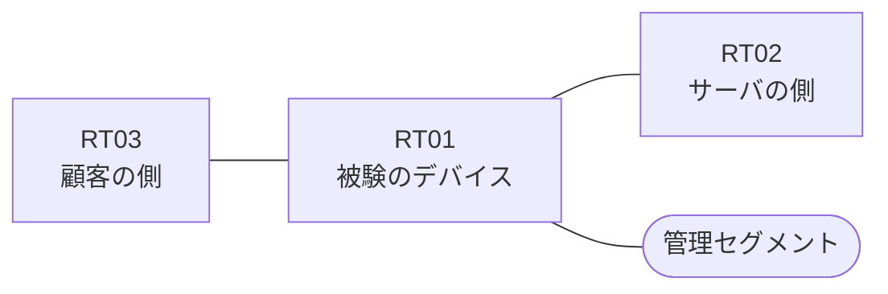

# 問題 20260913-003

> **本問は機器に接続せずに解答すること。追加の show 実行は認めない。**

## トポロジ

あなたは、下記のネットワークの保守を担当する技術者です。ある企業のネットワークにおいて、RT01 は、顧客の側のネットワークと、サーバの側のネットワークとの間に、配置されています。



| 区間 | 被験デバイス側のインターフェイス | ネットワーク |
|------|----------------------------------|--------------|
| RT03（顧客の側） ⇔ RT01 | `Ethernet2/0` | 10.59.253.0/24 |
| RT01 ⇔ RT02（サーバの側） | `Ethernet2/1` | 10.59.254.0/24 |
| RT01 ⇔ 管理セグメント | `Ethernet2/2` | 10.59.255.0/24 |

## 要件

1. RT01 において、`10.59.96.0/24`、`10.59.97.0/24`、`10.59.98.0/24` のネットワークからの通信が、許可されなければなりません。
2. アクセス・リストは、顧客の側のインターフェイスである `Ethernet2/0` において、着信の方向に適用されなければなりません。
3. `10.59.101.0/24` からの通信は、許可されてはなりません。
4. アクセス・リストのエントリは、1行で構成されなければなりません。
5. 本作業は、日中の時間帯において実施されるという理由により、対象外であるところのデバイスに対する構成の変更は、許可されていません。

## 現在の状態

```
RT01# show logging | include SEC-6
%SEC-6-IPACCESSLOGP: list FILTER-IN denied tcp 10.59.101.7(19415) -> 172.27.7.11(3389), 1 packet
```

## 設定抜粋

```
RT01# show ip access-lists FILTER-IN
Extended IP access list FILTER-IN
    10 deny   tcp 10.59.101.0 0.0.0.255 host 172.27.7.11 eq 3389 log
    20 deny   tcp 10.59.99.0 0.0.0.255 host 172.27.7.11 eq 3389
    30 permit ip any any
```

## 設問

示されているところの記録および構成から読み取ることができるものは、どれですか。(2つを選択してください)

## 選択肢
A. 記録に現れていない通信は、いずれも許可されたものである。

B. `10.59.99.7` からの通信は、許可された。

C. `10.59.96.7` からの通信は、拒否された。

D. 拒否のエントリのうち、`log` のキーワードを伴うものは1つだけである。

E. `10.59.101.7` からの通信は、アクセス・リストによって拒否された。
