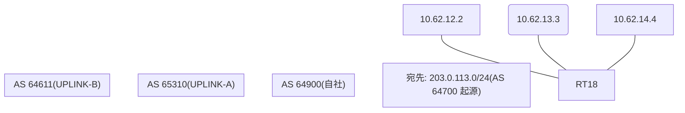

# 問題 20260913-004

> **本問は機器に接続せずに解答すること。追加の show 実行は認めない。**

## トポロジ

あなたの組織は、下記に示されているところのネットワークを運用しています。自社のルータ RT18 は、外部のネットワーク 203.0.113.0/24 への到達性を、複数の経路を通じて、確立しています。 UPLINK-A とは、2 本のリンクで、接続されています。 UPLINK-B とも、接続されています。 自社は、172.31.208.0/24 を、両方のリンクを通じて、広告しています。



## 要件

1. 対向 AS(65310)から、自 AS の 172.31.208.0/24 へ向かうところの、戻りのトラフィックが、10.62.13.3 側のリンクを、経由すること。
2. 広告するところの MED の値は、課金システムと連動しており、変更してはならない。
3. なお、設定の投入後、変更は、適切に、反映されているものとする。

## 現在の状態

対向 ASからの、戻りのトラフィックが、10.62.12.2 側のリンクに、集中しています。なお、対向 AS 内の経路選択は、既定値のままです。

```
RT18# show ip bgp
BGP table version is 23, local router ID is 131.131.131.131
Status codes: s suppressed, d damped, h history, * valid, > best, i - internal, 
              r RIB-failure, S Stale, m multipath, b backup-path, f RT-Filter, 
              x best-external, a additional-path, c RIB-compressed, 
              t secondary path, L long-lived-stale,
Origin codes: i - IGP, e - EGP, ? - incomplete
RPKI validation codes: V valid, I invalid, N Not found

     Network          Next Hop            Metric LocPrf Weight Path
 *    203.0.113.0      10.62.14.4                             0 64611 64611 64700 i
 *>                    10.62.12.2              20             0 65310 64700 i
 *                     10.62.13.3             300             0 65310 64700 i
```
```
RT18# show ip bgp 203.0.113.0
BGP routing table entry for 203.0.113.0/24, version 23
Paths: (3 available, best #2, table default)
  Advertised to update-groups:
     4         
  Refresh Epoch 3
  64611 64611 64700
    10.62.14.4 from 10.62.14.4 (88.88.88.88)
      Origin IGP, localpref 100, valid, external
      rx pathid: 0, tx pathid: 0
      Updated on Mar 25 2026 08:12:21 UTC
  Refresh Epoch 2
  65310 64700
    10.62.12.2 from 10.62.12.2 (179.179.179.179)
      Origin IGP, metric 20, localpref 100, valid, external, best
      rx pathid: 0, tx pathid: 0x0
      Updated on Mar 25 2026 07:47:14 UTC
  Refresh Epoch 1
  65310 64700
    10.62.13.3 from 10.62.13.3 (144.144.144.144)
      Origin IGP, metric 300, localpref 100, valid, external
      rx pathid: 0, tx pathid: 0
      Updated on Mar 25 2026 07:04:07 UTC
```

## 設定抜粋

```
RT18# show running-config | section router bgp
router bgp 64900
 bgp router-id 131.131.131.131
 bgp log-neighbor-changes
 neighbor 10.62.12.2 remote-as 65310
 neighbor 10.62.13.3 remote-as 65310
 neighbor 10.62.14.4 remote-as 64611
 !
 address-family ipv4
  neighbor 10.62.12.2 activate
  neighbor 10.62.13.3 activate
  neighbor 10.62.14.4 activate
 exit-address-family
```

## 設問

示されているところのすべての要件が満たされることを確実にするために、適用されなければならない構成は、どれですか。(1つを選択してください)

## 選択肢
**A.**
```
route-map RM-PRIMARY-IN permit 10
 set local-preference 200
router bgp 64900
 address-family ipv4
  neighbor 10.62.13.3 route-map RM-PRIMARY-IN in
```

**B.**
```
router bgp 64900
 address-family ipv4
  neighbor 10.62.13.3 weight 30000
```

**C.**
```
route-map RM-BACKUP-OUT permit 10
 set as-path prepend 64900 64900
router bgp 64900
 address-family ipv4
  neighbor 10.62.12.2 route-map RM-BACKUP-OUT out
```

**D.**
```
clear ip bgp * soft
```

**E.**
```
router bgp 64900
 bgp always-compare-med
```

**F.**
```
route-map RM-MED-A permit 10
 set metric 200
route-map RM-MED-B permit 10
 set metric 10
router bgp 64900
 address-family ipv4
  neighbor 10.62.12.2 route-map RM-MED-A out
  neighbor 10.62.13.3 route-map RM-MED-B out
```
