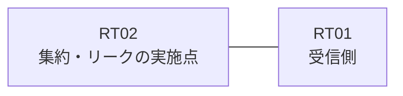

# 問題 20260913-025

> **本問は機器に接続せずに解答すること。追加の show 実行は認めない。**

## シナリオ

あなたは、下記のネットワークの保守を担当する技術者です。拠点のルーター RT02 は、複数のループバック・インターフェイスによって、サービスのためのアドレスのブロック 172.29.53.8/30 を収容しています。RT02 と RT01 は、1本のリンクによって直接に接続されており、そして、EIGRP 6571 が構成されています。通信の一部において、想定されていない挙動が、観測されています。示されているところの出力および構成に基づいて、要求されているところの動作が得られていない理由が、判断されなければなりません。運用のためのループバック 10.239.53.31 (/32) は、引き続き受信される必要があります。本作業は、日中の時間帯において実施されるという理由により、対象外であるところのデバイスに対する構成の変更は、許可されていません。ただし、監視のためのホストである 172.29.53.10 (/32) の明細のルートは、集約とともに、受信されなければなりません。集約のルートおよび明細のルートは、いずれも、EIGRP の内部のルートとして受信されなければなりません。ブロックの内部の明細のルートは、広告されることはできません。RT01 に対して、ブロック 172.29.53.8/30 は、集約のルートとして広告されなければなりません。



| 対象 | 内容 |
|------|------|
| RT02 のループバック | 172.29.53.9, 172.29.53.10, 172.29.53.11 |
| RT02 の運用系ループバック | 10.239.53.31 |
| RT02 ⇔ RT01 のリンク | 10.172.113.0/24（RT02=10.172.113.1 / RT01=10.172.113.2・Ethernet0/0） |

## 出力

```
RT02# show running-config
Building configuration...
!
interface Loopback0
 ip address 172.29.53.9 255.255.255.255
interface Loopback1
 ip address 172.29.53.10 255.255.255.255
interface Loopback2
 ip address 172.29.53.11 255.255.255.255
interface Loopback10
 ip address 10.239.53.31 255.255.255.255
interface Ethernet0/0
 description === to RT01 ===
 ip address 10.172.113.1 255.255.255.252
 ip summary-address eigrp 6571 172.29.53.8 255.255.255.252 leak-map RM-LEAK
!
router eigrp 6571
 network 172.29.53.9 0.0.0.0
 network 172.29.53.10 0.0.0.0
 network 172.29.53.11 0.0.0.0
 network 10.239.53.31 0.0.0.0
 network 10.172.113.0 0.0.0.3
!
ip prefix-list MON32 seq 5 permit 172.29.53.10/32
access-list 10 permit 172.29.53.11
!
route-map RM-LEAK permit 10
!
```
```
RT01# show ip route eigrp | begin Gateway
Gateway of last resort is not set
      10.0.0.0/32 is subnetted, 1 subnets
D        10.239.53.31 [90/409600] via 10.172.113.1, 00:13:15, Ethernet0/0
      172.29.0.0/16 is variably subnetted, 4 subnets, 2 masks
D        172.29.53.8/30 [90/409600] via 10.172.113.1, 00:13:15, Ethernet0/0
D        172.29.53.9/32 [90/409600] via 10.172.113.1, 00:13:15, Ethernet0/0
D        172.29.53.10/32 [90/409600] via 10.172.113.1, 00:13:15, Ethernet0/0
D        172.29.53.11/32 [90/409600] via 10.172.113.1, 00:13:15, Ethernet0/0
```

## 設問

次のうち、正しいものは、どれですか。

## 選択肢
A. EIGRP の auto-summary が有効にされており、明細の広告に影響している

B. 対象のループバックのネットワークが、EIGRP のプロセスへ参加させられていない

C. ルート・マップの permit のエントリに、match のステートメントが存在しない

D. リストにおいて許可されているアドレスが、対象のループバックのアドレスと異なっている

E. 集約のメトリックの計算に失敗しており、集約そのものが広告されていない

F. 再配布が参照しているところのリストにおいて、対象のループバックのアドレスが許可されていない
