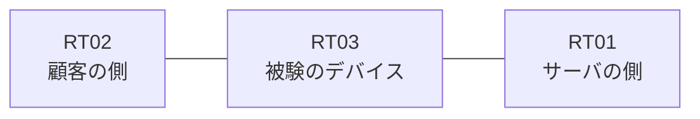

# 問題 20260913-027

> **本問は機器に接続せずに解答すること。追加の show 実行は認めない。**

## トポロジ

あなたの組織は、下記に示されているところのネットワークを運用しています。ある企業のネットワークにおいて、RT03 は、顧客の側のネットワークと、サーバの側のネットワークとの間に配置されており、IPv6 によって運用されています。



## 要件

1. 拒否のエントリを使用してはなりません。
2. RT03 において、`2001:DB8:C0:C0::/64`、`2001:DB8:C0:C1::/64`、`2001:DB8:C0:C2::/64` のネットワークからの通信が、`2001:DB8:C0:FF::10` の TCP ポート 80 に到達できなければなりません。
3. `2001:DB8:C0:C5::/64` からの通信は、許可されてはなりません。
4. `2001:DB8:C0:C3::/64` からの通信は、許可されることはできません。
5. 管理のための構成に対して、変更が加えられてはなりません。

## 現在の状態

一部の通信が、意図されているとおりに動作していない、という報告があります。示されているところの出力および構成に基づいて、要求されているところの動作が得られていない理由が、判断されなければなりません。

観測 | サーバへの到達
--- | ---
送信元が 2001:DB8:C0:C0::/64 のネットワークにあるホストから、2001:DB8:C0:FF::10 の TCP ポート 80 宛ての通信 | 到達可
送信元が 2001:DB8:C0:C1::/64 のネットワークにあるホストから、2001:DB8:C0:FF::10 の TCP ポート 80 宛ての通信 | 到達可
送信元が 2001:DB8:C0:C2::/64 のネットワークにあるホストから、2001:DB8:C0:FF::10 の TCP ポート 80 宛ての通信 | 到達可
送信元が 2001:DB8:C0:C3::/64 のネットワークにあるホストから、2001:DB8:C0:FF::10 の TCP ポート 80 宛ての通信 | 到達可
送信元が 2001:DB8:C0:C5::/64 のネットワークにあるホストから、2001:DB8:C0:FF::10 の TCP ポート 80 宛ての通信 | 到達可
送信元が 2001:DB8:C0:FA::/64 のネットワークにあるホストから、2001:DB8:C0:FF::10 の TCP ポート 80 宛ての通信 | 到達可

```
RT03# show ipv6 access-list

```
```
RT03# show ipv6 neighbors
IPv6 Address                              Age Link-layer Addr State Interface
2001:DB8:C0:C0::3                           0 aabb.cc02.4f00  REACH Et0/0
```

## 設定抜粋

```
RT03# show running-config | section ipv6 access-list|traffic-filter
interface Ethernet0/0
 ipv6 traffic-filter V6-FILTER-IN in
```

## 設問

次のうち、正しいものは、どれですか。

## 選択肢
A. インターフェイスにおいて IPv6 が有効にされていない

B. ワイルドカードによる指定が受理されず、意図されたエントリが存在していない

C. シーケンス番号が連続していないため、エントリが評価されていない

D. プレフィックスの長さが短く、対象としていないネットワークまでが一致の対象に含まれている

E. 参照されているアクセス・リストが定義されていない

F. 末尾に明示の拒否のエントリが記述されているため、近隣探索に対する暗黙の許可が失われ、隣接のアドレスが解決できていない
