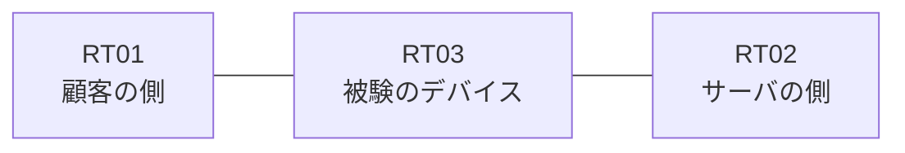

# 問題 20260914-003

> **本問は機器に接続せずに解答すること。追加の show 実行は認めない。**

## トポロジ

あなたの組織は、下記に示されているところのネットワークを運用しています。ある企業のネットワークにおいて、RT03 は、顧客の側のネットワークと、サーバの側のネットワークとの間に、配置されています。



| 区間 | 被験デバイス側のインターフェイス | ネットワーク |
|------|----------------------------------|--------------|
| RT01（顧客の側） ⇔ RT03 | — | 10.69.253.0/24 |
| RT03 ⇔ RT02（サーバの側） | — | 10.69.254.0/24 |

## 要件

1. 変更は、必要最小限に留められなければなりません。
2. RT03 において、`10.69.96.0/24`、`10.69.97.0/24`、`10.69.98.0/24` のネットワークからの通信のみが、アドレスの変換の対象とされなければなりません。
3. インタフェースの IP アドレッシングは、変更されてはなりません。

## 現在の状態

```
RT03# show ip access-lists
Standard IP access list 20
    10 deny   10.69.96.0, wildcard bits 0.0.1.255
    20 permit 10.69.96.0, wildcard bits 0.0.7.255
```

## 設定抜粋

```
RT03# show running-config | section access-group|distribute-list|verify unicast|ip nat|access-class|class-map
 ip nat inside source list 20 interface Ethernet0/1 overload
```

## 設問

10.69.253.3 から広告された 10.69.96.0 のルート1本 が処理されるとき、一致のカウンタが増加するのは、どの行ですか。(1つを選択してください)

## 選択肢
A. `10 deny   10.69.96.0, wildcard bits 0.0.1.255` の行

B. `20 permit 10.69.96.0, wildcard bits 0.0.7.255` の行

C. いずれの行のカウンタも増加しない(暗黙の拒否によって処理される)
