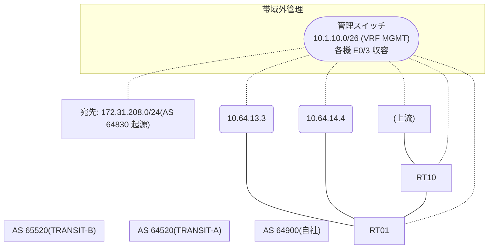

# 問題 20260914-004

> **本問は機器に接続せずに解答すること。追加の show 実行は認めない。**

## トポロジ

あなたは、下記のネットワークの保守を担当する技術者です。自社のルータ RT01 は、外部のネットワーク 172.31.208.0/24 への到達性を、複数の経路を通じて、確立しています。 TRANSIT-A とは、接続されています。 TRANSIT-B とも、接続されています。 一部の経路は、自 AS 内の境界ルータから、iBGP で、学習されています。



## 要件

1. 示されているところの出力、および、構成に基づいて、判断すること。
2. なお、機器の構成は、示されている抜粋のほかは、既定値である。

## 現在の状態

運用チームは、AS 全体のトラフィックを TRANSIT-A 経由とすることを意図して、境界ルータ RT10 に、示されているところの設定を、投入しました。しかしながら、RT01 のベストパスは、変更されていません。

```
RT01# show ip bgp
BGP table version is 19, local router ID is 138.138.138.138
Status codes: s suppressed, d damped, h history, * valid, > best, i - internal, 
              r RIB-failure, S Stale, m multipath, b backup-path, f RT-Filter, 
              x best-external, a additional-path, c RIB-compressed, 
              t secondary path, L long-lived-stale,
Origin codes: i - IGP, e - EGP, ? - incomplete
RPKI validation codes: V valid, I invalid, N Not found

     Network          Next Hop            Metric LocPrf Weight Path
 *>   172.31.208.0/24  10.64.14.4                             0 65520 64830 i
 *                     10.64.13.3                             0 64520 64520 64830 64830 i
 * i                   4.5.5.5                       100      0 64520 64830 i
```
```
RT01# show ip bgp 172.31.208.0
BGP routing table entry for 172.31.208.0/24, version 19
Paths: (3 available, best #1, table default)
  Advertised to update-groups:
     5         
  Refresh Epoch 1
  65520 64830
    10.64.14.4 from 10.64.14.4 (239.239.239.239)
      Origin IGP, localpref 100, valid, external, best
      rx pathid: 0, tx pathid: 0x0
      Updated on May 22 2026 21:09:03 UTC
  Refresh Epoch 4
  64520 64520 64830 64830
    10.64.13.3 from 10.64.13.3 (70.70.70.70)
      Origin IGP, localpref 100, valid, external
      rx pathid: 0, tx pathid: 0
      Updated on May 22 2026 20:45:56 UTC
  Refresh Epoch 1
  64520 64830
    4.5.5.5 (metric 11) from 4.5.5.5 (4.5.5.5)
      Origin IGP, localpref 100, valid, internal
      rx pathid: 0, tx pathid: 0
      Updated on May 22 2026 19:36:07 UTC
```

## 設定抜粋

```
RT01# show running-config | section router bgp
router bgp 64900
 bgp router-id 138.138.138.138
 bgp log-neighbor-changes
 neighbor 4.5.5.5 remote-as 64900
 neighbor 4.5.5.5 update-source Loopback0
 neighbor 10.64.13.3 remote-as 64520
 neighbor 10.64.14.4 remote-as 65520
 !
 address-family ipv4
  neighbor 4.5.5.5 activate
  neighbor 10.64.13.3 activate
  neighbor 10.64.14.4 activate
 exit-address-family
```
```
RT10# show running-config | section router bgp
router bgp 64900
 bgp router-id 4.5.5.5
 neighbor 138.138.138.138 remote-as 64900
 neighbor 138.138.138.138 update-source Loopback0
 neighbor 10.64.25.2 remote-as 64520
 !
 address-family ipv4
  neighbor 138.138.138.138 activate
  neighbor 138.138.138.138 next-hop-self
  neighbor 10.64.25.2 activate
  neighbor 10.64.25.2 weight 35000
 exit-address-family
```

## 設問

この事象の原因である可能性が、最も高いものは、どれですか。(1つを選択してください)

## 選択肢
A. MED は、異なる隣接 AS から受信した経路の間では、既定では比較されない

B. weight は、それを設定したルータのローカルでのみ有効であり、iBGP の近隣には伝播しない

C. LOCAL_PREF は iBGP でのみ交換される属性であり、eBGP の近隣には送信されない

D. 設定変更後に BGP セッションの再評価(clear)が行われていない
