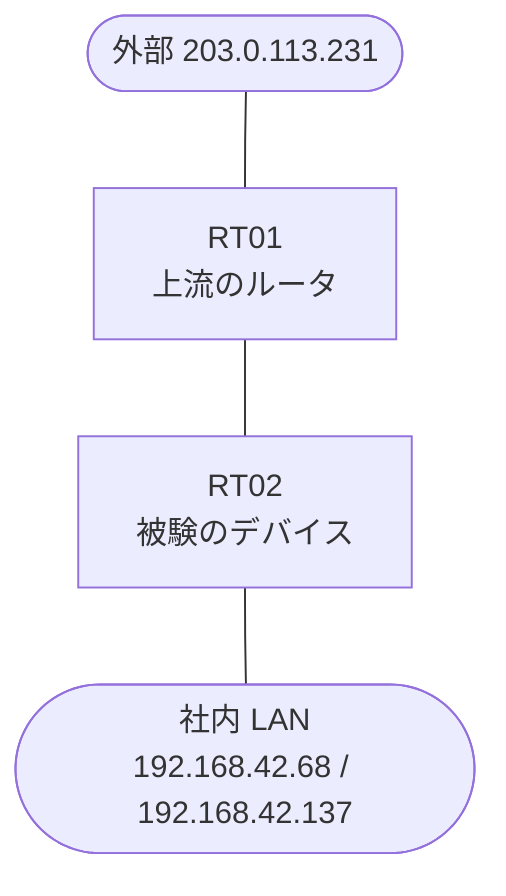

# 問題 20260914-005

> **本問は機器に接続せずに解答すること。追加の show 実行は認めない。**

## シナリオ

あなたは、ネットワークの運用を担当しています。あなたの会社の拠点のルータ RT02 は、上流のルータ RT01 を経由して、外部のネットワークへ接続されています。社内の LAN には、管理のステーション 192.168.42.68 およびサーバ 192.168.42.137 が存在し、そして、RT02 と RT01 の間では、ルーティング・プロトコルの隣接関係が確立されています。RT02 には、コントロール・プレーンを保護するためのサービス・ポリシーが、構成されています。通信の一部において、想定されていない挙動が、観測されています。あなたは、示されているところの出力および構成に基づいて、その構成が、下記において記述されているとおりに動作していない理由を、判断する必要があります。運用のために必要とされる、ルータへの管理のアクセス、および、ルーティング プロトコルの隣接関係は、影響を受けてはなりません。ルータ自身に宛てられたトラフィックの保護は、control-plane の input のサービス ポリシーによって、実装される必要があります。ルーター自身に宛てられた ICMP は、専用の class において帯域が制限され、そして、超過するトラフィックは破棄される必要があります。スタティック ルートおよび既定のルートによる迂回は、実施されてはなりません。問題となっているトラフィックへの対処のための分類において、特定の発信元のアドレスを名指しにするところのエントリの使用は、認められていません。class-default の扱いは、変更されてはなりません。ルータを通過するところのトラフィックの転送に、影響が与えられてはなりません。



| 対象 | 内容 |
|------|------|
| RT02 ⇔ RT01（外部側） | Ethernet0/0・10.125.43.0/30（RT02=10.125.43.1 / RT01=10.125.43.2） |
| RT02 ⇔ 社内 LAN | Ethernet0/1・192.168.42.0/24（RT02=192.168.42.1） |
| 管理のステーション（NMS） | 192.168.42.68（SSH / ping の発信元） |
| サーバ | 192.168.42.137 |
| 外部の発信元 | 203.0.113.231 |

## 出力

```
RT02# show policy-map control-plane
Control Plane 

  Service-policy input: COPP-POLICY

    Class-map: CM-ICMP (match-all)  
      Match: access-group 111
      police:
          cir 8000 bps, bc 1500 bytes
        conformed 0 packets, 0 bytes; actions:
          transmit 
        exceeded 0 packets, 0 bytes; actions:
          drop 
        conformed 0000 bps, exceeded 0000 bps

    Class-map: class-default (match-any)  
      Match: any
```
```
RT02# show running-config | section control-plane
control-plane
 service-policy input COPP-POLICY
```
```
RT02# show access-lists
Extended IP access list 110
    10 permit icmp any any
```
```
RT02# show running-config | section interface
interface Ethernet0/0
 description === to RT01 ===
 ip address 10.125.43.1 255.255.255.252
interface Ethernet0/1
 ip address 192.168.42.1 255.255.255.0
```
```
RT02# show running-config | section line
line con 0
 logging synchronous
line vty 0 4
 login local
 transport input ssh
```

## 設問

次のうち、正しいものは、どれですか。

## 選択肢
A. 物理インターフェイスの in 方向のアクセス・グループによって、当該のトラフィックが事前に破棄されている

B. police のバーストの値が構成されていないという理由により、policer が動作していない

C. アクセス・リストの deny のエントリによって、当該の発信元が class の一致から除外されている

D. class が match によって参照しているところの番号のアクセス・リストが、定義されていない

E. より広い一致を持つところの class が先に評価されており、意図された class にトラフィックが到達していない

F. 保護のための明示の class が存在せず、管理およびルーティングのトラフィックが、class-default の制限に道連れにされている
