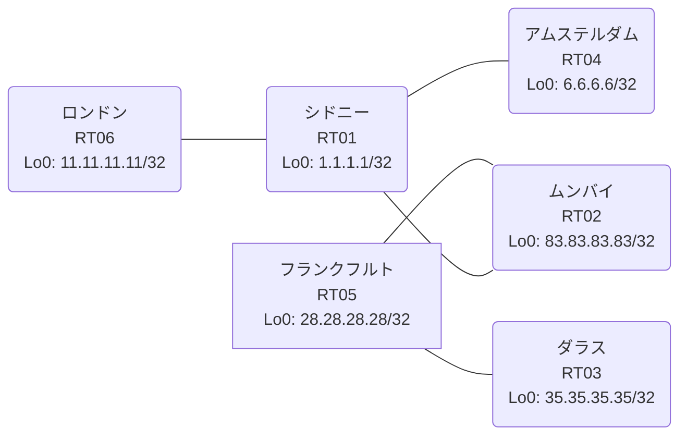

# 問題 20260916-001

> **本問は機器に接続せずに解答すること。追加の show 実行は認めない。**

## シナリオ

あなたの組織は、下記に示されているところのネットワークを運用しています。あなたの会社のネットワークは、複数のルーティング ドメインが、境界のルータによって接続され、そして、すべてのサイトのリーチアビリティが提供されている、というものです。ルーティングの設計の詳細は、示されているところのコンフィギュレーションから、読み取られることが、期待されています。各サイトのルータと、サイトの網との対応は、下記の表に示されているとおりです。通信の一部において、想定されていない挙動が、観測されています。示されているところの出力および構成に基づいて、要求されているところの動作が得られていない理由が、判断されなければなりません。再配送される経路の、選択的な制限は、実施されてはなりません。インタフェースの IP アドレッシングは、変更されてはなりません。本作業は、日中の時間帯において実施されるという理由により、対象外であるところのデバイスに対する構成の変更は、許可されていません。EIGRP へのルートの注入におけるシード メトリックは、プロセスの配下の default-metric `1000000 100 255 1 1500` によって、与えられなければなりません。redistribute によって参照されるところのプロセス ID / AS 番号は、その境界に実在する隣接のドメインのものと一致させられ、そして、実在しないプロセスへの参照が、残置されることはできません。いずれのサイトからも、他のすべてのサイトのネットワークへの、IP リーチアビリティが、確保されていること。



| 拠点 | ルータ | 拠点網 |
|------|--------|----------------------|
| アムステルダム | RT04 | `6.6.6.6/32` |
| シドニー | RT01 | `1.1.1.1/32` |
| ダラス | RT03 | `35.35.35.35/32` |
| フランクフルト | RT05 | `28.28.28.28/32` |
| ムンバイ | RT02 | `83.83.83.83/32` |
| ロンドン | RT06 | `11.11.11.11/32` |

リンク一覧:
```
  RT01:E0/0(.1) ── RT06:E0/0(.2)   10.226.185.0/30
  RT02:E0/0(.1) ── RT05:E0/0(.2)   10.147.157.0/30
  RT02:E0/1(.1) ── RT01:E0/1(.2)   10.20.160.0/30
  RT01:E0/2(.1) ── RT04:E0/0(.2)   10.116.218.0/30
  RT05:E0/1(.1) ── RT03:E0/0(.2)   10.113.67.0/30
```

## 出力

```
RT02# show route-map
route-map RM-SVC, permit, sequence 10
  Match clauses:
    ip address (access-lists): SVC 
  Set clauses:
  Policy routing matches: 0 packets, 0 bytes
route-map RM-STG1, deny, sequence 10
  Match clauses:
    ip address prefix-lists: PL-STG1 
  Set clauses:
  Policy routing matches: 0 packets, 0 bytes
route-map RM-STG1, permit, sequence 20
  Match clauses:
  Set clauses:
  Policy routing matches: 0 packets, 0 bytes
route-map RM-LEGACY2, deny, sequence 10
  Match clauses:
    ip address prefix-lists: PL-LEGACY2 
  Set clauses:
  Policy routing matches: 0 packets, 0 bytes
route-map RM-LEGACY2, permit, sequence 20
  Match clauses:
  Set clauses:
  Policy routing matches: 0 packets, 0 bytes
```
```
RT06# show running-config | section router
router ospf 37
 router-id 11.11.11.11
 passive-interface Loopback0
 network 10.226.185.0 0.0.0.3 area 0
 network 11.11.11.11 0.0.0.0 area 0
```
```
RT02# show running-config | section router
router eigrp 583
 default-metric 1000000 100 255 1 1500
 network 10.147.157.0 0.0.0.3
 network 83.83.83.83 0.0.0.0
 redistribute ospf 33 match internal external 1 external 2 route-map RM-SVC
 passive-interface Loopback0
router ospf 33
 router-id 83.83.83.83
 redistribute eigrp 583
 network 10.20.160.0 0.0.0.3 area 0
 network 83.83.83.83 0.0.0.0 area 0
```
```
RT02# show ip prefix-list
ip prefix-list PL-LEGACY2: 2 entries
   seq 5 deny 1.1.1.1/32
   seq 10 permit 0.0.0.0/0 le 32
ip prefix-list PL-STG1: 2 entries
   seq 5 deny 1.1.1.1/32
   seq 10 permit 0.0.0.0/0 le 32
ip prefix-list SVC: 3 entries
   seq 5 permit 1.1.1.1/32
   seq 10 permit 11.11.11.11/32
   seq 15 permit 6.6.6.6/32
```
```
RT04# show ip route
Gateway of last resort is not set
      1.0.0.0/32 is subnetted, 1 subnets
O E2     1.1.1.1 [110/1] via 10.116.218.1, 00:04:25, Ethernet0/0
      6.0.0.0/32 is subnetted, 1 subnets
C        6.6.6.6 is directly connected, Loopback0
      10.0.0.0/8 is variably subnetted, 6 subnets, 2 masks
O E2     10.20.160.0/30 [110/10] via 10.116.218.1, 00:04:25, Ethernet0/0
O E2     10.113.67.0/30 [110/20] via 10.116.218.1, 00:04:25, Ethernet0/0
C        10.116.218.0/30 is directly connected, Ethernet0/0
L        10.116.218.2/32 is directly connected, Ethernet0/0
O E2     10.147.157.0/30 [110/20] via 10.116.218.1, 00:04:25, Ethernet0/0
O        10.226.185.0/30 [110/20] via 10.116.218.1, 00:04:23, Ethernet0/0
      11.0.0.0/32 is subnetted, 1 subnets
O        11.11.11.11 [110/21] via 10.116.218.1, 00:04:18, Ethernet0/0
      28.0.0.0/32 is subnetted, 1 subnets
O E2     28.28.28.28 [110/20] via 10.116.218.1, 00:04:25, Ethernet0/0
      35.0.0.0/32 is subnetted, 1 subnets
O E2     35.35.35.35 [110/20] via 10.116.218.1, 00:04:25, Ethernet0/0
      83.0.0.0/32 is subnetted, 1 subnets
O E2     83.83.83.83 [110/11] via 10.116.218.1, 00:04:25, Ethernet0/0
```
```
RT04# show running-config | section router
router ospf 37
 router-id 6.6.6.6
 network 6.6.6.6 0.0.0.0 area 0
 network 10.116.218.0 0.0.0.3 area 0
```
```
RT01# show running-config | section router
router ospf 33
 router-id 1.1.1.1
 redistribute ospf 37 match internal external 1 external 2
 network 1.1.1.1 0.0.0.0 area 0
 network 10.20.160.0 0.0.0.3 area 0
router ospf 37
 redistribute ospf 33 match internal external 1 external 2
 passive-interface Loopback0
 network 10.116.218.0 0.0.0.3 area 0
 network 10.226.185.0 0.0.0.3 area 0
```
```
RT05# show ip route
Gateway of last resort is not set
      6.0.0.0/32 is subnetted, 1 subnets
D EX     6.6.6.6 [170/307200] via 10.147.157.1, 00:04:06, Ethernet0/0
      10.0.0.0/8 is variably subnetted, 4 subnets, 2 masks
C        10.113.67.0/30 is directly connected, Ethernet0/1
L        10.113.67.1/32 is directly connected, Ethernet0/1
C        10.147.157.0/30 is directly connected, Ethernet0/0
L        10.147.157.2/32 is directly connected, Ethernet0/0
      28.0.0.0/32 is subnetted, 1 subnets
C        28.28.28.28 is directly connected, Loopback0
      35.0.0.0/32 is subnetted, 1 subnets
D        35.35.35.35 [90/409600] via 10.113.67.2, 00:04:44, Ethernet0/1
      83.0.0.0/32 is subnetted, 1 subnets
D        83.83.83.83 [90/409600] via 10.147.157.1, 00:04:53, Ethernet0/0
```
```
RT02# show access-lists
Standard IP access list 18
    10 deny   1.1.1.1
    20 permit any
Standard IP access list 83
    10 deny   1.1.1.1
    20 permit any
Standard IP access list SVC
    10 permit 6.6.6.6 (1 match)
```
```
RT03# show running-config | section router
router eigrp 583
 network 10.113.67.0 0.0.0.3
 network 35.35.35.35 0.0.0.0
```
```
RT01# show ip route
Gateway of last resort is not set
      1.0.0.0/32 is subnetted, 1 subnets
C        1.1.1.1 is directly connected, Loopback0
      6.0.0.0/32 is subnetted, 1 subnets
O        6.6.6.6 [110/11] via 10.116.218.2, 00:04:42, Ethernet0/2
      10.0.0.0/8 is variably subnetted, 8 subnets, 2 masks
C        10.20.160.0/30 is directly connected, Ethernet0/1
L        10.20.160.2/32 is directly connected, Ethernet0/1
O E2     10.113.67.0/30 [110/20] via 10.20.160.1, 00:04:54, Ethernet0/1
C        10.116.218.0/30 is directly connected, Ethernet0/2
L        10.116.218.1/32 is directly connected, Ethernet0/2
O E2     10.147.157.0/30 [110/20] via 10.20.160.1, 00:04:54, Ethernet0/1
C        10.226.185.0/30 is directly connected, Ethernet0/0
L        10.226.185.1/32 is directly connected, Ethernet0/0
      11.0.0.0/32 is subnetted, 1 subnets
O        11.11.11.11 [110/11] via 10.226.185.2, 00:04:40, Ethernet0/0
      28.0.0.0/32 is subnetted, 1 subnets
O E2     28.28.28.28 [110/20] via 10.20.160.1, 00:04:54, Ethernet0/1
      35.0.0.0/32 is subnetted, 1 subnets
O E2     35.35.35.35 [110/20] via 10.20.160.1, 00:04:54, Ethernet0/1
      83.0.0.0/32 is subnetted, 1 subnets
O        83.83.83.83 [110/11] via 10.20.160.1, 00:04:54, Ethernet0/1
```
```
RT05# show running-config | section router
router eigrp 583
 network 10.113.67.0 0.0.0.3
 network 10.147.157.0 0.0.0.3
 network 28.28.28.28 0.0.0.0
```

## 設問

次のうち、正しいものは、どれですか。

## 選択肢
**A.**
```
clear ip route *
```

**B.**
```
ip prefix-list SVC seq 100 permit 0.0.0.0/0 le 32
```

**C.**
```
ip access-list standard SVC
 permit 1.1.1.1
 permit 11.11.11.11
```

**D.**
```
router eigrp 583
 no redistribute ospf 33
 redistribute ospf 33 match internal external 1 external 2
no route-map RM-SVC
no ip prefix-list SVC
no ip access-list standard SVC
```

**E.**
```
route-map RM-SVC permit 10
 no match ip address SVC
 match ip address prefix-list SVC
```

**F.**
```
router eigrp 583
 no passive-interface <上流IF>
```
