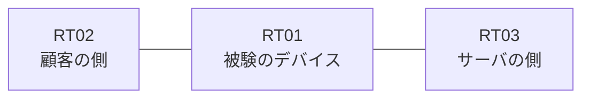

# 問題 20260916-003

> **本問は機器に接続せずに解答すること。追加の show 実行は認めない。**

## トポロジ

あなたの組織は、下記に示されているところのネットワークを運用しています。ある企業のネットワークにおいて、RT01 は、顧客の側のネットワークと、サーバの側のネットワークとの間に配置されており、IPv6 によって運用されています。



## 要件

1. `2001:DB8:2D:15::/64` からの通信は、許可されてはなりません。
2. インタフェースの IP アドレッシングは、変更されてはなりません。
3. RT01 において、`2001:DB8:2D:10::/64`、`2001:DB8:2D:11::/64`、`2001:DB8:2D:12::/64` のネットワークからの通信のみが、`2001:DB8:2D:FF::10` の TCP ポート 22 に到達できなければなりません。
4. 対象としていないネットワークが、一致の対象に含まれてはなりません。また、拒否のエントリを使用してはなりません。
5. `2001:DB8:2D:13::/64` からの通信は、許可されることはできません。

## 現在の状態

ユーザーから、通信に関する事象が、報告されています。あなたは、示されているところの出力および構成に基づいて、その構成が、下記において記述されているとおりに動作していない理由を、判断する必要があります。

観測 | サーバへの到達
--- | ---
送信元が 2001:DB8:2D:10::/64 のネットワークにあるホストから、2001:DB8:2D:FF::10 の TCP ポート 22 宛ての通信 | 到達可
送信元が 2001:DB8:2D:11::/64 のネットワークにあるホストから、2001:DB8:2D:FF::10 の TCP ポート 22 宛ての通信 | 到達可
送信元が 2001:DB8:2D:12::/64 のネットワークにあるホストから、2001:DB8:2D:FF::10 の TCP ポート 22 宛ての通信 | 到達可
送信元が 2001:DB8:2D:13::/64 のネットワークにあるホストから、2001:DB8:2D:FF::10 の TCP ポート 22 宛ての通信 | 到達可
送信元が 2001:DB8:2D:15::/64 のネットワークにあるホストから、2001:DB8:2D:FF::10 の TCP ポート 22 宛ての通信 | 到達可
送信元が 2001:DB8:2D:FA::/64 のネットワークにあるホストから、2001:DB8:2D:FF::10 の TCP ポート 22 宛ての通信 | 到達不可

```
RT01# show ipv6 neighbors
IPv6 Address                              Age Link-layer Addr State Interface
2001:DB8:2D:10::3                           0 aabb.cc02.4f00  REACH Et0/0
```
```
RT01# show ipv6 access-list
IPv6 access list V6-FILTER-IN
    permit ipv6 2001:DB8:2D:10::/61 any sequence 10
    deny ipv6 2001:DB8:2D:15::/64 any sequence 20
```

## 設定抜粋

```
RT01# show running-config | section ipv6 access-list|traffic-filter
ipv6 access-list V6-FILTER-IN
 sequence 10 permit ipv6 2001:DB8:2D:10::/61 any
 sequence 20 deny ipv6 2001:DB8:2D:15::/64 any
interface Ethernet0/0
 ipv6 traffic-filter V6-FILTER-IN in
```

## 設問

次のうち、正しいものは、どれですか。

## 選択肢
A. ワイルドカードによる指定が受理されず、意図されたエントリが存在していない

B. 末尾に明示の拒否のエントリが記述されているため、近隣探索に対する暗黙の許可が失われ、隣接のアドレスが解決できていない

C. 先行するエントリが広い範囲を許可しており、後続のエントリが評価されない

D. シーケンス番号が連続していないため、エントリが評価されていない

E. 参照されているアクセス・リストが定義されていない

F. アクセス・リストが `ip access-group` によって適用されている
