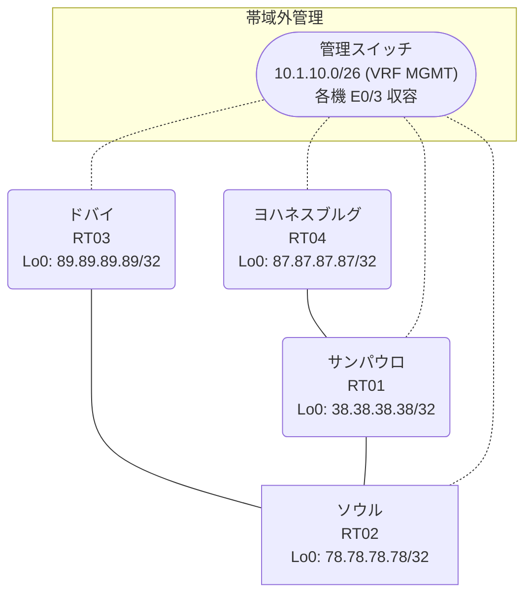

# 問題 20260917-001

> **本問は機器に接続せずに解答すること。追加の show 実行は認めない。**

## トポロジ

あなたは、下記のネットワークの保守を担当する技術者です。あなたの会社のネットワークは、複数のルーティング・ドメインが、境界のルータによって接続され、そして、すべてのサイトの到達可能性が提供されている、というものです。ルーティングの設計の詳細は、示されているところの構成から、読み取られることが、期待されています。各サイトのルーターと、サイトのネットワークとの対応は、下記の表に示されているとおりです。



| 拠点 | ルータ | 拠点網 |
|------|--------|----------------------|
| サンパウロ | RT01 | `38.38.38.38/32` |
| ソウル | RT02 | `78.78.78.78/32` |
| ドバイ | RT03 | `89.89.89.89/32` |
| ヨハネスブルグ | RT04 | `87.87.87.87/32` |

リンク一覧:
```
  RT02:E0/0(.1) ── RT03:E0/0(.2)   10.12.169.0/30
  RT01:E0/0(.1) ── RT04:E0/0(.2)   10.39.20.0/30
  RT02:E0/1(.1) ── RT01:E0/1(.2)   10.226.146.0/30
```

## 要件

1. 再配送に対するフィルターの適用は、禁止されているところのものです。
2. シード メトリック `100000 100 255 1 1500` は、redistribute のステートメントごとに、個別に指定される必要があります。
3. 管理のための構成に対して、変更が加えられてはなりません。
4. 各サイトのネットワークは、ドメインをまたいで、すべてのサイトから、到達されることができること。
5. スタティック・ルートおよび既定のルートによる迂回は、実施されることはできません。
6. redistribute によって参照されるところのプロセス ID / AS 番号は、その境界に実在する隣接のドメインのものと一致させられ、そして、実在しないプロセスへの参照が、残置されることはできません。

## 現在の状態

ユーザーから、通信に関する事象が、報告されています。あなたは、提示されているところの情報のみを使用して、要求されている状態が満たされていない理由を、特定しなければなりません。

```
RT04# show ip route
Gateway of last resort is not set
      10.0.0.0/8 is variably subnetted, 4 subnets, 2 masks
O E2     10.12.169.0/30 [110/20] via 10.39.20.1, 00:06:14, Ethernet0/0
C        10.39.20.0/30 is directly connected, Ethernet0/0
L        10.39.20.2/32 is directly connected, Ethernet0/0
O E2     10.226.146.0/30 [110/20] via 10.39.20.1, 00:06:14, Ethernet0/0
      38.0.0.0/32 is subnetted, 1 subnets
O        38.38.38.38 [110/11] via 10.39.20.1, 00:06:14, Ethernet0/0
      78.0.0.0/32 is subnetted, 1 subnets
O E2     78.78.78.78 [110/20] via 10.39.20.1, 00:06:14, Ethernet0/0
      87.0.0.0/32 is subnetted, 1 subnets
C        87.87.87.87 is directly connected, Loopback0
      89.0.0.0/32 is subnetted, 1 subnets
O E2     89.89.89.89 [110/20] via 10.39.20.1, 00:06:14, Ethernet0/0
```
```
RT01# show route-map
route-map RM-OLD1, deny, sequence 10
  Match clauses:
    ip address prefix-lists: PL-OLD1 
  Set clauses:
  Policy routing matches: 0 packets, 0 bytes
route-map RM-OLD1, permit, sequence 20
  Match clauses:
  Set clauses:
  Policy routing matches: 0 packets, 0 bytes
route-map RM-BACKUP2, deny, sequence 10
  Match clauses:
    ip address prefix-lists: PL-BACKUP2 
  Set clauses:
  Policy routing matches: 0 packets, 0 bytes
route-map RM-BACKUP2, permit, sequence 20
  Match clauses:
  Set clauses:
  Policy routing matches: 0 packets, 0 bytes
```
```
RT01# show access-lists
Standard IP access list 11
    10 deny   87.87.87.87
    20 permit any
Standard IP access list 49
    10 deny   78.78.78.78
    20 permit any
```
```
RT02# show ip route
Gateway of last resort is not set
      10.0.0.0/8 is variably subnetted, 4 subnets, 2 masks
C        10.12.169.0/30 is directly connected, Ethernet0/0
L        10.12.169.1/32 is directly connected, Ethernet0/0
C        10.226.146.0/30 is directly connected, Ethernet0/1
L        10.226.146.1/32 is directly connected, Ethernet0/1
      38.0.0.0/32 is subnetted, 1 subnets
D        38.38.38.38 [90/409600] via 10.226.146.2, 00:06:40, Ethernet0/1
      78.0.0.0/32 is subnetted, 1 subnets
C        78.78.78.78 is directly connected, Loopback0
      89.0.0.0/32 is subnetted, 1 subnets
O        89.89.89.89 [110/11] via 10.12.169.2, 00:05:58, Ethernet0/0
```
```
RT01# show ip prefix-list
ip prefix-list PL-BACKUP2: 2 entries
   seq 5 deny 78.78.78.78/32
   seq 10 permit 0.0.0.0/0 le 32
ip prefix-list PL-OLD1: 2 entries
   seq 5 deny 87.87.87.87/32
   seq 10 permit 0.0.0.0/0 le 32
```
```
RT03# show ip route
Gateway of last resort is not set
      10.0.0.0/8 is variably subnetted, 3 subnets, 2 masks
C        10.12.169.0/30 is directly connected, Ethernet0/0
L        10.12.169.2/32 is directly connected, Ethernet0/0
O E2     10.226.146.0/30 [110/20] via 10.12.169.1, 00:06:36, Ethernet0/0
      38.0.0.0/32 is subnetted, 1 subnets
O E2     38.38.38.38 [110/20] via 10.12.169.1, 00:06:36, Ethernet0/0
      78.0.0.0/32 is subnetted, 1 subnets
O        78.78.78.78 [110/11] via 10.12.169.1, 00:06:36, Ethernet0/0
      89.0.0.0/32 is subnetted, 1 subnets
C        89.89.89.89 is directly connected, Loopback0
```

## 設定抜粋

```
RT01# show running-config | section router
router eigrp 654
 timers active-time 5
 network 10.226.146.0 0.0.0.3
 network 38.38.38.38 0.0.0.0
 redistribute ospf 46 match internal external 1 external 2 metric 100000 100 255 1 1500
 passive-interface Loopback0
router ospf 39
 router-id 38.38.38.38
 redistribute eigrp 654
 network 10.39.20.0 0.0.0.3 area 0
 network 38.38.38.38 0.0.0.0 area 0
```
```
RT02# show running-config | section router
router eigrp 654
 timers active-time 5
 network 10.226.146.0 0.0.0.3
 network 78.78.78.78 0.0.0.0
 redistribute ospf 91 match internal external 1 external 2 metric 100000 100 255 1 1500
 passive-interface Loopback0
router ospf 91
 router-id 78.78.78.78
 redistribute eigrp 654
 network 10.12.169.0 0.0.0.3 area 0
 network 78.78.78.78 0.0.0.0 area 0
```
```
RT03# show running-config | section router
router ospf 91
 router-id 89.89.89.89
 timers throttle spf 50 200 5000
 passive-interface Loopback0
 network 10.12.169.0 0.0.0.3 area 0
 network 89.89.89.89 0.0.0.0 area 0
```
```
RT04# show running-config | section router
router ospf 39
 router-id 87.87.87.87
 passive-interface Loopback0
 network 10.39.20.0 0.0.0.3 area 0
 network 87.87.87.87 0.0.0.0 area 0
```

## 設問

次のうち、正しいものは、どれですか。

## 選択肢
A. RT01 の router eigrp 654 配下の redistribute が、実在しないプロセス/AS を参照している

B. RT01 の router eigrp 654 配下に redistribute が設定されていない

C. RT01 の route-map RM-OLD1 が対象の経路を拒否している

D. RT01 と RT02 側ドメインの間のリンクで MTU が一致していない

E. RT02 の router eigrp 654 に Loopback0 の network 文が設定されていない

F. RT01 の redistribute に適用された route-map が特定の拠点網を deny している
