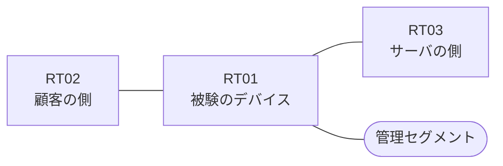

# 問題 20260917-003

> **本問は機器に接続せずに解答すること。追加の show 実行は認めない。**

## トポロジ

あなたは、ネットワークの運用を担当しています。ある企業のネットワークにおいて、RT01 は、顧客の側のネットワークと、サーバの側のネットワークとの間に、配置されています。



| 区間 | 被験デバイス側のインターフェイス | ネットワーク |
|------|----------------------------------|--------------|
| RT02（顧客の側） ⇔ RT01 | `Ethernet1/0` | 10.162.253.0/24 |
| RT01 ⇔ RT03（サーバの側） | `Ethernet1/1` | 10.162.254.0/24 |
| RT01 ⇔ 管理セグメント | `Ethernet1/2` | 10.162.255.0/24 |

## 要件

1. アクセス・リストのエントリは、1行で構成されなければなりません。
2. ルーティング プロトコルの種別およびプロセスの配置は、変更されてはなりません。
3. `10.162.61.0/24` からの通信は、許可されてはなりません。
4. RT01 において、`10.162.56.0/24`、`10.162.57.0/24`、`10.162.58.0/24`、`10.162.59.0/24` のネットワークからの通信のみが、サーバである `172.18.21.70` の TCP ポート 3389 に到達できなければなりません。
5. 当該のサーバの他のポートへの通信、および当該のサーバ以外の宛先への通信は、許可されてはなりません。
6. `10.162.60.0/24` からの通信は、許可されてはなりません。
7. アクセス・リストは、顧客の側のインターフェイスである `Ethernet1/0` において、着信の方向に適用されなければなりません。

## 現在の状態

```
RT01# show logging | include SEC-6
%SEC-6-IPACCESSLOGP: list RT-IN denied tcp 10.162.61.7(19375) -> 172.18.21.70(3389), 1 packet
```

## 設定抜粋

```
RT01# show ip access-lists RT-IN
Extended IP access list RT-IN
    10 deny   tcp 10.162.61.0 0.0.0.255 host 172.18.21.70 eq 3389 log
    20 deny   tcp 10.162.60.0 0.0.0.255 host 172.18.21.70 eq 3389
    30 permit ip any any
```

## 設問

示されているところの記録および構成から読み取ることができるものは、どれですか。(2つを選択してください)

## 選択肢
A. `10.162.56.7` からの通信は、拒否された。

B. `10.162.60.7` からの通信は、許可された。

C. `10.162.60.7` からの通信は、記録には現れていないが、アクセス・リストによって拒否された。

D. `10.162.61.7` からの通信は、アクセス・リストによって拒否された。

E. 記録に現れていない通信は、いずれも許可されたものである。
