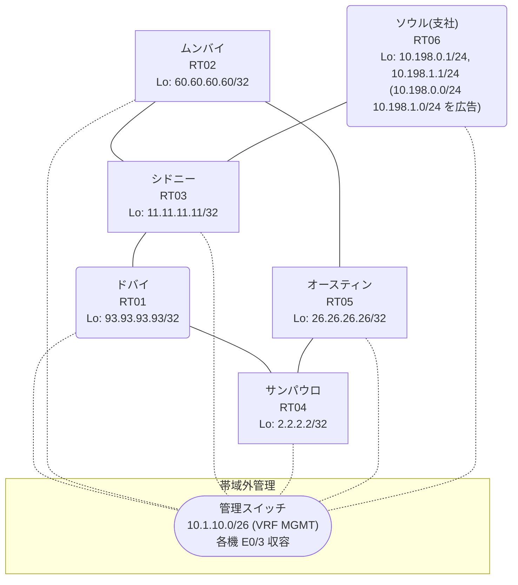

# 問題 20260917-005

> **本問は機器に接続せずに解答すること。追加の show 実行は認めない。**

## シナリオ

あなたは、ネットワークの運用を担当しています。あなたの会社のネットワークは、支社のドメインと、本社のコアのドメイン(OSPF)とが、2 台の境界のルータによって接続され、そして、それらは境界において接続されています。支社のネットワーク `10.198.0.0/24` および `10.198.1.0/24` は、RT06 によって、広告されています。どちらの境界が失われた場合においても、通信が継続されることができるように、設計されています。ルーティングの設計の詳細は、示されているところの出力から、読み取られることが、期待されています。ユーザーから、通信に関する事象が、報告されています。示されているところの出力および構成に基づいて、要求されているところの動作が得られていない理由が、判断されなければなりません。支社のネットワーク `10.198.0.0/24` / `10.198.1.0/24` への到達可能性が、すべてのサイトにおいて、確保されていること。経路は、最短の転送パスを取ること。本作業は、日中の時間帯において実施されるという理由により、対象外であるところのデバイスに対する構成の変更は、許可されていません。二点相互再配送による、冗長の設計が、維持される必要があります。ルーティング プロトコルの種別およびプロセスの配置は、変更されてはなりません。フィルタおよび route-map の新設は、変更の凍結により、使用することができません。スタティック ルートおよび既定のルートによる迂回は、実施されることはできません。支社のネットワーク宛のパケットが、広告元である RT06 の方向へ転送され、そして、転送のループが存在していないこと。



| 拠点 | ルータ | Loopback / 広告網 |
|------|--------|--------------------|
| オースティン | RT05 | 26.26.26.26/32 |
| サンパウロ | RT04 | 2.2.2.2/32 |
| シドニー | RT03 | 11.11.11.11/32 |
| ソウル(支社) | RT06 | 10.198.0.1/24, 10.198.1.1/24 (`10.198.0.0/24` `10.198.1.0/24` を広告) |
| ドバイ | RT01 | 93.93.93.93/32 |
| ムンバイ | RT02 | 60.60.60.60/32 |

リンク一覧:
```
  RT06:E0/0(.2) ── RT03:E0/0(.1)   10.215.154.0/30
  RT03:E0/1(.1) ── RT02:E0/0(.2)   10.37.230.0/30
  RT03:E0/2(.1) ── RT01:E0/0(.2)   10.209.238.0/30
  RT02:E0/1(.1) ── RT05:E0/0(.2)   172.16.12.0/30
  RT05:E0/1(.1) ── RT04:E0/0(.2)   172.16.143.0/30
  RT01:E0/1(.1) ── RT04:E0/1(.2)   172.16.130.0/30
```

## 出力

```
RT01# show ip route
Gateway of last resort is not set
      2.0.0.0/32 is subnetted, 1 subnets
O        2.2.2.2 [110/11] via 172.16.130.2, 00:04:08, Ethernet0/1
      10.0.0.0/8 is variably subnetted, 6 subnets, 3 masks
O E2     10.37.230.0/30 [110/20] via 172.16.130.2, 00:04:00, Ethernet0/1
O E2     10.198.0.0/24 [110/20] via 172.16.130.2, 00:04:00, Ethernet0/1
O E2     10.198.1.0/24 [110/20] via 172.16.130.2, 00:04:00, Ethernet0/1
C        10.209.238.0/30 is directly connected, Ethernet0/0
L        10.209.238.2/32 is directly connected, Ethernet0/0
O E2     10.215.154.0/30 [110/20] via 172.16.130.2, 00:04:00, Ethernet0/1
      11.0.0.0/32 is subnetted, 1 subnets
O E2     11.11.11.11 [110/20] via 172.16.130.2, 00:04:00, Ethernet0/1
      26.0.0.0/32 is subnetted, 1 subnets
O        26.26.26.26 [110/21] via 172.16.130.2, 00:04:06, Ethernet0/1
      60.0.0.0/32 is subnetted, 1 subnets
O        60.60.60.60 [110/31] via 172.16.130.2, 00:04:00, Ethernet0/1
      93.0.0.0/32 is subnetted, 1 subnets
C        93.93.93.93 is directly connected, Loopback0
      172.16.0.0/16 is variably subnetted, 4 subnets, 2 masks
O        172.16.12.0/30 [110/30] via 172.16.130.2, 00:04:03, Ethernet0/1
C        172.16.130.0/30 is directly connected, Ethernet0/1
L        172.16.130.1/32 is directly connected, Ethernet0/1
O        172.16.143.0/30 [110/20] via 172.16.130.2, 00:04:07, Ethernet0/1
```
```
RT02# show ip route 10.198.0.0
Routing entry for 10.198.0.0/24
  Known via "rip", distance 120, metric 2
  Redistributing via ospf 1, rip
  Advertised by ospf 1 subnets route-map RIP2OSPF
  Last update from 10.37.230.1 on Ethernet0/0, 00:00:19 ago
  Routing Descriptor Blocks:
  * 10.37.230.1, from 10.37.230.1, 00:00:19 ago, via Ethernet0/0
      Route metric is 2, traffic share count is 1
```
```
RT03# show ip route 26.26.26.26
Routing entry for 26.26.26.26/32
  Known via "rip", distance 120, metric 5
  Tag 150
  Redistributing via rip
  Last update from 10.209.238.2 on Ethernet0/2, 00:00:11 ago
  Routing Descriptor Blocks:
  * 10.209.238.2, from 10.209.238.2, 00:00:11 ago, via Ethernet0/2
      Route metric is 5, traffic share count is 1
      Route tag 150
    10.37.230.2, from 10.37.230.2, 00:00:14 ago, via Ethernet0/1
      Route metric is 5, traffic share count is 1
      Route tag 150
```
```
RT01# traceroute 10.198.0.1 probe 1 timeout 1 ttl 1 8
Type escape sequence to abort.
Tracing the route to 10.198.0.1
VRF info: (vrf in name/id, vrf out name/id)
  1 172.16.130.2 1 msec
  2 172.16.143.1 1 msec
  3 172.16.12.1 2 msec
  4 10.37.230.1 1 msec
  5 10.215.154.2 2 msec
```
```
RT02# show running-config | section router
router ospf 1
 router-id 60.60.60.60
 redistribute rip route-map RIP2OSPF
 network 60.60.60.60 0.0.0.0 area 0
 network 172.16.12.0 0.0.0.3 area 0
 distance ospf external 180
router rip
 version 2
 redistribute ospf 1 metric 5 route-map OSPF2RIP
 network 10.0.0.0
 network 60.0.0.0
 no auto-summary
```

## 設問

次のうち、正しいものは、どれですか。

## 選択肢
**A.**
```
! RT01 に投入
router ospf 1
 no redistribute rip
```

**B.**
```
! RT01 にのみ投入
router ospf 1
 distance ospf external 180
```

**C.**
```
! RT02 に投入
router ospf 1
 no distance ospf external 180
```

**D.**
```
! RT01 に投入
route-map OSPF2RIP deny 10
 match tag 50
```

**E.**
```
! RT05 と RT04 に投入
router ospf 1
 distance ospf external 180
```

**F.**
```
clear ip ospf process
```
