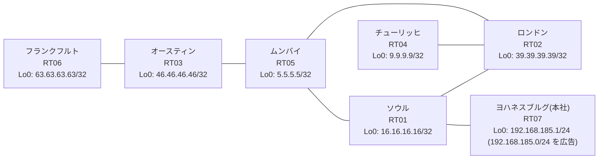

# 問題 20260919-001

> **本問は機器に接続せずに解答すること。追加の show 実行は認めない。**

## シナリオ

あなたは、下記のネットワークの保守を担当する技術者です。本社の顧客のネットワークは、BGP AS 64971 の RT07 によって、広告されています。あなたの会社の内部は、BGP / EIGRP / OSPF という 3 つのドメインから構成されています。サイトと、ルータおよびアドレスとの対応は、下記の表に示されているとおりです。ユーザーから、通信に関する事象が、報告されています。あなたは、示されているところの出力および構成に基づいて、その構成が、下記において記述されているとおりに動作していない理由を、判断する必要があります。スタティック ルートおよび既定のルートによる迂回は、実施されてはなりません。すべてのルータが、`192.168.185.0/24` を含むところのすべての宛先へ、到達することができること。`192.168.185.0/24` 宛のパケットが、広告元である RT07 の方向へ転送され、そして、転送のループが存在していないこと。既存の再配送の設計が、変更または撤去されることはできません。スタティック・ルートによる回避も、許可されていません。



| 拠点 | ルータ | 拠点網 / 広告網 |
|------|--------|------------------|
| オースティン | RT03 | 46.46.46.46/32 |
| ソウル | RT01 | 16.16.16.16/32 |
| チューリッヒ | RT04 | 9.9.9.9/32 |
| フランクフルト | RT06 | 63.63.63.63/32 |
| ムンバイ | RT05 | 5.5.5.5/32 |
| ヨハネスブルグ(本社) | RT07 | 192.168.185.1/24 (`192.168.185.0/24` を広告) |
| ロンドン | RT02 | 39.39.39.39/32 |

リンク一覧:
```
  RT07:E0/0(.1) ── RT01:E0/0(.2)   10.108.37.0/30
  RT01:E0/1(.1) ── RT02:E0/0(.2)   10.195.99.0/30
  RT01:E0/2(.1) ── RT05:E0/0(.2)   10.207.49.0/30
  RT02:E0/1(.1) ── RT05:E0/1(.2)   10.220.60.0/30
  RT05:E0/2(.1) ── RT03:E0/0(.2)   10.18.23.0/30
  RT03:E0/1(.1) ── RT06:E0/0(.2)   10.19.235.0/30
  RT02:E0/2(.1) ── RT04:E0/0(.2)   10.245.31.0/30
```

## 出力

```
RT01# show access-lists
Standard IP access list 42
    10 deny   9.9.9.9
    20 permit any
Standard IP access list 68
    10 deny   39.39.39.39
    20 permit any
```
```
RT06# traceroute 192.168.185.1 probe 1 timeout 1 ttl 1 8
Type escape sequence to abort.
Tracing the route to 192.168.185.1
VRF info: (vrf in name/id, vrf out name/id)
  1 10.19.235.1 2 msec
  2 10.18.23.1 1 msec
  3 10.207.49.1 2 msec
  4 10.195.99.2 2 msec
  5 10.220.60.2 2 msec
  6 10.207.49.1 2 msec
  7 10.195.99.2 16 msec
  8 10.220.60.2 3 msec
```
```
RT01# show route-map
route-map RM-STG2, deny, sequence 10
  Match clauses:
    ip address prefix-lists: PL-STG2 
  Set clauses:
  Policy routing matches: 0 packets, 0 bytes
route-map RM-STG2, permit, sequence 20
  Match clauses:
  Set clauses:
  Policy routing matches: 0 packets, 0 bytes
route-map RM-MIGR1, deny, sequence 10
  Match clauses:
    ip address prefix-lists: PL-MIGR1 
  Set clauses:
  Policy routing matches: 0 packets, 0 bytes
route-map RM-MIGR1, permit, sequence 20
  Match clauses:
  Set clauses:
  Policy routing matches: 0 packets, 0 bytes
```
```
RT05# show running-config | section router
router ospf 10
 router-id 5.5.5.5
 passive-interface Loopback0
 network 5.5.5.5 0.0.0.0 area 0
 network 10.18.23.0 0.0.0.3 area 0
 network 10.207.49.0 0.0.0.3 area 0
 network 10.220.60.0 0.0.0.3 area 0
```
```
RT01# show ip protocols | include Routing Protocol|Distance
Routing Protocol is "application"
    Gateway         Distance      Last Update
  Distance: (default is 4)
Routing Protocol is "eigrp 122"
      Distance: internal 90 external 170
    Gateway         Distance      Last Update
  Distance: internal 90 external 170
Routing Protocol is "ospf 10"
    Gateway         Distance      Last Update
  Distance: (default is 110)
Routing Protocol is "bgp 64971"
    Gateway         Distance      Last Update
  Distance: external 20 internal 200 local 200
```
```
RT07# show running-config | section router
router bgp 64971
 bgp router-id 192.168.185.1
 bgp log-neighbor-changes
 network 192.168.185.0
 neighbor 10.108.37.2 remote-as 64971
```
```
RT02# show running-config | section router
router eigrp 122
 network 10.195.99.0 0.0.0.3
 redistribute ospf 10 metric 100000 100 255 1 1500
router ospf 10
 router-id 39.39.39.39
 redistribute eigrp 122
 network 10.220.60.0 0.0.0.3 area 0
 network 10.245.31.0 0.0.0.3 area 0
 network 39.39.39.39 0.0.0.0 area 0
```
```
RT01# show ip bgp
BGP table version is 14, local router ID is 16.16.16.16
Status codes: s suppressed, d damped, h history, * valid, > best, i - internal, 
              r RIB-failure, S Stale, m multipath, b backup-path, f RT-Filter, 
              x best-external, a additional-path, c RIB-compressed, 
              t secondary path, L long-lived-stale,
Origin codes: i - IGP, e - EGP, ? - incomplete
RPKI validation codes: V valid, I invalid, N Not found

     Network          Next Hop            Metric LocPrf Weight Path
 *>   5.5.5.5/32       10.207.49.2             11         32768 ?
 *>   9.9.9.9/32       10.207.49.2             31         32768 ?
 *>   10.18.23.0/30    10.207.49.2             20         32768 ?
 *>   10.19.235.0/30   10.207.49.2             30         32768 ?
 *>   10.207.49.0/30   0.0.0.0                  0         32768 ?
 *>   10.220.60.0/30   10.207.49.2             20         32768 ?
 *>   10.245.31.0/30   10.207.49.2             30         32768 ?
 *>   16.16.16.16/32   0.0.0.0                  0         32768 i
 *>   39.39.39.39/32   10.207.49.2             21         32768 ?
 *>   46.46.46.46/32   10.207.49.2             21         32768 ?
 *>   63.63.63.63/32   10.207.49.2             31         32768 ?
 r>i  192.168.185.0    10.108.37.1              0    100      0 i
```
```
RT01# show ip prefix-list
ip prefix-list PL-MIGR1: 2 entries
   seq 5 deny 9.9.9.9/32
   seq 10 permit 0.0.0.0/0 le 32
ip prefix-list PL-STG2: 2 entries
   seq 5 deny 39.39.39.39/32
   seq 10 permit 0.0.0.0/0 le 32
```
```
RT01# show running-config | section router
router eigrp 122
 network 10.195.99.0 0.0.0.3
 passive-interface Loopback0
router ospf 10
 router-id 16.16.16.16
 redistribute eigrp 122
 redistribute bgp 64971
 network 10.207.49.0 0.0.0.3 area 0
 network 16.16.16.16 0.0.0.0 area 0
router bgp 64971
 bgp router-id 16.16.16.16
 bgp log-neighbor-changes
 bgp redistribute-internal
 network 16.16.16.16 mask 255.255.255.255
 redistribute ospf 10
 neighbor 10.108.37.1 remote-as 64971
```
```
RT01# show ip route
Gateway of last resort is not set
      5.0.0.0/32 is subnetted, 1 subnets
O        5.5.5.5 [110/11] via 10.207.49.2, 00:04:55, Ethernet0/2
      9.0.0.0/32 is subnetted, 1 subnets
O        9.9.9.9 [110/31] via 10.207.49.2, 00:04:27, Ethernet0/2
      10.0.0.0/8 is variably subnetted, 10 subnets, 2 masks
O        10.18.23.0/30 [110/20] via 10.207.49.2, 00:04:36, Ethernet0/2
O        10.19.235.0/30 [110/30] via 10.207.49.2, 00:04:29, Ethernet0/2
C        10.108.37.0/30 is directly connected, Ethernet0/0
L        10.108.37.2/32 is directly connected, Ethernet0/0
C        10.195.99.0/30 is directly connected, Ethernet0/1
L        10.195.99.1/32 is directly connected, Ethernet0/1
C        10.207.49.0/30 is directly connected, Ethernet0/2
L        10.207.49.1/32 is directly connected, Ethernet0/2
O        10.220.60.0/30 [110/20] via 10.207.49.2, 00:04:55, Ethernet0/2
O        10.245.31.0/30 [110/30] via 10.207.49.2, 00:04:55, Ethernet0/2
      16.0.0.0/32 is subnetted, 1 subnets
C        16.16.16.16 is directly connected, Loopback0
      39.0.0.0/32 is subnetted, 1 subnets
O        39.39.39.39 [110/21] via 10.207.49.2, 00:04:55, Ethernet0/2
      46.0.0.0/32 is subnetted, 1 subnets
O        46.46.46.46 [110/21] via 10.207.49.2, 00:04:31, Ethernet0/2
      63.0.0.0/32 is subnetted, 1 subnets
O        63.63.63.63 [110/31] via 10.207.49.2, 00:04:24, Ethernet0/2
D EX  192.168.185.0/24 [170/307200] via 10.195.99.2, 00:04:09, Ethernet0/1
```

## 設問

次のうち、正しいものは、どれですか。

## 選択肢
A. RT01 の BGP テーブルにおいて当該経路が RIB-failure となり、ベストパスが選出できていない

B. RT01 が、一周して戻ってきた外部経路を iBGP の経路より優先して採用している

C. 当該プレフィックスの next-hop が最適でなく、遠回りの経路が選択されている

D. RT02 の相互再配送において経路が収束せず、振動している

E. RT07 からの広告が RT01 に到達していない

F. RT01 において当該プレフィックスの外部経路タイプが E2 であり、内部コストが加算されていない
