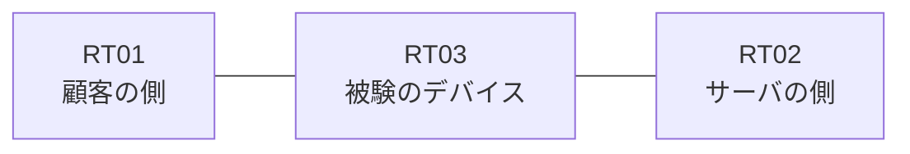

# 問題 20260919-003

> **本問は機器に接続せずに解答すること。追加の show 実行は認めない。**

## トポロジ

あなたは、下記のネットワークの保守を担当する技術者です。ある企業のネットワークにおいて、RT03 は、顧客の側のネットワークと、サーバの側のネットワークとの間に配置されており、IPv6 によって運用されています。



## 要件

1. `2001:DB8:C3:83::/64` からの通信は、許可されてはなりません。
2. 拒否のエントリを使用してはなりません。
3. 管理のための構成に対して、変更が加えられてはなりません。
4. `2001:DB8:C3:85::/64` からの通信は、許可されてはなりません。
5. RT03 において、`2001:DB8:C3:80::/64`、`2001:DB8:C3:81::/64`、`2001:DB8:C3:82::/64` のネットワークからの通信が、`2001:DB8:C3:FF::10` の TCP ポート 22 に到達できなければなりません。

## 設問

次のうち、正しいものは、どれですか。

## 選択肢
**A.**
```
sequence 10 permit ipv6 2001:DB8:C3:80::/61 any
```

**B.**
```
sequence 10 permit ipv6 2001:DB8:C3:80::/62 0.0.3.255 any
```

**C.**
```
sequence 10 permit ipv6 2001:DB8:C3:80::/64 any
sequence 20 permit ipv6 2001:DB8:C3:81::/64 any
sequence 30 permit ipv6 2001:DB8:C3:82::/64 any
```

**D.**
```
sequence 10 permit ipv6 2001:DB8:C3:80::/62 any
```

**E.**
```
sequence 10 deny ipv6 2001:DB8:C3:83::/64 any
sequence 20 permit ipv6 2001:DB8:C3:80::/62 any
```

**F.**
```
sequence 10 permit ipv6 2001:DB8:C3:80::/63 any
```
