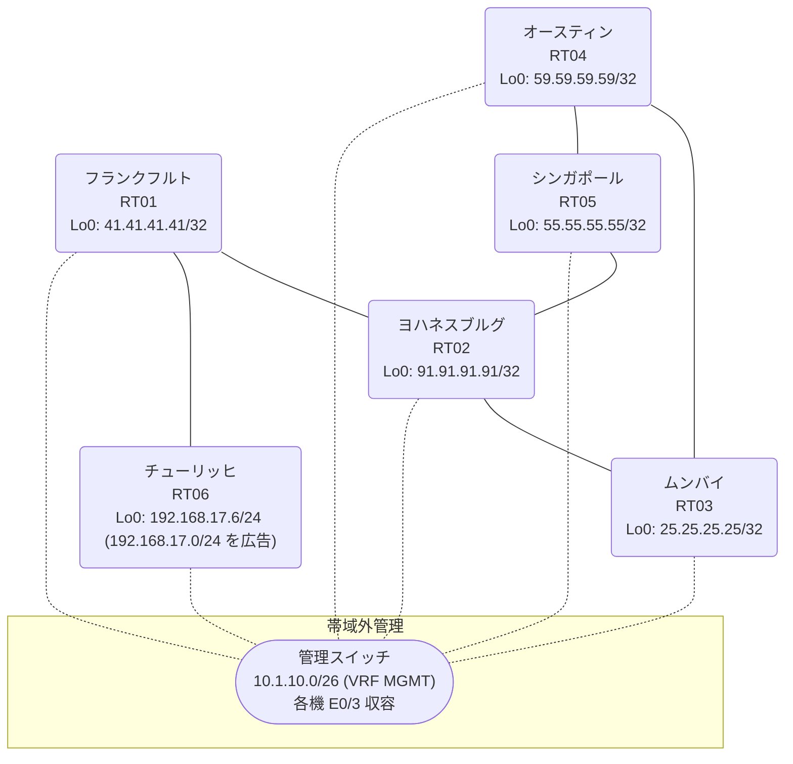

# 問題 20260919-020

> **本問は機器に接続せずに解答すること。追加の show 実行は認めない。**

## トポロジ

あなたの組織は、下記に示されているところのネットワークを運用しています。あなたの会社のネットワークは、OSPF のドメインと EIGRP のドメインとが、2 つの境界のルーターによって接続され、そして、それらは境界において接続されています。顧客のネットワーク `192.168.17.0/24` は、チューリッヒ のサイトにおいて、別のルーティング・プロトコルによって学習され、そして、再配送によって、社内へ持ち込まれています。ルーティングの設計の詳細は、示されているところのコンフィギュレーションから、読み取られることが、期待されています。



| 拠点 | ルータ | 拠点網 / 広告網 |
|------|--------|------------------|
| オースティン | RT04 | 59.59.59.59/32 |
| シンガポール | RT05 | 55.55.55.55/32 |
| チューリッヒ | RT06 | 192.168.17.6/24 (`192.168.17.0/24` を広告) |
| フランクフルト | RT01 | 41.41.41.41/32 |
| ムンバイ | RT03 | 25.25.25.25/32 |
| ヨハネスブルグ | RT02 | 91.91.91.91/32 |

リンク一覧:
```
  RT04:E0/0(.1) ── RT03:E0/0(.2)   172.16.89.0/24
  RT04:E0/1(.1) ── RT05:E0/0(.3)   172.16.151.0/24
  RT03:E0/1(.2) ── RT02:E0/0(.4)   172.16.61.0/24
  RT05:E0/1(.3) ── RT02:E0/1(.4)   172.16.123.0/24
  RT02:E0/2(.4) ── RT01:E0/0(.5)   172.16.37.0/24
  RT01:E0/1(.5) ── RT06:E0/0(.6)   172.16.158.0/24
```

## 要件

1. すべてのサイトから、`192.168.17.0/24` を含むところのすべての宛先へ、到達することができること。
2. スタティック ルートおよび既定のルートによる迂回は、実施されることはできません。
3. 既存の相互再配送の設計が、削除または停止されてはなりません。
4. 是正は、番号付き標準アクセス リストと、再配送点における distribute-list によって、実装されなければなりません。
5. インタフェースの IP アドレッシングは、変更されてはなりません。
6. `192.168.17.0/24` 宛のトラフィックが RT06 へ配送され、経路の周回が、発生していないこと。

## 現在の状態

ユーザーから、通信に関する事象が、報告されています。あなたは、示されているところの出力および構成に基づいて、その構成が、下記において記述されているとおりに動作していない理由を、判断する必要があります。

```
RT02# show ip route
Gateway of last resort is not set
      25.0.0.0/32 is subnetted, 1 subnets
D EX     25.25.25.25 [170/281856] via 172.16.123.3, 00:04:12, Ethernet0/1
                     [170/281856] via 172.16.61.2, 00:04:12, Ethernet0/0
      41.0.0.0/32 is subnetted, 1 subnets
D        41.41.41.41 [90/409600] via 172.16.37.5, 00:04:57, Ethernet0/2
      55.0.0.0/32 is subnetted, 1 subnets
D EX     55.55.55.55 [170/281856] via 172.16.123.3, 00:04:10, Ethernet0/1
                     [170/281856] via 172.16.61.2, 00:04:10, Ethernet0/0
      59.0.0.0/32 is subnetted, 1 subnets
D EX     59.59.59.59 [170/281856] via 172.16.123.3, 00:04:12, Ethernet0/1
                     [170/281856] via 172.16.61.2, 00:04:12, Ethernet0/0
      91.0.0.0/32 is subnetted, 1 subnets
C        91.91.91.91 is directly connected, Loopback0
      172.16.0.0/16 is variably subnetted, 9 subnets, 2 masks
C        172.16.37.0/24 is directly connected, Ethernet0/2
L        172.16.37.4/32 is directly connected, Ethernet0/2
C        172.16.61.0/24 is directly connected, Ethernet0/0
L        172.16.61.4/32 is directly connected, Ethernet0/0
D EX     172.16.89.0/24 [170/281856] via 172.16.123.3, 00:04:12, Ethernet0/1
                        [170/281856] via 172.16.61.2, 00:04:12, Ethernet0/0
C        172.16.123.0/24 is directly connected, Ethernet0/1
L        172.16.123.4/32 is directly connected, Ethernet0/1
D EX     172.16.151.0/24 [170/281856] via 172.16.123.3, 00:04:17, Ethernet0/1
                         [170/281856] via 172.16.61.2, 00:04:17, Ethernet0/0
D        172.16.158.0/24 [90/307200] via 172.16.37.5, 00:04:57, Ethernet0/2
D EX  192.168.17.0/24 [170/281856] via 172.16.123.3, 00:04:12, Ethernet0/1
```
```
RT02# show ip eigrp topology 192.168.17.0 255.255.255.0
EIGRP-IPv4 Topology Entry for AS(42)/ID(91.91.91.91) for 192.168.17.0/24
  State is Passive, Query origin flag is 1, 1 Successor(s), FD is 281856
  Descriptor Blocks:
  172.16.123.3 (Ethernet0/1), from 172.16.123.3, Send flag is 0x0
      Composite metric is (281856/2816), route is External
      Vector metric:
        Minimum bandwidth is 10000 Kbit
        Total delay is 1010 microseconds
        Reliability is 255/255
        Load is 1/255
        Minimum MTU is 1500
        Hop count is 1
        Originating router is 55.55.55.55
      External data:
        AS number of route is 76
        External protocol is OSPF, external metric is 20
        Administrator tag is 0 (0x00000000)
  172.16.37.5 (Ethernet0/2), from 172.16.37.5, Send flag is 0x0
      Composite metric is (307456/281856), route is External
      Vector metric:
        Minimum bandwidth is 10000 Kbit
        Total delay is 2010 microseconds
        Reliability is 255/255
        Load is 1/255
        Minimum MTU is 1500
        Hop count is 2
        Originating router is 192.168.17.6
      External data:
        AS number of route is 0
        External protocol is RIP, external metric is 0
        Administrator tag is 0 (0x00000000)
```
```
RT01# show ip route
Gateway of last resort is not set
      25.0.0.0/32 is subnetted, 1 subnets
D EX     25.25.25.25 [170/307456] via 172.16.37.4, 00:05:12, Ethernet0/0
      41.0.0.0/32 is subnetted, 1 subnets
C        41.41.41.41 is directly connected, Loopback0
      55.0.0.0/32 is subnetted, 1 subnets
D EX     55.55.55.55 [170/307456] via 172.16.37.4, 00:04:29, Ethernet0/0
      59.0.0.0/32 is subnetted, 1 subnets
D EX     59.59.59.59 [170/307456] via 172.16.37.4, 00:04:35, Ethernet0/0
      91.0.0.0/32 is subnetted, 1 subnets
D        91.91.91.91 [90/409600] via 172.16.37.4, 00:05:21, Ethernet0/0
      172.16.0.0/16 is variably subnetted, 8 subnets, 2 masks
C        172.16.37.0/24 is directly connected, Ethernet0/0
L        172.16.37.5/32 is directly connected, Ethernet0/0
D        172.16.61.0/24 [90/307200] via 172.16.37.4, 00:05:21, Ethernet0/0
D EX     172.16.89.0/24 [170/307456] via 172.16.37.4, 00:05:12, Ethernet0/0
D        172.16.123.0/24 [90/307200] via 172.16.37.4, 00:05:21, Ethernet0/0
D EX     172.16.151.0/24 [170/307456] via 172.16.37.4, 00:04:35, Ethernet0/0
C        172.16.158.0/24 is directly connected, Ethernet0/1
L        172.16.158.5/32 is directly connected, Ethernet0/1
D EX  192.168.17.0/24 [170/281856] via 172.16.158.6, 00:04:31, Ethernet0/1
```
```
RT04# show ip route
Gateway of last resort is not set
      25.0.0.0/32 is subnetted, 1 subnets
O        25.25.25.25 [110/11] via 172.16.89.2, 00:04:55, Ethernet0/0
      41.0.0.0/32 is subnetted, 1 subnets
O E2     41.41.41.41 [110/20] via 172.16.151.3, 00:04:51, Ethernet0/1
                     [110/20] via 172.16.89.2, 00:04:55, Ethernet0/0
      55.0.0.0/32 is subnetted, 1 subnets
O        55.55.55.55 [110/11] via 172.16.151.3, 00:04:51, Ethernet0/1
      59.0.0.0/32 is subnetted, 1 subnets
C        59.59.59.59 is directly connected, Loopback0
      91.0.0.0/32 is subnetted, 1 subnets
O E2     91.91.91.91 [110/20] via 172.16.151.3, 00:04:51, Ethernet0/1
                     [110/20] via 172.16.89.2, 00:04:55, Ethernet0/0
      172.16.0.0/16 is variably subnetted, 8 subnets, 2 masks
O E2     172.16.37.0/24 [110/20] via 172.16.151.3, 00:04:51, Ethernet0/1
                        [110/20] via 172.16.89.2, 00:04:55, Ethernet0/0
O E2     172.16.61.0/24 [110/20] via 172.16.151.3, 00:04:51, Ethernet0/1
                        [110/20] via 172.16.89.2, 00:04:55, Ethernet0/0
C        172.16.89.0/24 is directly connected, Ethernet0/0
L        172.16.89.1/32 is directly connected, Ethernet0/0
O E2     172.16.123.0/24 [110/20] via 172.16.151.3, 00:04:51, Ethernet0/1
                         [110/20] via 172.16.89.2, 00:04:55, Ethernet0/0
C        172.16.151.0/24 is directly connected, Ethernet0/1
L        172.16.151.1/32 is directly connected, Ethernet0/1
O E2     172.16.158.0/24 [110/20] via 172.16.151.3, 00:04:51, Ethernet0/1
                         [110/20] via 172.16.89.2, 00:04:55, Ethernet0/0
O E2  192.168.17.0/24 [110/20] via 172.16.89.2, 00:04:55, Ethernet0/0
```
```
RT02# show ip protocols | include Routing Protocol|Distance
Routing Protocol is "application"
    Gateway         Distance      Last Update
  Distance: (default is 4)
Routing Protocol is "eigrp 42"
      Distance: internal 90 external 170
    Gateway         Distance      Last Update
  Distance: internal 90 external 170
```
```
RT04# traceroute 192.168.17.6 probe 1 timeout 1 ttl 1 8
Type escape sequence to abort.
Tracing the route to 192.168.17.6
VRF info: (vrf in name/id, vrf out name/id)
  1 172.16.89.2 1 msec
  2 172.16.61.4 2 msec
  3 172.16.123.3 2 msec
  4 172.16.151.1 1 msec
  5 172.16.89.2 1 msec
  6 172.16.61.4 3 msec
  7 172.16.123.3 2 msec
  8 172.16.151.1 2 msec
```

## 設定抜粋

```
RT04# show running-config | section router
router ospf 76
 router-id 59.59.59.59
 network 59.59.59.59 0.0.0.0 area 0
 network 172.16.89.0 0.0.0.255 area 0
 network 172.16.151.0 0.0.0.255 area 0
```
```
RT03# show running-config | section router
router eigrp 42
 network 172.16.61.0 0.0.0.255
 redistribute ospf 76 metric 1000000 1 255 1 1500
router ospf 76
 router-id 25.25.25.25
 redistribute eigrp 42
 network 25.25.25.25 0.0.0.0 area 0
 network 172.16.89.0 0.0.0.255 area 0
```
```
RT05# show running-config | section router
router eigrp 42
 network 172.16.123.0 0.0.0.255
 redistribute ospf 76 metric 1000000 1 255 1 1500
router ospf 76
 router-id 55.55.55.55
 redistribute eigrp 42
 network 55.55.55.55 0.0.0.0 area 0
 network 172.16.151.0 0.0.0.255 area 0
```
```
RT02# show running-config | section router
router eigrp 42
 network 91.91.91.91 0.0.0.0
 network 172.16.37.0 0.0.0.255
 network 172.16.61.0 0.0.0.255
 network 172.16.123.0 0.0.0.255
```
```
RT01# show running-config | section router
router eigrp 42
 network 41.41.41.41 0.0.0.0
 network 172.16.37.0 0.0.0.255
 network 172.16.158.0 0.0.0.255
```
```
RT06# show running-config | section router
router eigrp 42
 network 172.16.158.0 0.0.0.255
 redistribute rip metric 1000000 1 255 1 1500
router rip
 version 2
 network 192.168.17.0
 no auto-summary
```

## 設問

次のうち、正しいものは、どれですか。

## 選択肢
**A.**
```
! RT03 にのみ投入
access-list 93 deny 192.168.17.0 0.0.0.255
access-list 93 permit any
router eigrp 42
 distribute-list 93 out ospf 76
```

**B.**
```
router eigrp 42
 redistribute rip metric 100 1 255 1 1500
```

**C.**
```
! RT03 と RT05 の両方に投入
ip prefix-list PL-NO-FEEDBACK seq 5 deny 192.168.17.0/24
ip prefix-list PL-NO-FEEDBACK seq 10 permit 0.0.0.0/0 le 32
router eigrp 42
 distribute-list prefix PL-NO-FEEDBACK out ospf 76
```

**D.**
```
router eigrp 42
 distance eigrp 90 200
```

**E.**
```
! RT03 と RT05 の両方に投入
access-list 93 deny 192.168.17.0 0.0.0.255
access-list 93 permit any
router eigrp 42
 distribute-list 93 out ospf 76
```

**F.**
```
clear ip route *
```
