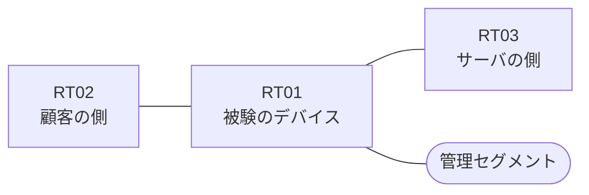

# 問題 20260919-022

> **本問は機器に接続せずに解答すること。追加の show 実行は認めない。**

## シナリオ

あなたの組織は、下記に示されているところのネットワークを運用しています。ある企業のネットワークにおいて、RT01 は、顧客の側のネットワークと、サーバの側のネットワークとの間に、配置されています。一部の通信が、意図されているとおりに動作していない、という報告があります。あなたは、提示されているところの情報のみを使用して、要求されている状態が満たされていない理由を、特定しなければなりません。`10.136.101.0/24` からの通信は、許可されてはなりません。対象としていないネットワークが、一致の対象に含まれてはなりません。また、エントリの行数は、最小でなければなりません。RT01 において、`10.136.96.0/24`、`10.136.97.0/24`、`10.136.98.0/24` のネットワークからの通信のみが、許可される必要があります。アクセス・リストは、顧客の側のインターフェイスである `Ethernet0/0` において、着信の方向に適用されなければなりません。ルーティング プロトコルの種別およびプロセスの配置は、変更されてはなりません。



| 区間 | 被験デバイス側のインターフェイス | ネットワーク |
|------|----------------------------------|--------------|
| RT02（顧客の側） ⇔ RT01 | `Ethernet0/0` | 10.136.253.0/24 |
| RT01 ⇔ RT03（サーバの側） | `Ethernet0/1` | 10.136.254.0/24 |
| RT01 ⇔ 管理セグメント | `Ethernet0/2` | 10.136.255.0/24 |

## 出力

観測 | サーバへの到達
--- | ---
送信元が 10.136.96.0/24 のネットワークにあるホストから、172.30.15.27 の TCP ポート 3389 宛ての通信 | 到達可
送信元が 10.136.97.0/24 のネットワークにあるホストから、172.30.15.27 の TCP ポート 3389 宛ての通信 | 到達可
送信元が 10.136.98.0/24 のネットワークにあるホストから、172.30.15.27 の TCP ポート 3389 宛ての通信 | 到達不可
送信元が 10.136.99.0/24 のネットワークにあるホストから、172.30.15.27 の TCP ポート 3389 宛ての通信 | 到達不可
送信元が 10.136.101.0/24 のネットワークにあるホストから、172.30.15.27 の TCP ポート 3389 宛ての通信 | 到達不可
送信元が 10.136.250.0/24 のネットワークにあるホストから、172.30.15.27 の TCP ポート 3389 宛ての通信 | 到達不可

```
RT01# show ip access-lists
Standard IP access list 50
    10 permit 10.136.96.0, wildcard bits 0.0.1.255
```
```
RT01# show running-config | section ^interface
interface Ethernet0/0
 description === to RT02 ===
 ip address 10.136.253.1 255.255.255.0
 ip access-group 50 in
interface Ethernet0/1
 description === to RT03 ===
 ip address 10.136.254.1 255.255.255.0
interface Ethernet0/2
 description === management ===
 ip address 10.136.255.1 255.255.255.0
```

## 設問

次のうち、正しいものは、どれですか。

## 選択肢
A. ポートの演算子が、宛先の側ではなく送信元の側に記述されている

B. established のキーワードが、戻りの側ではなく、通信を開始する側のアクセス・リストに記述されている

C. インターフェイスが管理上シャットダウンされている

D. ルーティング・プロトコルの隣接関係が確立されていない

E. ワイルドカードのビットが不足しており、対象としているネットワークの一部が一致の対象から外れている

F. インターフェイスに対して、アクセス・リストが in ではなく out の方向に適用されている
