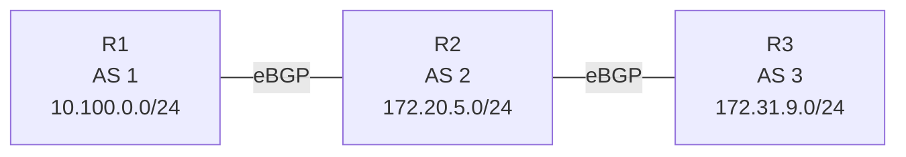

# 問題 20260919-026

> **本問は機器に接続せずに解答すること。追加の show 実行は認めない。**

## シナリオ



R1(AS 1)- R2(AS 2)- R3(AS 3)の順に eBGP で接続されています。R1 は 10.100.0.0/24、R2 は 172.20.5.0/24、R3 は 172.31.9.0/24 を広告しています。AS 2 を非トランジット AS にしようとしましたが、AS 1 と AS 3 がそれぞれの経路を交換しています。

```
R1# show ip bgp | begin Network
     Network          Next Hop            Metric LocPrf Weight Path
 *>  10.100.0.0/24    0.0.0.0                  0         32768 i
 *>  172.20.5.0/24    203.0.113.2              0             0 2 i
 *>  172.31.9.0/24    203.0.113.2                            0 2 3 i

【R2 に追加する設定】
R2(config)# 【?】
R2(config)# router bgp 2
R2(config-router)# neighbor 203.0.113.1 distribute-list 1 out
R2(config-router)# neighbor 203.0.113.6 distribute-list 3 out
```

## 設問

AS 1 に AS 3 の経路、AS 3 に AS 1 の経路が届かないようにするために R2 で必要な【?】に当てはまる設定はどれですか。なお、R1 と R3 は AS 2 の経路を動的に学習する必要があり、R2 は AS 1 と AS 3 の経路を動的に学習する必要があります。(1つを選択してください)

## 選択肢

**A.**

```
access-list 1 deny 172.31.9.0 0.0.0.255
access-list 1 permit any
access-list 3 deny 10.100.0.0 0.0.0.255
access-list 3 permit any
```

**B.**

```
access-list 1 deny 10.100.0.0 0.0.0.255
access-list 1 permit any
access-list 3 deny 172.31.9.0 0.0.0.255
access-list 3 permit any
```

**C.**

```
access-list 11 deny 172.31.9.0 0.0.0.255
access-list 11 permit any
access-list 31 deny 10.100.0.0 0.0.0.255
access-list 31 permit any
```

**D.**

```
access-list 1 permit 172.31.9.0 0.0.0.255
access-list 1 deny any
access-list 3 permit 10.100.0.0 0.0.0.255
access-list 3 deny any
```
