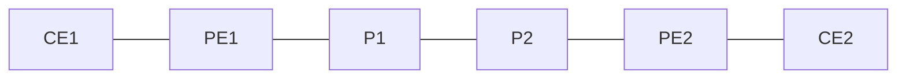

# 問題 20260919-039

> **本問は機器に接続せずに解答すること。追加の show 実行は認めない。**

## 設問

次の説明文(設定例を含む)の空欄 ①〜④ に入る語句を、下の語群 A〜H から 1 つずつ選択してください。同じ語句を 2 つの空欄に使うことはありません。語群にはどの空欄にも当てはまらない語句が含まれます。



```
vrf definition TENANT1
 rd 65500:200
 address-family ipv4
  route-target export 65500:20
  route-target import 65500:20
!
interface Ethernet0/2
 vrf forwarding TENANT1
 ip address 192.168.1.1 255.255.255.252
!
router bgp 65500
 neighbor 172.31.255.2 remote-as 65500
 neighbor 172.31.255.2 update-source Loopback0
 !
 address-family ［①］
  neighbor 172.31.255.2 ［②］
  neighbor 172.31.255.2 send-community extended
 !
 address-family ipv4 vrf TENANT1
  neighbor 192.168.1.2 remote-as 65010
  neighbor 192.168.1.2 ［②］
  neighbor 192.168.1.2 ［③］
```

上は PE1 の設定である。`address-family ［①］` 配下のネイバー 172.31.255.2 はプロバイダ網内(PE-PE の iBGP) に属する対向 PE で、この AF で VRF TENANT1 の経路が RD 65500:200 付きの VPNv4 経路と VPN ラベルとして交換される。RT は BGP の拡張コミュニティなので、この AF で `send-community extended` が無いと RT が伝わらず、対向 PE はどの VRF にも取り込めない。ネイバーアドレスに Loopback0 の /32 アドレスを使うのは、その /32 に対して LDP が配るラベルがそのまま VPN パケットのトランスポートラベルになるからである。`address-family ipv4 vrf TENANT1` 配下のネイバー 192.168.1.2 は［④］に属し、ここで学んだ経路は VRF TENANT1 の経路表にだけ入る。両拠点の CE が同じ AS 65010 を使うため、PE から CE へ広告する際に［③］で AS_PATH 中の 65010 を 65500 に書き換えないと、受け取った CE が自 AS を見つけてループ検出で捨ててしまう。

## 選択肢

A. activate

B. 顧客側(PE-CE の eBGP)

C. remove-private-as

D. ipv4 unicast

E. P ルータとの間

F. as-override

G. vpnv4

H. route-reflector-client
