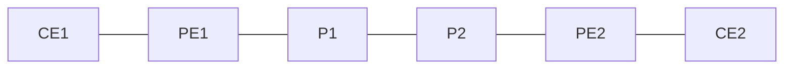

# 問題 20260919-041

> **本問は機器に接続せずに解答すること。追加の show 実行は認めない。**

## 設問

次の説明文(設定例を含む)の空欄 ①〜④ に入る語句を、下の語群 A〜H から 1 つずつ選択してください。同じ語句を 2 つの空欄に使うことはありません。語群にはどの空欄にも当てはまらない語句が含まれます。

MPLS L3VPN の網は 3 種類のルータで構成される。顧客拠点側に置かれる CE は MPLS もラベルも意識せず、通常の IGP・eBGP・静的経路でプロバイダ側と経路を交換するだけである。プロバイダ網の縁に置かれる PE は顧客ごとに［①］を持ち、顧客経路を隔離して保持する唯一の装置である。網の中心にある［②］は顧客経路もその分離表も持たず、IGP(OSPF/IS-IS) で学んだプロバイダ内部の経路と［③］で学んだラベルだけを使って転送する。したがって顧客経路を運ぶ［④］のピアは網の縁の装置同士の間だけで張られ、中心の装置は関与しない。顧客から見ると、プロバイダ網全体が 1 台の巨大なルータのように振る舞う。

## 選択肢

A. PE

B. MP-BGP

C. IGP(OSPF/IS-IS)

D. P

E. VRF

F. LDP

G. NHRP

H. グローバルルーティングテーブル
