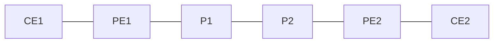

# 問題 20260919-049

> **本問は機器に接続せずに解答すること。追加の show 実行は認めない。**

## 設問

次の説明文(設定例を含む)の空欄 ①〜④ に入る語句を、下の語群 A〜H から 1 つずつ選択してください。同じ語句を 2 つの空欄に使うことはありません。語群にはどの空欄にも当てはまらない語句が含まれます。



```
PE1# show mpls forwarding-table
Local      Outgoing   Prefix           Bytes Label   Outgoing   Next Hop
Label      Label      or Tunnel Id     Switched      interface
16         Pop Label  10.0.0.2/32      0             Et0/1      10.0.12.2
17         23         10.0.0.4/32      524160        Et0/1      10.0.12.2
18         No Label   10.0.99.0/24     0             Et0/3      10.0.99.9
19         No Label   172.16.1.0/24[V] 0             Et0/0      192.168.1.2
20         Aggregate  192.168.1.0/30[V] 0
```

上は PE1 の LFIB である。ローカルラベル 16 の行は、隣接 P1(10.0.0.2)のループバック宛で Outgoing が Pop Label になっている。これは P1 が自分の /32 に対して［①］を広告してきたためで、PE1 がその 1 つ手前として PHP を行う。ローカルラベル 17 の行は対向 PE2(10.0.0.4)宛で、受け取ったパケットのラベルを 23 に付け替えて P1 へ送る。VPN パケットの先頭ラベルはこの行で決まる。ローカルラベル 18 の行は Outgoing が［②］で、次ホップ 10.0.99.9 との間に LDP セッションが無い(または相手がその FEC を広告していない)ことを示す。この宛先へラベル付きで届いたパケットは IP パケットに戻して送られるため、その先が VPN 経路なら LSP の穴(ブラックホール) となって通信できない。末尾に［③］が付く 2 行は VRF の経路で、対向 PE から届いた VPN ラベル 19 はそのまま CE へ IP 転送され、ローカル生成の集約経路に付く［④］は「ラベルで VRF を特定した後に IP 検索する」ことを意味する。

## 選択肢

A. Pop Label

B. No Label

C. Untagged VRF

D. Implicit Null(3)

E. [A]

F. Aggregate

G. [V]

H. Router Alert(1)
