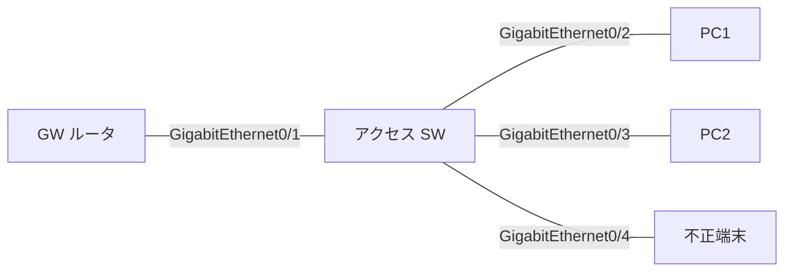

# 問題 20260919-055

> **本問は機器に接続せずに解答すること。追加の show 実行は認めない。**

## 設問

次の説明文(設定例を含む)の空欄 ①〜④ に入る語句を、下の語群 A〜H から 1 つずつ選択してください。同じ語句を 2 つの空欄に使うことはありません。語群にはどの空欄にも当てはまらない語句が含まれます。



```
ipv6 nd raguard policy RA-EDGE
 device-role ［①］
!
ipv6 nd raguard policy ROUTERS
 device-role router
 router-preference maximum high
 match ra prefix-list RA-PL
!
interface GigabitEthernet0/1
 ipv6 nd raguard attach-policy ROUTERS
interface GigabitEthernet0/2
 ipv6 nd raguard attach-policy RA-EDGE
interface GigabitEthernet0/3
 ipv6 nd raguard attach-policy RA-EDGE
interface GigabitEthernet0/4
 ipv6 nd raguard attach-policy RA-EDGE
!
ipv6 prefix-list RA-PL seq 10 permit 2001:DB8:10::/64
```

上はアクセススイッチの設定である。RA guard は着信(ingress) 方向でだけ働くので、ポリシーは「そのポートに何がつながっているか」を device-role で宣言する形になる。端末側の GigabitEthernet0/2〜GigabitEthernet0/4 には［①］を付け、そこから入ってくる RA は無条件に破棄される。GW 側の GigabitEthernet0/1 には router を付け、RA を通すが、ポリシーに書いた検査は行う。ここでは優先度が high を超える RA と、プレフィックスリスト RA-PL に無いプレフィックスを広告する RA が落ちる。検査を一切しないポートにしたいときは device-role の代わりに trusted-port を書く。ポリシーはポートだけでなく［②］にも付けられるが、VLAN だけに端末用ポリシーを付けると［③］ため、GW ポートには必ずポート側でルータ用のポリシーを付ける。両方に付いているときは［④］が勝つ。なお device-role の既定値は show running-config に表示されないので、確認は `show ipv6 nd raguard policy` で行う。

## 選択肢

A. switch

B. 正規 GW の RA まで落ちる

C. host

D. 後から付けた方

E. ポートのポリシー

F. VLAN(vlan configuration)

G. ポートチャネル

H. 不正端末の RA だけ通る
