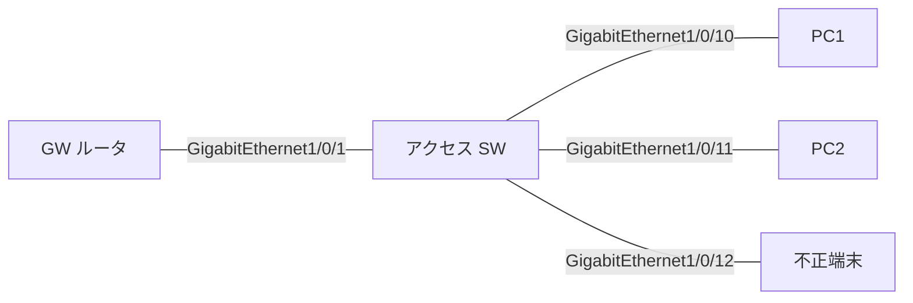

# 問題 20260919-056

> **本問は機器に接続せずに解答すること。追加の show 実行は認めない。**

## 設問

次の説明文(設定例を含む)の空欄 ①〜④ に入る語句を、下の語群 A〜H から 1 つずつ選択してください。同じ語句を 2 つの空欄に使うことはありません。語群にはどの空欄にも当てはまらない語句が含まれます。



```
ipv6 dhcp guard policy CLIENTS
 device-role client
!
ipv6 dhcp guard policy DHG-SERVER
 ［①］
 match server access-list OK-DHCP
 preference min 200
!
ipv6 access-list OK-DHCP
 permit ipv6 host FE80::1 any
!
interface GigabitEthernet1/0/1
 ipv6 dhcp guard attach-policy DHG-SERVER
interface GigabitEthernet1/0/10
 ipv6 dhcp guard attach-policy CLIENTS
interface GigabitEthernet1/0/12
 ipv6 dhcp guard attach-policy CLIENTS
```

DHCPv6 guard が破棄するのは、サーバやリレーが［②］向きに送る［③］である。端末が送る SOLICIT/REQUEST は検査せず通すので、端末ポートに device-role client を付けても正規サーバへの要求は妨げない。GW(またはリレー)側のポートには［①］を付け、さらに match server access-list でサーバ/リレーの送信元アドレスを、`match reply prefix-list` で配布プレフィックスを、preference min/max でサーバの優先度を検査できる。role を取り違えて GW ポートに端末用ポリシーを付けると、RA は正常なのに端末が DNS やドメイン名を取得できないという切り分けにくい症状になる(実測)。破棄されたメッセージは `show device-tracking counters interface` の Dropped 欄に `DHCP Guard: DHCPv6 REP … reason: Message type is not authorized by the policy on this port, ［④］` と出る。

## 選択肢

A. Preference flag error

B. リレー

C. device-role mismatch

D. ADVERTISE と REPLY

E. RS と RA

F. クライアント

G. device-role server

H. device-role client
