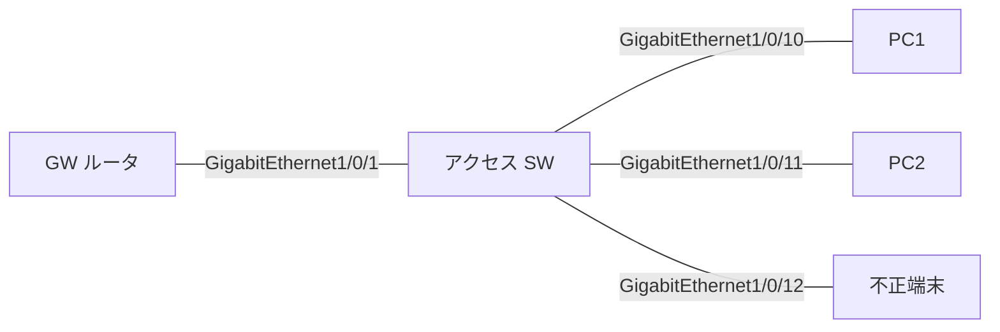

# 問題 20260919-058

> **本問は機器に接続せずに解答すること。追加の show 実行は認めない。**

## 設問

次の説明文(設定例を含む)の空欄 ①〜④ に入る語句を、下の語群 A〜H から 1 つずつ選択してください。同じ語句を 2 つの空欄に使うことはありません。語群にはどの空欄にも当てはまらない語句が含まれます。



```
SW# show device-tracking counters interface GigabitEthernet1/0/1
Received messages on GigabitEthernet1/0/1:
  Protocol  Protocol message
  NDP       RS[12] RA[40] NS[8] NA[8]
  DHCPv6    SOL[3] ADV[3] REQ[3] REP[3]
Dropped messages on GigabitEthernet1/0/1:
  Feature     Protocol Msg [Total dropped]
  RA guard    NDP      RA  [40]
     reason: Message unauthorized on port [40]

SW# show device-tracking counters interface GigabitEthernet1/0/12
Dropped messages on GigabitEthernet1/0/12:
  Feature     Protocol Msg [Total dropped]
  RA guard    NDP      RA  [15]
     reason: Message unauthorized on port [15]
  DHCP Guard  DHCPv6   REP [6]
     reason: Message type is not authorized by the policy on this port, device-role mismatch [6]
```

上は 2 つのポートのカウンタである。GigabitEthernet1/0/12 側は意図どおりで、不正端末の RA が RA guard に、偽サーバの REPLY が DHCPv6 guard に落とされている。問題は GigabitEthernet1/0/1 側で、正規 GW が送る RA が 40 通すべて落ちている。理由が「Message unauthorized on port」なら［①］が原因で、GW ポートに device-role router のポリシー(または trusted-port) を付けるのが是正になる。理由が［②］なら `router-preference maximum` が正規 GW の優先度より低く設定されているのが原因である。どちらの場合も端末側の見え方は同じで、`show ipv6 routers` に GW が現れず、端末は［③］になる。この 2 つを見分けるのは症状ではなく［④］であり、だからこそカウンタを先に見る。

## 選択肢

A. Dropped の理由文字列

B. 端末の ping 結果

C. Preference flag error

D. GW ポートが host 扱い(ポリシー無しで VLAN の host が効いている、または host を付けた)

E. アドレスが重複する状態

F. Message unauthorized on port

G. リンクローカルだけで GUA も既定 GW も無い状態

H. DHCPv6 guard の role 誤り
