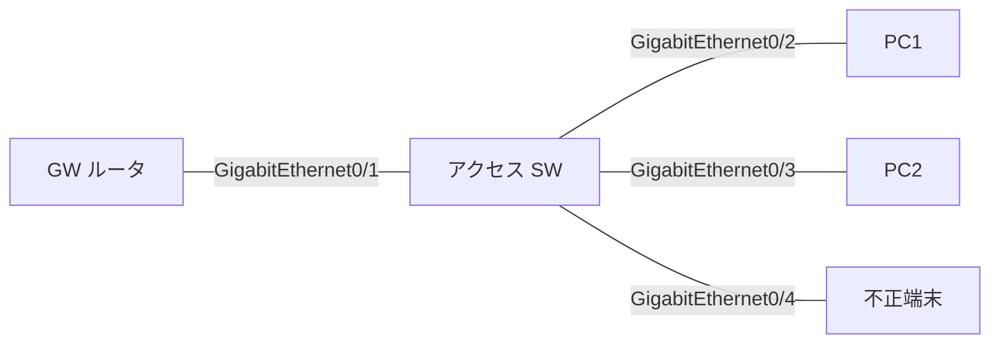

# 問題 20260919-065

> **本問は機器に接続せずに解答すること。追加の show 実行は認めない。**

## 設問

次の説明文(設定例を含む)の空欄 ①〜④ に入る語句を、下の語群 A〜H から 1 つずつ選択してください。同じ語句を 2 つの空欄に使うことはありません。語群にはどの空欄にも当てはまらない語句が含まれます。



```
ipv6 nd raguard policy RAG-HOST
 device-role host
ipv6 nd raguard policy RAG-UPLINK
 device-role router
 router-preference maximum medium
!
interface GigabitEthernet0/1
 ipv6 nd raguard attach-policy RAG-HOST
interface GigabitEthernet0/2
 ipv6 nd raguard attach-policy RAG-HOST
interface GigabitEthernet0/4
 ipv6 nd raguard attach-policy RAG-HOST
```

上はアクセススイッチの設定で、GigabitEthernet0/1 に正規 GW、GigabitEthernet0/2 に端末、GigabitEthernet0/4 に不正端末がつながる(全ポート VLAN 30)。RA guard は［①］方向でだけ働く。不正端末が GigabitEthernet0/4 から送る RA は［②］。正規 GW が GigabitEthernet0/1 から送る RA は［③］。その結果、端末 GigabitEthernet0/2 はリンクローカルだけで GUA も既定 GW も無い。この盤面で `show device-tracking counters interface GigabitEthernet0/1` の Dropped 欄には［④］。是正として妥当なのは GigabitEthernet0/1 のポリシーを device-role router のものに付け替える。なおポートと VLAN の両方にポリシーがあるときはポートのポリシーが勝ち、検査を一切しないポートにしたいときは device-role の代わりに trusted-port を書く。

## 選択肢

A. GW ポートに付いた host ポリシーで無条件に破棄される

B. ポート側にポリシーが無く VLAN の host が効いて破棄される

C. 着信(ingress)

D. 双方向

E. VLAN の host ポリシーで破棄される

F. Message unauthorized on port が出る

G. Preference flag error が出る

H. 端末ポートの host ポリシーで破棄される
