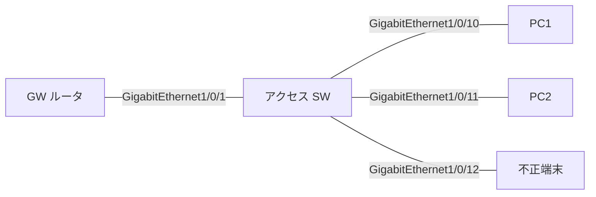

# 問題 20260919-069

> **本問は機器に接続せずに解答すること。追加の show 実行は認めない。**

## 設問

次の説明文(設定例を含む)の空欄 ①〜④ に入る語句を、下の語群 A〜H から 1 つずつ選択してください。同じ語句を 2 つの空欄に使うことはありません。語群にはどの空欄にも当てはまらない語句が含まれます。



```
ipv6 dhcp guard policy CLIENTS
 device-role client
ipv6 dhcp guard policy DH-GW
 device-role server
 match server access-list SRV-ACL
!
ipv6 access-list SRV-ACL
 permit ipv6 host 2001:DB8::53 any
!
interface GigabitEthernet1/0/1
 ipv6 dhcp guard attach-policy DH-GW
interface GigabitEthernet1/0/10
 ipv6 dhcp guard attach-policy CLIENTS
interface GigabitEthernet1/0/12
 ipv6 dhcp guard attach-policy CLIENTS
```

上はアクセススイッチの設定で、GigabitEthernet1/0/1 の先に正規の DHCPv6 サーバ(リレー)、GigabitEthernet1/0/10 に端末、GigabitEthernet1/0/12 に偽サーバを動かす不正端末がつながる。DHCPv6 guard が破棄するのは、サーバやリレーがクライアント向きに送る［①］で、端末が送る SOLICIT/REQUEST は検査せず通す。この盤面で、正規サーバの応答が GigabitEthernet1/0/1 から入ると server ポリシーなので検査を通って転送される。偽サーバの応答が GigabitEthernet1/0/12 から入ると［②］。その結果、端末 GigabitEthernet1/0/10 は［③］。`show device-tracking counters interface GigabitEthernet1/0/1` の Dropped 欄には何も出ない。是正として妥当なのは是正不要(意図どおり)。なお［④］でサーバ/リレーの送信元アドレスも検査でき、優先度は preference min/max で範囲を絞れる。

## 選択肢

A. match server access-list で破棄される

B. match server access-list

C. 正規サーバの DNS とドメインを正常に得る

D. ADVERTISE と REPLY

E. RA は正常だが DNS やドメイン名を取得できない

F. RS と RA

G. match ra prefix-list

H. 端末ポートの client ポリシーで破棄される
