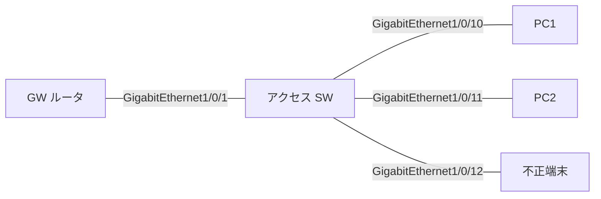

# 問題 20260919-070

> **本問は機器に接続せずに解答すること。追加の show 実行は認めない。**

## 設問

次の説明文(設定例を含む)の空欄 ①〜④ に入る語句を、下の語群 A〜H から 1 つずつ選択してください。同じ語句を 2 つの空欄に使うことはありません。語群にはどの空欄にも当てはまらない語句が含まれます。



```
SW# show device-tracking counters interface GigabitEthernet1/0/1
Received messages on GigabitEthernet1/0/1:
  Protocol  Protocol message
  NDP       RS[12] RA[40] NS[8] NA[8]
Dropped messages on GigabitEthernet1/0/1:
  Feature     Protocol Msg [Total dropped]
  RA guard    NDP      RA  [40]
     reason: Message unauthorized on port [40]

SW# show device-tracking counters interface GigabitEthernet1/0/12
Dropped messages on GigabitEthernet1/0/12:
  Feature     Protocol Msg [Total dropped]
  RA guard    NDP      RA  [15]
     reason: Message unauthorized on port [15]
  DHCP Guard  DHCPv6   REP [6]
     reason: Message type is not authorized by the policy on this port, device-role mismatch [6]
```

上は GW がつながる GigabitEthernet1/0/1 と、不正端末がつながる GigabitEthernet1/0/12 のカウンタである。GigabitEthernet1/0/12 側は［①］。GigabitEthernet1/0/1 側の Dropped から読める状態は GW ポートが host 扱い(host を付けた、または VLAN の host だけが効いている) で、是正は GigabitEthernet1/0/1 にポート側で device-role router(または trusted-port)のポリシーを付ける。このとき端末はリンクローカルだけで GUA も既定 GW も無い。RA guard で落ちる理由は大きく 2 つあり、「Message unauthorized on port」は［②］、「Preference flag error」は［③］を意味する。端末側の症状はどちらも同じなので、見分けるのは［④］である。

## 選択肢

A. 無防備(何も落ちていない)

B. ホップリミットが範囲外だった

C. 意図どおり(不正 RA と偽 REPLY が落ちている)

D. prefix-list に無いプレフィックスだった

E. show running-config

F. RA の優先度が上限を超えた

G. Dropped の理由文字列

H. そのポート(の役割)では RA を受け付けない
