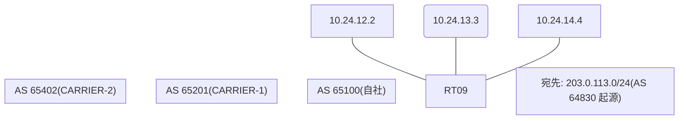

# 問題 20260920-040

> **本問は機器に接続せずに解答すること。追加の show 実行は認めない。**

## シナリオ

あなたの組織は、下記に示されているところのネットワークを運用しています。自社のルータ RT09 は、外部のネットワーク 203.0.113.0/24 への到達性を、複数の経路を通じて、確立しています。 CARRIER-1 とは、2 本のリンクで、接続されています。 CARRIER-2 とも、接続されています。現在、203.0.113.0/24 への転送は、要件に適合しないところの経路を、使用しています。RT09 における、203.0.113.0/24 への転送は、next hop 10.24.13.3 の経路を、使用すること。この変更の影響は、当該のルータに、限定されること。AS 内の、ほかのルータの経路選択を、変更してはならない。各事業者から受信するところの MED の値は、相互に調整されていない、独自の値である。経路選択の判断基準として、使用してはならない。なお、設定の投入後、変更は、適切に、反映されているものとする。



## 出力

```
RT09# show running-config | section router bgp
router bgp 65100
 bgp router-id 26.26.26.26
 bgp log-neighbor-changes
 neighbor 10.24.12.2 remote-as 65201
 neighbor 10.24.13.3 remote-as 65201
 neighbor 10.24.14.4 remote-as 65402
 !
 address-family ipv4
  neighbor 10.24.12.2 activate
  neighbor 10.24.13.3 activate
  neighbor 10.24.14.4 activate
 exit-address-family
```
```
RT09# show ip bgp
BGP table version is 57, local router ID is 26.26.26.26
Status codes: s suppressed, d damped, h history, * valid, > best, i - internal, 
              r RIB-failure, S Stale, m multipath, b backup-path, f RT-Filter, 
              x best-external, a additional-path, c RIB-compressed, 
              t secondary path, L long-lived-stale,
Origin codes: i - IGP, e - EGP, ? - incomplete
RPKI validation codes: V valid, I invalid, N Not found

     Network          Next Hop            Metric LocPrf Weight Path
 *    203.0.113.0      10.24.14.4                             0 65402 65402 64830 i
 *>                    10.24.12.2              50             0 65201 64830 i
 *                     10.24.13.3             400             0 65201 64830 i
```

## 設問

示されているところのすべての要件が満たされることを確実にするために、適用されなければならない構成は、どれですか。(1つを選択してください)

## 選択肢
**A.**
```
router bgp 65100
 address-family ipv4
  neighbor 10.24.13.3 weight 30000
```

**B.**
```
route-map RM-MED-A permit 10
 set metric 200
route-map RM-MED-B permit 10
 set metric 10
router bgp 65100
 address-family ipv4
  neighbor 10.24.12.2 route-map RM-MED-A out
  neighbor 10.24.13.3 route-map RM-MED-B out
```

**C.**
```
router bgp 65100
 bgp always-compare-med
```

**D.**
```
route-map RM-PRIMARY-IN permit 10
 set local-preference 200
router bgp 65100
 address-family ipv4
  neighbor 10.24.13.3 route-map RM-PRIMARY-IN in
```

**E.**
```
clear ip bgp * soft
```

**F.**
```
route-map RM-BACKUP-OUT permit 10
 set as-path prepend 65100 65100
router bgp 65100
 address-family ipv4
  neighbor 10.24.12.2 route-map RM-BACKUP-OUT out
```
