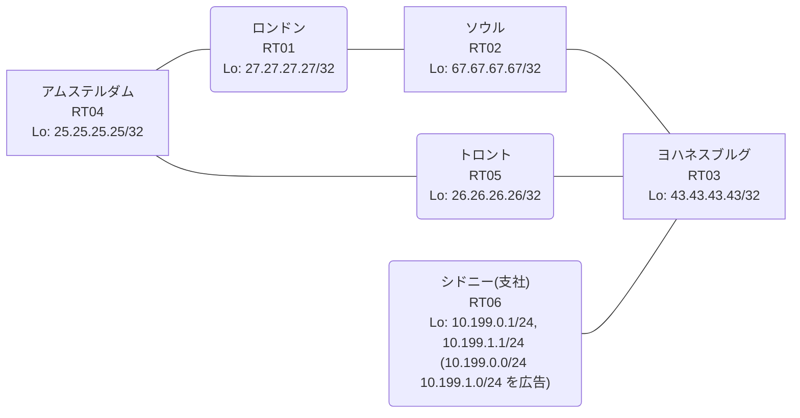

# 問題 20260920-041

> **本問は機器に接続せずに解答すること。追加の show 実行は認めない。**

## シナリオ

あなたは、下記のネットワークの保守を担当する技術者です。あなたの会社のネットワークは、支社のドメインと、本社のコアのドメイン(OSPF)とが、2 台の境界のルータによって接続され、そして、それらは境界において接続されています。支社のネットワーク `10.199.0.0/24` および `10.199.1.0/24` は、RT06 によって、広告されています。どちらの境界が失われた場合においても、通信が継続されることができるように、設計されています。ルーティングの設計の詳細は、示されているところの出力から、読み取られることが、期待されています。一部の通信が、意図されているとおりに動作していない、という報告があります。あなたは、示されているところの出力および構成に基づいて、その構成が、下記において記述されているとおりに動作していない理由を、判断する必要があります。支社のネットワーク宛のトラフィックが RT06 へ配送され、経路の周回が、発生していないこと。ルーティング・プロトコルの種別およびプロセスの配置は、変更されることはできません。本作業は、日中の時間帯において実施されるという理由により、対象外であるところのデバイスに対する構成の変更は、許可されていません。支社のネットワーク `10.199.0.0/24` / `10.199.1.0/24` への到達可能性が、すべてのサイトにおいて、確保されていること。二点相互再配送による、冗長の設計が、維持される必要があります。スタティック ルートおよび既定のルートによる迂回は、実施されてはなりません。



| 拠点 | ルータ | Loopback / 広告網 |
|------|--------|--------------------|
| アムステルダム | RT04 | 25.25.25.25/32 |
| シドニー(支社) | RT06 | 10.199.0.1/24, 10.199.1.1/24 (`10.199.0.0/24` `10.199.1.0/24` を広告) |
| ソウル | RT02 | 67.67.67.67/32 |
| トロント | RT05 | 26.26.26.26/32 |
| ヨハネスブルグ | RT03 | 43.43.43.43/32 |
| ロンドン | RT01 | 27.27.27.27/32 |

リンク一覧:
```
  RT06:E0/0(.2) ── RT03:E0/0(.1)   10.227.147.0/30
  RT03:E0/1(.1) ── RT05:E0/0(.2)   10.183.147.0/30
  RT03:E0/2(.1) ── RT02:E0/0(.2)   10.48.107.0/30
  RT05:E0/1(.1) ── RT04:E0/0(.2)   172.16.185.0/30
  RT04:E0/1(.1) ── RT01:E0/0(.2)   172.16.50.0/30
  RT02:E0/1(.1) ── RT01:E0/1(.2)   172.16.18.0/30
```

## 出力

```
RT05# show ip route 10.199.0.0
Routing entry for 10.199.0.0/24
  Known via "ospf 1", distance 110, metric 20, type extern 2, forward metric 30
  Redistributing via rip
  Advertised by rip metric 1
  Last update from 172.16.185.2 on Ethernet0/1, 00:04:24 ago
  Routing Descriptor Blocks:
  * 172.16.185.2, from 67.67.67.67, 00:04:24 ago, via Ethernet0/1
      Route metric is 20, traffic share count is 1
```
```
RT02# show running-config | section router
router ospf 1
 router-id 67.67.67.67
 redistribute rip
 network 67.67.67.67 0.0.0.0 area 0
 network 172.16.18.0 0.0.0.3 area 0
router rip
 version 2
 redistribute ospf 1 metric 1
 network 10.0.0.0
 network 67.0.0.0
 no auto-summary
```
```
RT03# show ip route
Gateway of last resort is not set
      10.0.0.0/8 is variably subnetted, 8 subnets, 3 masks
C        10.48.107.0/30 is directly connected, Ethernet0/2
L        10.48.107.1/32 is directly connected, Ethernet0/2
C        10.183.147.0/30 is directly connected, Ethernet0/1
L        10.183.147.1/32 is directly connected, Ethernet0/1
R        10.199.0.0/24 [120/1] via 10.227.147.2, 00:00:08, Ethernet0/0
                       [120/1] via 10.183.147.2, 00:00:04, Ethernet0/1
R        10.199.1.0/24 [120/1] via 10.227.147.2, 00:00:08, Ethernet0/0
                       [120/1] via 10.183.147.2, 00:00:04, Ethernet0/1
C        10.227.147.0/30 is directly connected, Ethernet0/0
L        10.227.147.1/32 is directly connected, Ethernet0/0
      25.0.0.0/32 is subnetted, 1 subnets
R        25.25.25.25 [120/1] via 10.183.147.2, 00:00:04, Ethernet0/1
                     [120/1] via 10.48.107.2, 00:00:23, Ethernet0/2
      26.0.0.0/32 is subnetted, 1 subnets
R        26.26.26.26 [120/1] via 10.183.147.2, 00:00:04, Ethernet0/1
                     [120/1] via 10.48.107.2, 00:00:23, Ethernet0/2
      27.0.0.0/32 is subnetted, 1 subnets
R        27.27.27.27 [120/1] via 10.183.147.2, 00:00:04, Ethernet0/1
                     [120/1] via 10.48.107.2, 00:00:23, Ethernet0/2
      43.0.0.0/32 is subnetted, 1 subnets
C        43.43.43.43 is directly connected, Loopback0
      67.0.0.0/32 is subnetted, 1 subnets
R        67.67.67.67 [120/1] via 10.183.147.2, 00:00:04, Ethernet0/1
                     [120/1] via 10.48.107.2, 00:00:23, Ethernet0/2
      172.16.0.0/30 is subnetted, 3 subnets
R        172.16.18.0 [120/1] via 10.183.147.2, 00:00:04, Ethernet0/1
                     [120/1] via 10.48.107.2, 00:00:23, Ethernet0/2
R        172.16.50.0 [120/1] via 10.183.147.2, 00:00:04, Ethernet0/1
                     [120/1] via 10.48.107.2, 00:00:23, Ethernet0/2
R        172.16.185.0 [120/1] via 10.183.147.2, 00:00:04, Ethernet0/1
                      [120/1] via 10.48.107.2, 00:00:23, Ethernet0/2
```
```
RT04# traceroute 10.199.0.1 probe 1 timeout 1 ttl 1 8
Type escape sequence to abort.
Tracing the route to 10.199.0.1
VRF info: (vrf in name/id, vrf out name/id)
  1 172.16.50.2 1 msec
  2 172.16.18.1 1 msec
  3 10.48.107.1 2 msec
  4 10.227.147.2 2 msec
```
```
RT05# show running-config | section router
router ospf 1
 router-id 26.26.26.26
 redistribute rip
 network 26.26.26.26 0.0.0.0 area 0
 network 172.16.185.0 0.0.0.3 area 0
router rip
 version 2
 redistribute ospf 1 metric 1
 network 10.0.0.0
 network 26.0.0.0
 no auto-summary
```

## 設問

次のうち、正しいものは、どれですか。

## 選択肢
A. 支社網の経路が収束せず、境界の間で振動している

B. RT03 が、境界で再注入された経路を、RT06 からの正規の経路と等価に扱っている

C. 等コストの複数経路による正常な負荷分散であり、事象は仕様どおりである

D. RT06 が支社網を広告しておらず、正規の経路が存在しない

E. RT03 において、再注入された経路の管理距離が、正規の経路のそれより小さい

F. 境界の OSPF→RIP の再配送でメトリックが無限大となり、経路が広告されていない
