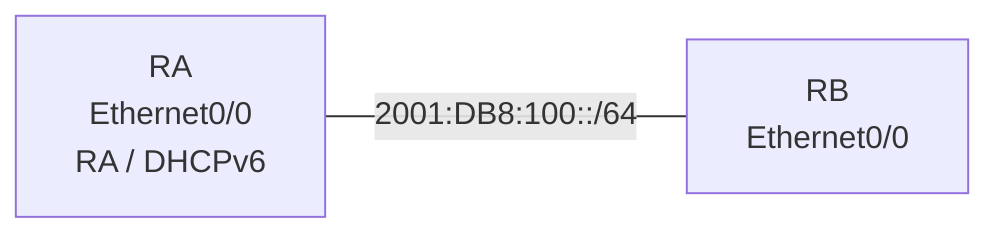

# 問題 20260920-050

> **本問は機器に接続せずに解答すること。追加の show 実行は認めない。**

## シナリオ



RA は RA を送信し、RB は RA のプレフィックスからアドレスを自動生成します。DHCPv6 は使用しません。

```
RA# show running-config | section ipv6|interface Ethernet0/0
ipv6 unicast-routing
interface Ethernet0/0
 ipv6 address 2001:DB8:100::1/64
 【1】
 no shutdown

RB# show running-config | section interface Ethernet0/0
interface Ethernet0/0
 【2】
 no shutdown
```

## 設問

【1】と【2】に当てはまるコマンドの組合せとして正しいものは、次のうちどれですか。(1つを選択してください)

## 選択肢

A. 【1】ipv6 nd other-config-flag　【2】ipv6 address dhcp

B. 【1】(フラグの設定なし)　【2】ipv6 address autoconfig

C. 【1】ipv6 address dhcp　【2】ipv6 nd managed-config-flag

D. 【1】(フラグの設定なし)　【2】ipv6 address dhcp
