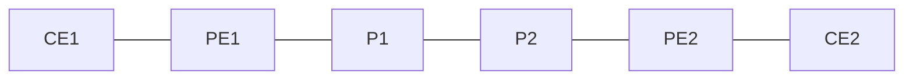

# 問題 20260920-059

> **本問は機器に接続せずに解答すること。追加の show 実行は認めない。**

## 設問

次の説明文(設定例を含む)の空欄 ①〜④ に入る語句を、下の語群 A〜H から 1 つずつ選択してください。同じ語句を 2 つの空欄に使うことはありません。語群にはどの空欄にも当てはまらない語句が含まれます。

CE1 が広告した 172.16.1.0/24 が対向拠点の CE2 に届くまでを追う。PE1 は PE-CE の経路交換で受け取った経路を［①］に入れる。それが BGP へ再配送または VRF 配下の AF で受信されると、PE1 は VRF に設定した RD を前置し、［②］の RT を付けて VPNv4 BGP テーブルに載せる。同時に PE1 はこの経路に［③］を割り当てる(既定はプレフィックスごと)。MP-iBGP で PE2 に届くと、PE2 は自分の各 VRF の import 一覧と経路の RT を突き合わせ、一致した VRF にだけ取り込む。ネクストホップは PE1 の Loopback アドレス(/32) のままなので、PE2 からそこへ至る LSP が IGP と LDP で完成している必要があり、無ければ経路はベストにならず VRF に入らない。確認は、VPNv4 表全体なら `show ip bgp vpnv4 ［④］`、特定 VRF の分だけなら `show ip route vrf <名前>` を使う。

## 選択肢

A. グローバル経路表

B. summary

C. both

D. TE ラベル

E. export

F. VPN ラベル

G. all

H. VRF の経路表
