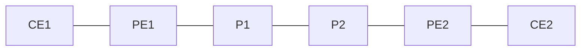

# 問題 20260920-060

> **本問は機器に接続せずに解答すること。追加の show 実行は認めない。**

## 設問

次の説明文(設定例を含む)の空欄 ①〜④ に入る語句を、下の語群 A〜H から 1 つずつ選択してください。同じ語句を 2 つの空欄に使うことはありません。語群にはどの空欄にも当てはまらない語句が含まれます。

入口 PE は VRF 宛の顧客パケットに 2 段のラベルを［①］する。スタックの底(bottom) に置かれるのが VPN ラベルで、これは MP-BGP により VPNv4 経路と一緒に配布され、出口 PE がどの VRF(あるいはどの出力先)へ届けるかを決めるためだけに使われる。スタックの先頭(top) に置かれるのがトランスポートラベルで、出口 PE のループバックアドレスを FEC として［②］が配布したものである。途中の P ルータは先頭のラベルだけを［③］し、底のラベルには一切触れない。ラベルエントリの［④］が 1 のものがスタックの底であることを示すので、出口 PE はそこまで剥がせばよいと判断できる。

## 選択肢

A. pop

B. LDP

C. push

D. TC(EXP)

E. TTL

F. S ビット(Bottom of Stack)

G. swap

H. OSPF
