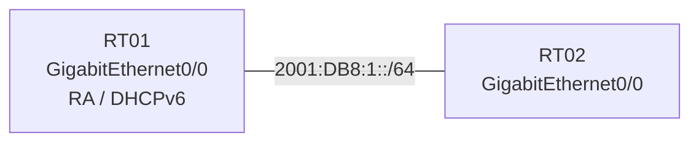

# 問題 20260920-070

> **本問は機器に接続せずに解答すること。追加の show 実行は認めない。**

## シナリオ



RT01 は DHCPv6 サーバとして DNS サーバとドメイン名だけを配布し、RT02 はアドレスを RA のプレフィックスから自動生成します。

```
RT01# show running-config | section ipv6|interface GigabitEthernet0/0
ipv6 unicast-routing
ipv6 dhcp pool V6POOL
 dns-server 2001:DB8:53::53
 domain-name example.net
!
interface GigabitEthernet0/0
 ipv6 address 2001:DB8:1::1/64
 ipv6 dhcp server V6POOL
 【1】
 no shutdown

RT02# show running-config | section interface GigabitEthernet0/0
interface GigabitEthernet0/0
 【2】
 no shutdown
```

## 設問

【1】と【2】に当てはまるコマンドを、次のうちから 2 つ選択してください。

## 選択肢

A. ipv6 dhcp relay destination FE80::A8BB:CCFF:FE01:5800

B. ipv6 address autoconfig

C. ipv6 nd managed-config-flag

D. ipv6 nd ra suppress all

E. ipv6 nd other-config-flag
