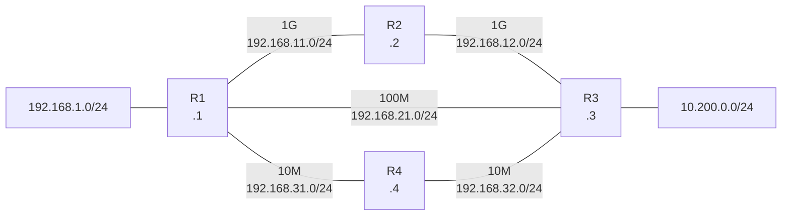

# 問題 20260920-076

> **本問は機器に接続せずに解答すること。追加の show 実行は認めない。**

## シナリオ



```
トポロジ(帯域・リンクのアドレス):
  R1 — R2: 1G    192.168.11.0/24 (R1 .1 / R2 .2)
  R2 — R3: 1G    192.168.12.0/24 (R2 .2 / R3 .3)
  R1 — R3: 100M  192.168.21.0/24 (R1 .1 / R3 .3)
  R1 — R4: 10M   192.168.31.0/24 (R1 .1 / R4 .4)
  R4 — R3: 10M   192.168.32.0/24 (R4 .4 / R3 .3)
  192.168.1.0/24 は R1 の LAN、10.200.0.0/24 は R3 の LAN

各ルータの設定:
  ・全ルータで RIP を有効にしている
  ・全ルータで OSPF を有効にしている(auto-cost reference-bandwidth 10000)
  ・R1 は上記に加え ip route 10.200.0.0 255.255.255.0 192.168.21.3 を設定している
```

## 設問

192.168.1.0/24 から 10.200.0.0/24 宛の通信を、より帯域の広い経路で転送させる方法を、次のうちから 2 つ選択してください。

## 選択肢

A. RIP の設定を削除する。

B. 静的経路の設定を削除する。

C. OSPF の AD を 11 にする。

D. R3 で ip route 10.200.0.0 255.255.255.0 を削除する。

E. RIP の設定を削除したうえで、静的経路も削除する。
